# Chapter 2 - Setting up an `R` environment

## What We're Building

An "R environment" means having all the software tools installed and configured so you can write and run R commands. Think of it like setting up a laboratory - you need the right equipment in the right places before you can do experiments.
We'll install three things in order:

1. **R** - the programming language itself
2. **Compiler Tools** - additional tools R needs to work with some packages (RTools on Windows, Xcode Command Line Tools on Mac, r-base-dev on Linux)
3. **RStudio** - a program that makes R easier to use

The order matters because each tool depends on the previous ones working correctly.


## Version Notes
**These instructions were originally tested with R 4.3+ and RTools43 (Windows), and confirmed still working on R 4.6.0 (2026-04-24, Mac).**

**Recommendation:** Install the latest versions of R and your compiler tools, even if they're newer than what's shown here
If you encounter version-related errors: The concepts remain the same, but specific variable names may need updating for your R version

## The Essentials {.essentials}

**Step 1: Install R**
R is the core programming language. Without it, nothing else will work. Go to https://cloud.r-project.org/ and download the version for your operating system:

- **Windows:** Click "Download R for Windows" > "base" > download the latest version (something like "R-4.3.x for Windows") > run the installer with default settings
- **Mac:** Click "Download R for macOS" > choose the installer that matches your Mac (Apple silicon or Intel) > run the installer with default settings
- **Linux:** Install through your distribution's package manager instead of the website, for example `sudo apt install r-base` on Ubuntu/Debian, or the equivalent for your distribution


```
#> Warning in readLines(f, n): line 1 appears to contain an
#> embedded nul
```

<div class="figure" style="text-align: center">
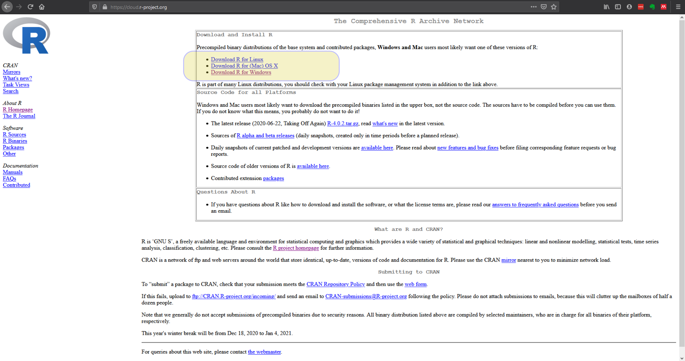
<p class="caption">(\#fig:install-r-step-1)Download the correct R version for your operating system</p>
</div>

<div class="figure" style="text-align: center">
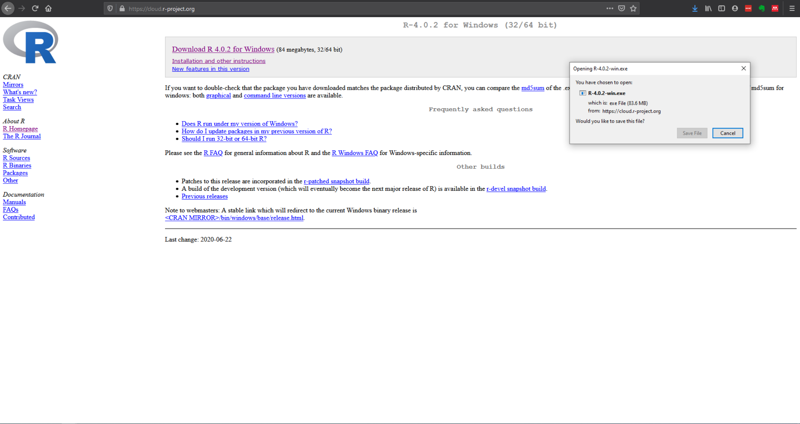
<p class="caption">(\#fig:install-r-step-4)Download the latest version of R. The version you download may be higher than the one pictured</p>
</div>

Once installed, you can open R directly to confirm it worked, you'll see a single window with version information and a blinking cursor:

<div class="figure" style="text-align: center">
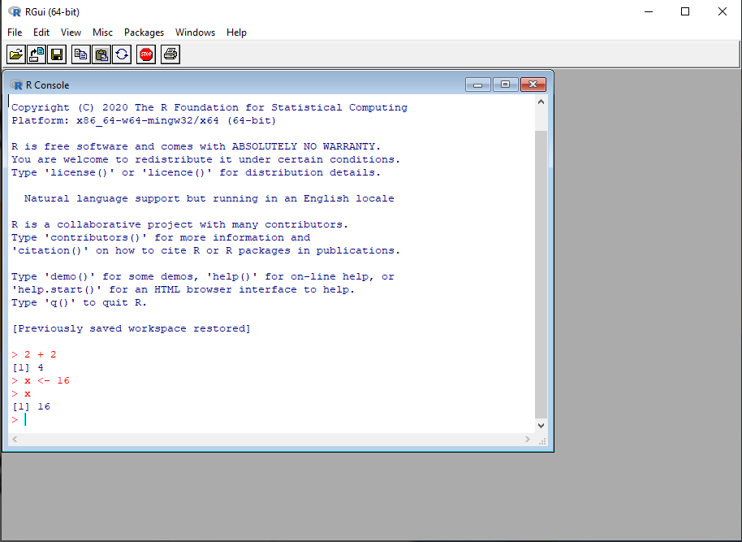
<p class="caption">(\#fig:use-r)The base R interface is basic but functional</p>
</div>

**Success check:** You should now have R installed. We'll test it more thoroughly after installing the other components.

**Step 2: Install Compiler Tools**
Many R packages contain code written in other languages (like C++) that needs to be "compiled." R needs the right compiler tools installed to do that. What you install depends on your operating system:

- **Windows:** Install RTools from https://cran.r-project.org/bin/windows/Rtools/. Download the version matching your R install (likely RTools46) and install with default settings.
- **Mac:** Install Xcode Command Line Tools. Open the Terminal app and run `xcode-select --install`, then follow the prompts.
- **Linux:** Install the R development package through your distribution's package manager, for example `sudo apt install r-base-dev` on Ubuntu/Debian.

**Step 3: Connect the Compiler Tools to R**
This step tells R where to find the compiler tools you just installed.

**Windows only:** Open R (look for "R" in your Start menu), then type this command exactly and press Enter:


``` r
writeLines('PATH="${RTOOLS43_HOME}\\usr\\bin;${PATH}"', con = "~/.Renviron")
```

**What this does:** Creates a configuration file that tells R where RTools is installed. Close R completely, then reopen it.

**Mac and Linux:** No extra configuration step is needed, Xcode Command Line Tools and r-base-dev connect to R automatically once installed.

**Step 4: Verify the Compiler Tools Work**

Test that R can find them, on any operating system:


``` r
Sys.which("make")
```

**Success looks like this (Windows):**
```
                                  make
"C:\\rtools43\\usr\\bin\\make.exe"
```

**Success looks like this (Mac/Linux):**
```
        make
"/usr/bin/make"
```

**Problem looks like this:**
```
make
 ""
```
Empty quotes mean the compiler tools aren't configured correctly. On Windows this means RTools isn't connected (repeat Step 3); on Mac or Linux it usually means the Step 2 install didn't complete.

**Step 5: Install RStudio**

RStudio is what's called an "IDE" - an Integrated Development Environment. An IDE is a program that combines multiple programming tools into one interface. Instead of having separate programs for writing code, running it, viewing results, and managing files, an IDE puts everything in one place.
While you could use R by itself, RStudio makes R much easier to use by providing helpful features like syntax highlighting, project organisation, and integrated help.

1. Go to https://posit.co/downloads/
2. Click "Download RStudio Desktop" (the free version)
3. Download and install with default settings

<div class="figure" style="text-align: center">

<p class="caption">(\#fig:install-rstudio)There are several RStudio versions, the free Desktop version is the one we need</p>
</div>

**Step 6: Open RStudio and Verify Everything Works**

Open RStudio (not R - look for "RStudio" in your programs)
You should see a window divided into several sections (called "panes")

<div class="figure" style="text-align: center">
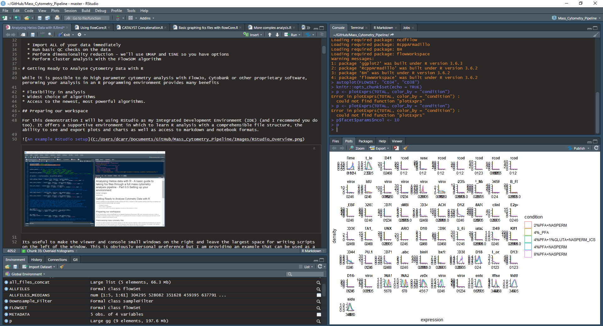
<p class="caption">(\#fig:rstudio-overview)What RStudio looks like when it's set up and running</p>
</div>

In the bottom-left pane (called the "Console"), type:


``` r
R.version
#>                _                           
#> platform       aarch64-apple-darwin23      
#> arch           aarch64                     
#> os             darwin23                    
#> system         aarch64, darwin23           
#> status                                     
#> major          4                           
#> minor          6.0                         
#> year           2026                        
#> month          04                          
#> day            24                          
#> svn rev        89956                       
#> language       R                           
#> version.string R version 4.6.0 (2026-04-24)
#> nickname       Because it was There
```

**Success looks like this (Windows):**
```
               _
platform       x86_64-w64-mingw32
arch           x86_64
os             mingw32
system         x86_64, mingw32
status
major          4
minor          3.2
year           2023
month          10
day            31
svn rev        85441
language       R
version.string R version 4.3.2 (2023-10-31 ucrt)
nickname       Eye Holes
```

**Success looks like this (Mac):**
```
               _
platform       aarch64-apple-darwin23
arch           aarch64
os             darwin23
system         aarch64, darwin23
status
major          4
minor          6.0
year           2026
month          04
day            24
svn rev        89956
language       R
version.string R version 4.6.0 (2026-04-24)
nickname       Because it was There
```
Real output, checked against an actual Mac install running current R. The exact numbers will differ depending on your R version and operating system (Mac will show `x86_64` instead of `aarch64` on an Intel Mac, for instance), what matters is that something like this prints with no error message.

**Problem:** If you see `Error: object 'R.version' not found` or similar, RStudio isn't finding a working R installation, go back and confirm Step 1 completed successfully.

## Common Problems and Solutions

**Problem:** `Sys.which("make")` returns empty quotes

**Cause:** The compiler tools aren't properly connected to R

**Solution:**

- **Windows:** Make sure you closed and reopened R after Step 3, and check that RTools installed correctly. If using an older R version, try:

``` r
writeLines('PATH="${RTOOLS42_HOME}\\usr\\bin;${PATH}"', con = "~/.Renviron")
```
- **Mac:** Check that Xcode Command Line Tools finished installing by running `xcode-select --install` again, it will tell you if they're already installed.
- **Linux:** Check that `r-base-dev` (or your distribution's equivalent) installed without errors.

**Problem:** RStudio won't start

- Make sure R installed successfully first
- Try restarting your computer
- Run R directly to test if the problem is R or RStudio

**Problem:** Can't find downloaded files

**Solution:** Check your Downloads folder and make sure you're downloading the version that matches your operating system


## A Deeper Dive {.deeper-dive}

### Understanding the Components
**R (the language):** The core program that interprets and runs R commands. It includes basic mathematical functions, data manipulation tools, and the ability to load additional packages.

**Compiler Tools:** Many R packages contain code written in other programming languages like C++ that needs to be "compiled" (translated into computer instructions). RTools (Windows), Xcode Command Line Tools (Mac), or r-base-dev (Linux) provide the compilers and other development tools needed for this process.

**RStudio (the IDE):** While you can run R commands directly in the basic R console, RStudio provides a much more user-friendly environment. As an Integrated Development Environment, it combines multiple tools:

- A code editor with syntax highlighting (colors that make code easier to read)
- The R console for running commands
- Project organisation tools
- An integrated help system
- A plot viewing area
- File management capabilities

### The RStudio Interface
When you open RStudio, you'll see four main areas (called "panes"):

<div class="figure" style="text-align: center">
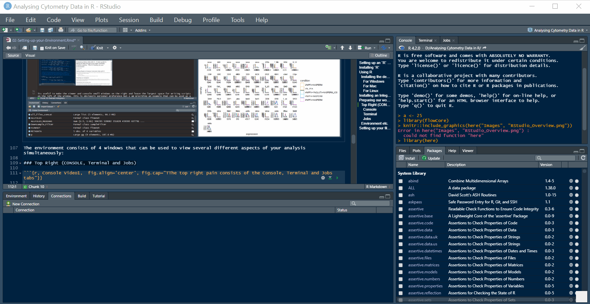
<p class="caption">(\#fig:rstudio-panes-overview)The four main panes: Console/Terminal/Jobs, Source, Environment, and Files/Plots/Help/Viewer</p>
</div>

**Console (bottom-left):** Where you type R commands and see results. This is the same as the basic R program, but integrated into RStudio.

<div class="figure" style="text-align: center">
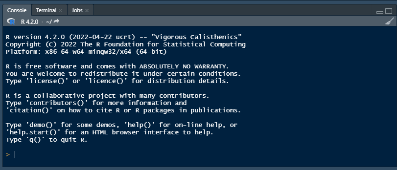
<p class="caption">(\#fig:rstudio-console)The console works exactly like the base R interface you tested earlier</p>
</div>

This pane also has a **Terminal** tab, giving access to your system's command line (bash, PowerShell, etc.), not something this course uses directly, but it's there if you need it, for tasks like remote log-in, file management, or version control with Git:

<div class="figure" style="text-align: center">
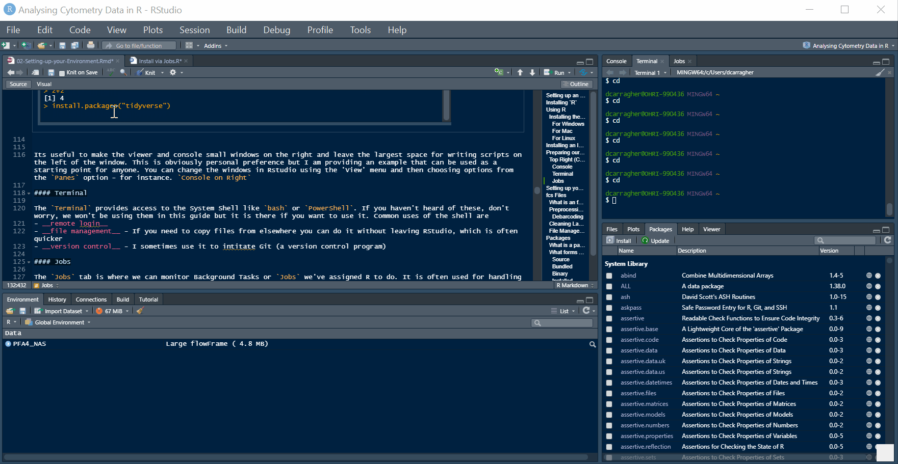
<p class="caption">(\#fig:rstudio-terminal)The Terminal tab gives access to your system shell without leaving RStudio</p>
</div>

And a **Jobs** tab, for running scripts in the background, useful for long installs or long-running analyses that would otherwise block you from using R while they run:

<div class="figure" style="text-align: center">
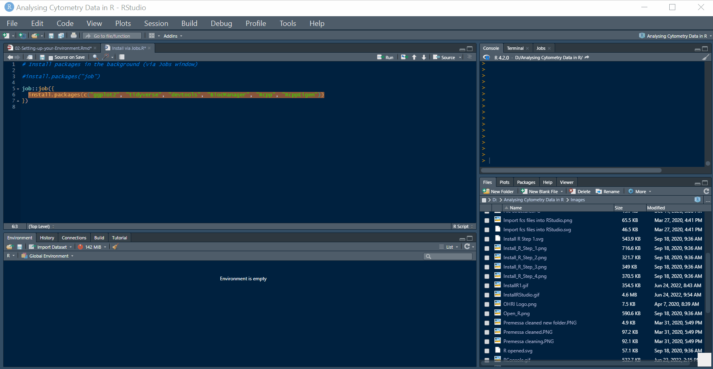
<p class="caption">(\#fig:rstudio-jobs)The Jobs tab lets you run scripts in the background</p>
</div>

**Source (top-left):** Where you write and edit longer R scripts. A script is a file containing multiple R commands that you want to save and reuse. Think of this as your notebook where you write down the steps of your analysis.

**Environment (top-right):** Shows the data objects you've created. When you load cytometry data, it will appear here so you can see what data you're working with.

<div class="figure" style="text-align: center">
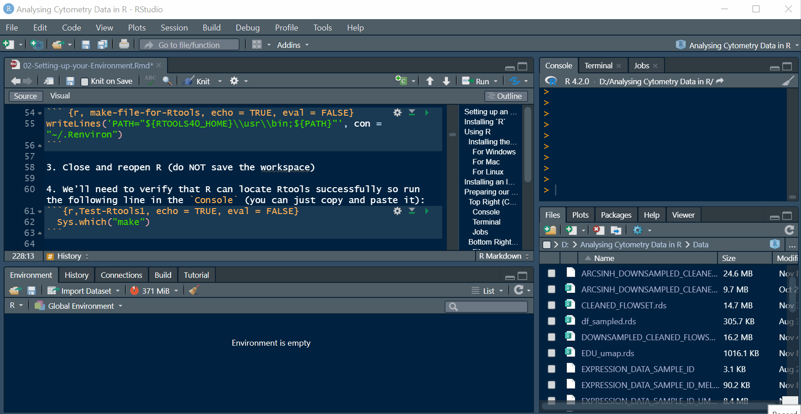
<p class="caption">(\#fig:rstudio-environment)As you create variables and load data, they appear here with basic info about each one</p>
</div>

**Files/Plots (bottom-right):** Contains several tabs:

- **Files:** A file browser for navigating folders

<div class="figure" style="text-align: center">
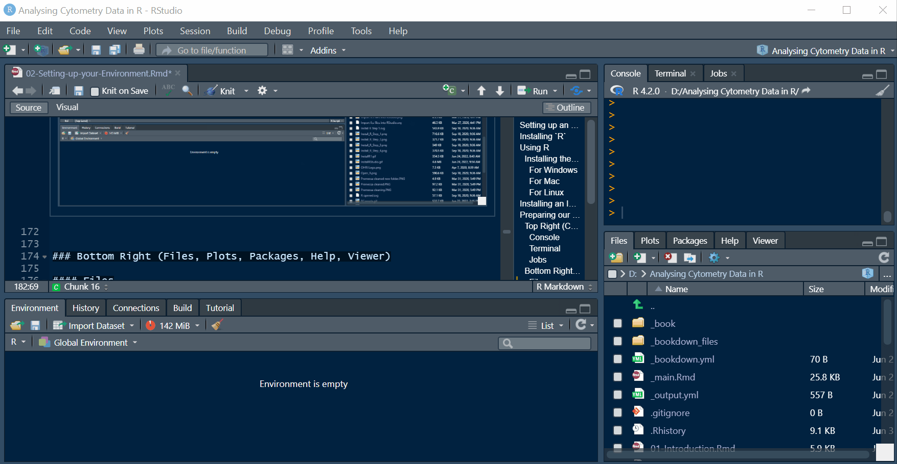
<p class="caption">(\#fig:rstudio-files)The Files tab works like a standard file browser</p>
</div>

- **Plots:** Where graphs will appear when you create them

<div class="figure" style="text-align: center">
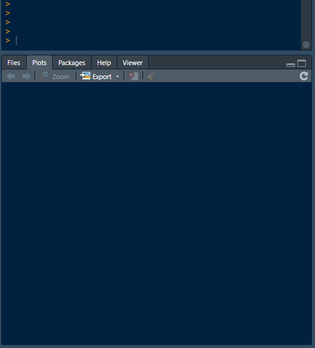
<p class="caption">(\#fig:rstudio-plots)The Plots tab shows every plot you generate; scroll through multiple plots with the arrow icons</p>
</div>

- **Help:** Where documentation appears when you ask for help (`?functionname` or `??keyword`)

<div class="figure" style="text-align: center">
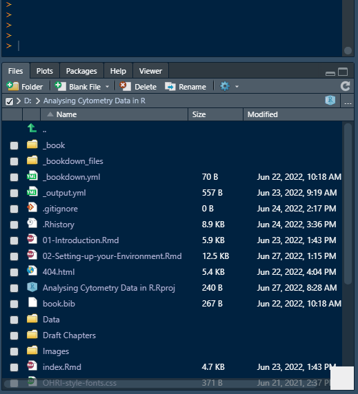
<p class="caption">(\#fig:rstudio-help)The Help tab shows package documentation and vignettes</p>
</div>

- **Viewer:** Displays local web-compatible content, tables, interactive plots, and similar

<div class="figure" style="text-align: center">
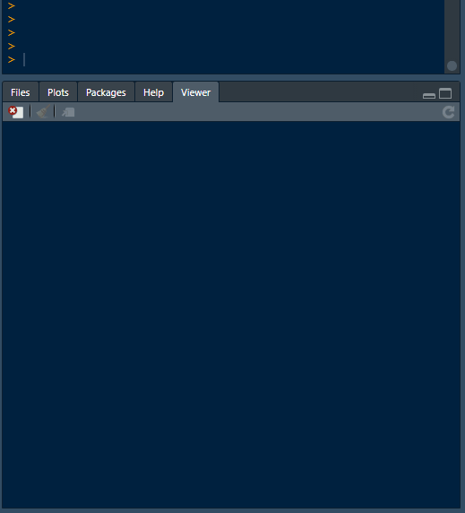
<p class="caption">(\#fig:rstudio-viewer)The Viewer tab displays local web-compatible output like interactive tables</p>
</div>

- **Packages:** Shows installed packages (we'll learn about packages in the next chapter)

### Why This Setup Process Matters
This installation sequence creates a stable foundation for everything that follows. Each component serves a specific purpose:

1. R provides the analytical capabilities
2. Compiler tools enable installation of specialized packages
3. RStudio makes the whole system usable for daily work

Without this proper setup, you'll encounter errors when trying to install the cytometry-specific packages we need for analysis.

### Packages Preview
Once this environment is working, you'll install "packages" - collections of additional functions written by other researchers. A package is like an add-on that gives R new capabilities. The cytometry analysis we'll do depends on several specialized packages that extend R's basic functions.

### File Paths and Working Directories
As you start using R, you'll encounter the concept of "working directories" - the folder where R looks for files by default. A working directory is like R's current location on your computer's file system. RStudio helps manage this through "Projects" which we'll set up in the next chapter.

Understanding file paths is crucial for cytometry analysis because you'll be loading data files and saving results. The setup we're building now will make file management much easier later.

### Next Steps
With R, your compiler tools, and RStudio installed, you have a complete environment for cytometry analysis. The next chapter will show you how to extend R's capabilities by installing specialized packages for working with cytometry data.

Don't worry if some of this setup felt abstract - the purpose will become clear when we start loading actual data and creating visualisations.
