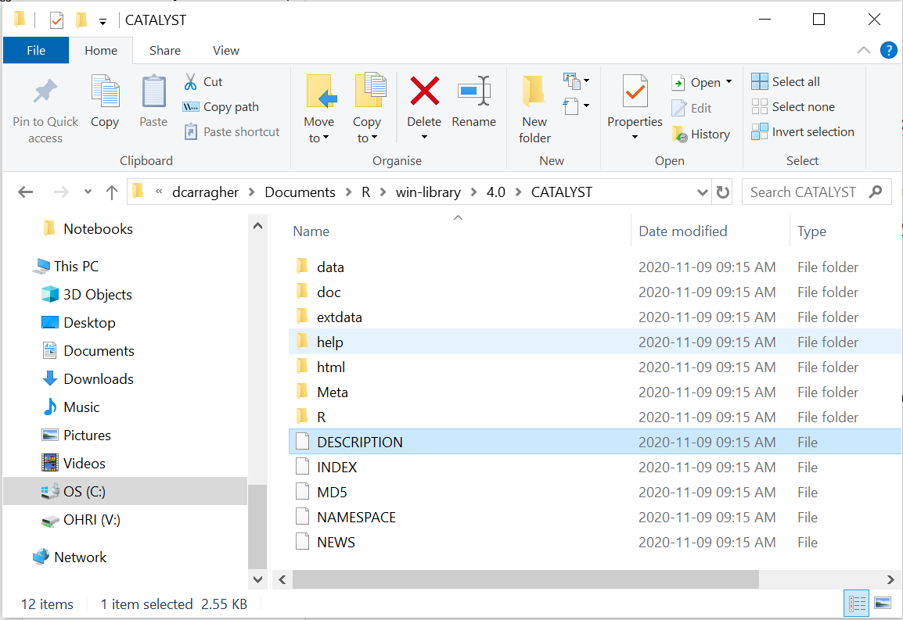

# Chapter 3 - Packages

## What Are Packages?

Before we install anything, let's understand what we're working with. A package is a collection of functions and tools that extends what R can do. Think of base R as a toolkit that comes with essential tools like a hammer and screwdriver. A package adds more specialized tools to that same toolkit, a plane and router for fine woodworking, for instance. The tools we'll add throughout this course are for cytometry analysis: reading FCS files, building cytometry-style plots, and running population-discovery algorithms.

When you install R, you get "base R" - the core functions for basic data manipulation and statistics. But cytometry analysis requires specialized functions for reading FCS files, creating cytometry-specific plots, and applying flow cytometry algorithms. These come in packages written by researchers who share their tools with the community.

## Where Packages Come From

Packages are distributed through different repositories - online collections of software that you can download from. We'll use three main sources:

**CRAN (Comprehensive R Archive Network):** The main repository for general-purpose R packages. These are rigorously tested and maintained. Examples include packages for data manipulation, statistical analysis, and general plotting.

**Bioconductor:** A specialized repository for biological data analysis packages. These packages often work together and use common data structures designed for biological research. Most cytometry-specific packages live here.

**GitHub:** A code sharing platform where developers publish packages that may not be on CRAN or Bioconductor yet. These can include cutting-edge methods or specialized tools for specific research needs.

Each repository requires different installation methods, which we'll learn below.

## Version Notes

**These instructions were tested with current CRAN and Bioconductor versions**  
**Recommendation:** Install the latest package versions available  
**If you encounter installation errors:** Package names and dependencies may change over time - check error messages for specific guidance

## The Essentials {.essentials}

To get ready for cytometry analysis, we need to install packages from all three sources. We'll install everything now so we don't interrupt later chapters with package management.

### Step 1: Install Package Managers

First, we need tools that can install packages from Bioconductor and GitHub:


``` r
install.packages("BiocManager")
install.packages("devtools")
```

### Step 2: Install All Required Packages

Copy and run this entire code block - it installs everything we'll need for cytometry analysis:


``` r
# Package managers (if not already installed)
if(!require(BiocManager)) install.packages("BiocManager")
if(!require(devtools)) install.packages("devtools")

# Core programming utilities
if(!require(rlang)) install.packages("rlang")         # R language utilities and C++ integration

# Core cytometry packages - read FCS files and create cytometry plots
if(!require(flowCore)) BiocManager::install("flowCore")
if(!require(ggcyto)) BiocManager::install("ggcyto")

# Advanced cytometry analysis - clustering and population discovery
if(!require(FlowSOM)) BiocManager::install("FlowSOM")
if(!require(flowCut)) BiocManager::install("flowCut")
if(!require(flowWorkspace)) BiocManager::install("flowWorkspace") # GatingSet functions used in the Gating chapter
if(!require(openCyto)) BiocManager::install("openCyto")           # estimateMedianLogicle(), used in the Transformation chapter

# Dimensionality reduction for cytometry
if(!require(uwot)) install.packages("uwot")           # UMAP implementation
if(!require(Rtsne)) install.packages("Rtsne")         # t-SNE implementation
if(!require(ggh4x)) install.packages("ggh4x")         # facet_nested_wrap(), nested per-sample panels in the Dimensionality Reduction chapter
if(!require(dbscan)) install.packages("dbscan")       # Density clustering, used to gate regions on a UMAP
if(!require(ggforce)) install.packages("ggforce")     # geom_mark_hull(), draws those gates as outlines rather than boxes

# Data manipulation and general visualisation
if(!require(tidyverse)) install.packages("tidyverse")  # Data wrangling toolkit
if(!require(tidyr)) install.packages("tidyr")          # pivot_longer(), reshaping wide tables to long. Ships inside tidyverse, listed separately because several chapters load it directly
if(!require(cowplot)) install.packages("cowplot")     # Multi-panel figures
if(!require(ggtext)) install.packages("ggtext")       # Enhanced text formatting
if(!require(ggridges)) install.packages("ggridges")   # Ridge/density plots for distributions

# Colour and visualisation utilities
if(!require(RColorBrewer)) install.packages("RColorBrewer") # Colour palettes
if(!require(viridis)) install.packages("viridis")     # Colourblind-friendly palettes
if(!require(colorspace)) install.packages("colorspace") # Colour manipulation
if(!require(scales)) install.packages("scales")       # Plot scaling
if(!require(GGally)) install.packages("GGally")       # ggpairs() NxN marker grids, used in the Channel Names chapter
if(!require(pheatmap)) install.packages("pheatmap")   # Heatmaps, used in the Statistics chapter
if(!require(ggrepel)) install.packages("ggrepel")     # Non-overlapping plot labels, used in the Statistics chapter
library(grDevices) # Graphics devices; ships with base R, no installation needed

# Animation, used in the Dimensionality Reduction chapter
if(!require(gganimate)) install.packages("gganimate") # Animates a ggplot across a variable
if(!require(gifski)) install.packages("gifski")       # Renders the frames to a GIF. gganimate needs a renderer and will fail without one

# Statistical analysis
if(!require(limma)) BiocManager::install("limma")     # Differential expression
if(!require(fBasics)) install.packages("fBasics")     # Basic statistics

# File management and data handling
if(!require(here)) install.packages("here")           # Portable file paths
if(!require(readxl)) install.packages("readxl")       # Read Excel files

# Utilities and system integration
if(!require(foreach)) install.packages("foreach")     # Parallel processing
if(!require(rstudioapi)) install.packages("rstudioapi")    # RStudio integration

# Specialized cytometry data cleaning
if(!require(premessa)) devtools::install_github("ParkerICI/premessa", force = TRUE)
if(!require(Rphenograph)) devtools::install_github("JinmiaoChenLab/Rphenograph", force = TRUE)  # Clustering alternative to FlowSOM, used in the Clustering chapter
```

**A prompt you'll likely see partway through:** installing this many packages, several from Bioconductor, R will often pause and ask something like:

```
These packages have more recent versions available.
Which would you like to update?

 1: All
 2: CRAN packages only
 3: None
Enter one or more numbers, or an empty line to skip updates:
```

or the shorter `Update all/some/none? [a/s/n]:` version. This is asking about *dependencies*, packages your new install already relies on, not the packages you asked for. Typing `3` (or `n`, or just pressing Enter to skip) is the safe default, it keeps installing what you asked for without touching anything else. Updating everything can work too, but occasionally breaks compatibility between packages that were tested together at specific versions, not worth the risk partway through a long install. If you're ever unsure, skipping updates is always the safer choice here.

### Step 3: Verify Installation

Test that the core packages loaded successfully:


``` r
library(flowCore)
library(ggcyto)
library(tidyverse)
library(here)
```

**Success looks like this:**
```
-- Attaching core tidyverse packages ------------------------ tidyverse 2.0.0 --
v dplyr     1.1.4     v readr     2.1.5
v forcats   1.0.0     v stringr   1.5.1
v ggplot2   3.5.1     v tibble    3.2.1
v lubridate 1.9.3     v tidyr     1.3.1
v purrr     1.0.2
-- Conflicts ------------------------------------------ tidyverse_conflicts() --
x dplyr::filter() masks stats::filter()
x dplyr::lag()    masks stats::lag()
```
Package "attaching" messages and even the odd "conflicts" or "masks" notice are normal, not errors, they just tell you two loaded packages both have a function with the same name.

**Problem looks like this:**
```
Error in library(flowCore) : there is no package called 'flowCore'
```
This means the install step didn't complete for that package. Go back to Step 2, run the install line for that specific package on its own, and check for a `Warning: package X is not available` message, that usually points to a spelling issue or a CRAN/Bioconductor mismatch.

## A Deeper Dive {.deeper-dive}

### Installing Without Blocking Your Console

Step 2's install block covers a lot of packages, several from Bioconductor, which can take a while. While it runs, your R console is locked, you can't run anything else until it finishes. RStudio's Jobs pane gets around this, via the `job` package:


``` r
if(!require(job)) install.packages("job")

job::job({
  install.packages(c("ggplot2", "tidyverse", "devtools", "BiocManager"))
})
```

This runs the install in a separate background R process, RStudio's Jobs tab (next to Console) shows its progress, and your console stays free to keep working in the meantime. Useful for this chapter's long install, and for any future script that takes a while to run.

### Understanding Package Installation

When you type `install.packages("packagename")`, R downloads the package from CRAN and installs it on your computer. The package gets stored in a "library" - a folder where R keeps all installed packages.

Note the quotation marks around the package name - they're required during installation or you'll get an error. However, when you load packages with `library()`, quotation marks are optional.

### Package Sources in Detail

#### CRAN Packages

The Comprehensive R Archive Network hosts over 18,000 packages. These undergo automated testing on multiple operating systems and must meet strict standards. CRAN packages are the most stable and reliable.

Install with:

``` r
install.packages("packagename")
```

#### Bioconductor Packages

Bioconductor focuses on biological data analysis and maintains about 2,000 packages. These packages often work together using shared data structures. For example, the flowSet object we'll use throughout this course was pioneered by Bioconductor. Like CRAN, every submission goes through extensive automated testing and manual review before acceptance, and packages are re-checked on every Bioconductor release to make sure they still work together.

First install the manager:

``` r
install.packages("BiocManager")
```

Then install packages:

``` r
BiocManager::install("packagename")
```

#### GitHub Packages

GitHub hosts cutting-edge packages that may not be available elsewhere. These can be less stable but provide access to the newest methods. Some packages start on GitHub before moving to CRAN or Bioconductor. Unlike CRAN and Bioconductor, there's no centralized testing, review, or acceptance process, whether a package works, is maintained, or is safe to rely on is entirely up to the individual author. That's the trade-off for early access to new methods.

First install the devtools:

``` r
install.packages("devtools")
```

Then install packages:

``` r
devtools::install_github("username/packagename")
```

### Loading Packages vs Installing Packages

Installing a package downloads it to your computer once. Loading a package makes it available for your current R session. You need to load packages every time you start R.

**Install once:**

``` r
install.packages("flowCore")
```

**Load every session:**

``` r
library(flowCore)
```

### About require() vs library()

We use the `if(!require(package)) install.packages("package")` pattern throughout this tutorial because it's efficient for setup scripts:

1. Checks if the package is already loaded
2. If not loaded, tries to load it
3. If loading fails (package not installed), installs it automatically
4. This means you can rerun the same installation script without wasting time or bandwidth

**For tutorial and setup scripts:** `require()` is the practical choice because it handles both installation and loading efficiently.

**For your own analysis scripts:** `library()` is often better because it stops with a clear error message if a package is missing. This makes problems obvious so you can fix them quickly.

**Example of the difference:**

``` r
# Using require() - gives warning, continues running
require(nonexistent_package)
some_function()  # This might fail mysteriously later

# Using library() - stops immediately with clear error  
library(nonexistent_package)  # Error: package not found
some_function()  # This line never runs
```

**Why this matters:** In analysis scripts, you want to know immediately if packages are missing. In setup scripts, you want the convenience of automatic installation and efficient reruns.

Both functions have their place - we use the right tool for each situation.

### Understanding Our Package Collection

#### Core Cytometry Tools
- `flowCore`: Reads FCS files and provides basic data structures for cytometry data
- `ggcyto`: Creates publication-quality cytometry plots using familiar ggplot2 syntax
- `flowWorkspace`: `GatingSet` and related functions, used in the Gating chapter
- `openCyto`: `estimateMedianLogicle()`, used in the Transformation chapter's logicle comparison

#### Advanced Analysis
- `FlowSOM`: Self-organising map clustering for population discovery
- `flowCut`: Automated quality control and outlier detection
- `limma`: Statistical analysis for differential expression

#### Visualisation and Exploration
- `ggridges`: Ridge plots are particularly useful for comparing marker expression distributions between samples or treatment groups
- `uwot` and `Rtsne`: Dimensionality reduction techniques (UMAP and t-SNE) for visualising high-dimensional cytometry data in 2D
- `GGally`: `ggpairs()`, used in the Channel Names chapter's NxN marker grid
- `pheatmap` and `ggrepel`: heatmaps and non-overlapping plot labels, used in the Statistics chapter

#### Data Manipulation
- `tidyverse`: Modern R tools for data cleaning, transformation, and analysis
- `here`: Portable file path management that works across different computers

### Package Dependencies

Packages often depend on other packages to work. When you install a package, R automatically installs its dependencies. This is why installation sometimes takes longer than expected - R may be installing several related packages.

**Example:** When you install `ggcyto`, R also installs `ggplot2`, `flowCore`, and several other packages that `ggcyto` needs to function.

### What a Package Actually Is on Disk

R occasionally asks which form of a package you want, for example "Do you want to install the package from Source?" A source package is just a directory of files with a specific structure, a `DESCRIPTION` file, an `R/` folder containing `.R` files, and so on:

<div class="figure" style="text-align: center">

<p class="caption">(\#fig:package-structure)On your computer, a package is just an organised set of files and folders</p>
</div>

### Managing Your Package Library

**Check what's installed:**

``` r
installed.packages()
```

**Update all packages:**

``` r
update.packages()
```

**Remove a package:**

``` r
remove.packages("packagename")
```

**Find package information:**

``` r
packageDescription("packagename")
```

### Getting Help with Packages

Every package includes documentation:

**Quick help:**

``` r
?packagename
```

**Detailed tutorials (vignettes):**

``` r
browseVignettes("packagename")
```

Vignettes are particularly valuable - they're tutorials written by package authors showing how to use their tools effectively.

### Why We Install Everything Upfront

This front-loaded approach means subsequent chapters won't be interrupted by package installation. You can focus on learning analysis techniques rather than managing software.

### Troubleshooting Installation Problems

**Package installation fails:**
- Check your internet connection
- Try installing one package at a time to identify the problem
- Look at error messages for specific guidance

**Package loading fails:**
- Make sure the package installed successfully
- Check for typos in the package name
- Try reinstalling the package

**Version conflicts:**
- Update all packages with `update.packages()`
- Remove and reinstall problematic packages
- Restart R and try again

### What's Next

With these packages installed, you have the tools needed for comprehensive cytometry analysis. Chapter 4 will show you how to organise your work, then Chapter 5 will show you how to load your first cytometry dataset.

This gives you the foundation for everything that follows - from basic data import to advanced population discovery algorithms.
