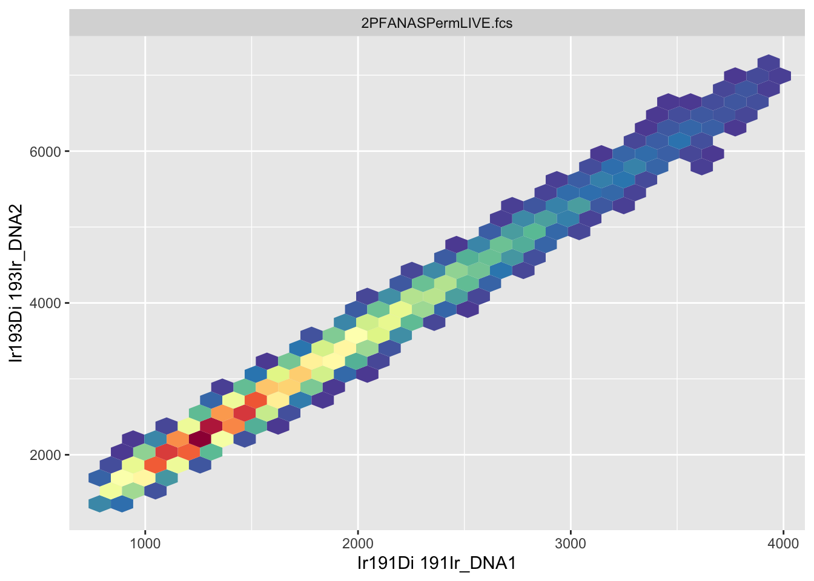
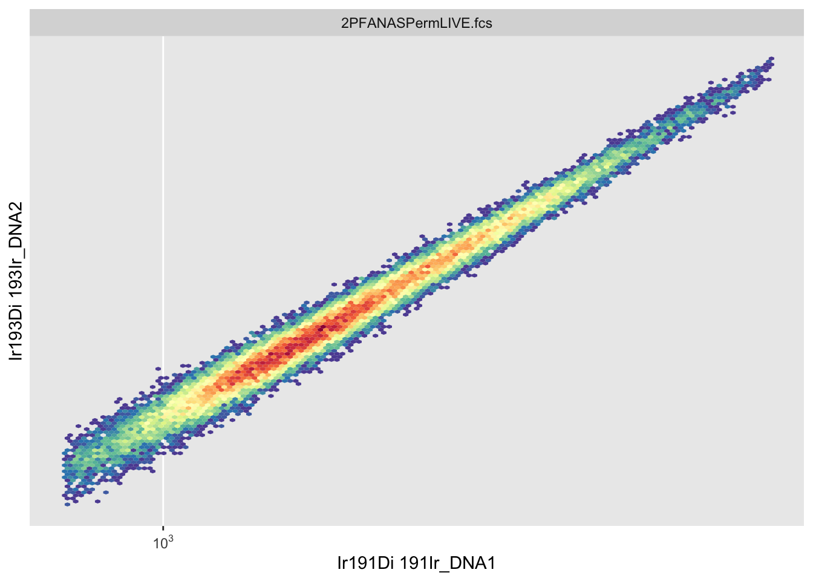
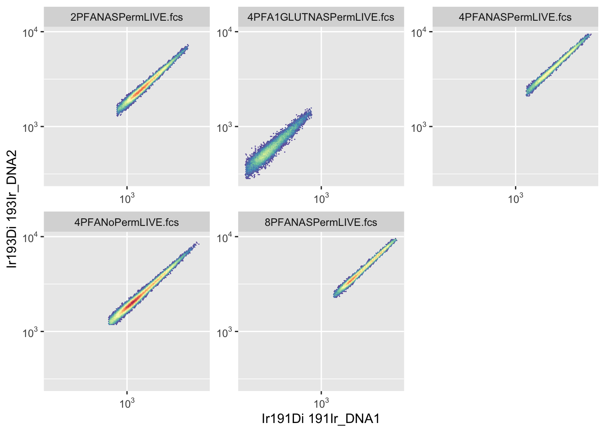

# Chapter 6 - Visualising Cytometry Data

## What You'll Learn

Cytometry data lives in high-dimensional space - dozens of markers measured simultaneously on each cell. Visualisation helps us see patterns, identify populations, and verify our analysis at every step. This chapter teaches you to create the plots you'll need throughout the course.

## Understanding Cytometry Visualisation

Traditional cytometry analysis relies heavily on visual inspection. We look at scatter plots to:
- Identify cell populations
- Set gates
- Verify data quality
- Compare samples
- Present results

In R, we use the `ggcyto` package, which combines:
- `flowCore`: Cytometry data structures
- `ggplot2`: R's powerful plotting system

## The Essentials {.essentials}

### Step 1: Load Required Packages


``` r
library(flowCore)
library(ggcyto)
#> Loading required package: ggplot2
#> Loading required package: ncdfFlow
#> Loading required package: BH
#> Loading required package: flowWorkspace
#> As part of improvements to flowWorkspace, some behavior of
#> GatingSet objects has changed. For details, please read the section
#> titled "The cytoframe and cytoset classes" in the package vignette:
#> 
#>   vignette("flowWorkspace-Introduction", "flowWorkspace")
library(here)
#> Warning in readLines(f, n): line 1 appears to contain an
#> embedded nul
#> here() starts at /Volumes/T31/CLAUDE/Analysing-Cytometry-Data-With-R
```

### Step 2: Load Your Data


``` r
FLOWSET <- readRDS(here("Data", "RDS", "FLOWSET.rds"))
```

### Step 3: Your First Cytometry Plot


``` r
autoplot(FLOWSET[[1]], x = "Ir191Di", y = "Ir193Di")
```



This creates a basic scatter plot showing DNA markers (Ir191 and Ir193) for the first sample.

**What you should see:** A scatter plot with most events clustered together, some spread along the axes.

### Step 4: Improve the Visualisation

The default plot compresses data onto the axes. Transform it for better visibility:


``` r
autoplot(FLOWSET[[1]], x = "Ir191Di", y = "Ir193Di", bins = 128) +
  scale_x_flowCore_fasinh() +
  scale_y_flowCore_fasinh()
```



**What changed:** 
- Data spreads out from the axes
- Populations become visible
- Colours show density

### Step 5: Plot Multiple Samples


``` r
autoplot(FLOWSET, x = "Ir191Di", y = "Ir193Di", bins = 128) +
  scale_x_flowCore_fasinh() +
  scale_y_flowCore_fasinh()
```



This creates separate plots for each sample, making it easy to compare them.

Channel names are all you have at this point in the pipeline, the metal isotope names you saw in Chapter 5. Marker names (like "CD34") only become available once you've matched channels to your panel in Chapter 8, every plot in this chapter uses channel names for that reason.

## A Deeper Dive {.deeper-dive}

### Understanding autoplot

`autoplot()` is ggcyto's quick plotting function. It automatically:
- Detects you're plotting cytometry data
- Creates appropriate plot types
- Handles both flowFrames and flowSets

**Basic syntax:**

``` r
autoplot(data, x = "marker1", y = "marker2")
```

### Binning and Hexagonal Plots

By default, `autoplot()` creates hexagonal density plots rather than showing individual points.

**Why hexagons?**
- Cytometry files contain thousands to millions of events
- Plotting every point is slow and cluttered
- Binning shows density patterns clearly

**Control bin number:**

``` r
autoplot(FLOWSET[[1]], x = "Ir191Di", y = "Ir193Di", bins = 64)   # Coarser
autoplot(FLOWSET[[1]], x = "Ir191Di", y = "Ir193Di", bins = 256)  # Finer
```

Higher bin numbers show more detail but take longer to render.

### Transformation for Visualisation

Raw cytometry data is compressed - negative populations cluster near zero, positive populations spread across orders of magnitude.

**Scale functions transform axes:**


``` r
scale_x_flowCore_fasinh()    # Hyperbolic arcsinh (recommended)
scale_y_logicle()             # Logicle transform
scale_x_log10()               # Log10 (can't handle negatives)
```

**Why transform?**
- Separates negative and positive populations
- Shows dim populations clearly
- Matches FlowJo visualisation

We'll cover transformations in detail in Chapter 11. For now, use `scale_x_flowCore_fasinh()` for visualisation.

### Selecting Different Channels

You can plot any channel in your dataset:


``` r
autoplot(FLOWSET, x = "Pr141Di", y = "Nd142Di")
```

**Check available channels:**

``` r
colnames(FLOWSET)
```

### Single Sample vs Multiple Samples

**Plot one sample:**

``` r
autoplot(FLOWSET[[1]], x = "Ir191Di", y = "Ir193Di")
```

**Plot all samples:**

``` r
autoplot(FLOWSET, x = "Ir191Di", y = "Ir193Di")
```

When plotting flowSets, ggcyto automatically creates a panel with one plot per sample.

### Controlling Facets

Facets are the small multiple plots created for each sample.

**Arrange facets:**

``` r
autoplot(FLOWSET, x = "Ir191Di", y = "Ir193Di") +
  facet_wrap(~ name, ncol = 3)  # 3 columns
```

### Using ggcyto Instead of autoplot

`ggcyto()` provides more control than `autoplot()`:


``` r
ggcyto(FLOWSET, aes(x = "Ir191Di", y = "Ir193Di")) +
  geom_hex(bins = 128) +
  scale_x_flowCore_fasinh() +
  scale_y_flowCore_fasinh() +
  facet_wrap(~ name)
```

This gives the same result as `autoplot()` but with explicit control over each element.

### Plot Types

**Hexagonal density plot (default):**

``` r
ggcyto(FLOWSET[[1]], aes(x = "Ir191Di", y = "Ir193Di")) +
  geom_hex(bins = 128)
```

**Point plot (use sparingly - slow with many events):**

``` r
ggcyto(FLOWSET[[1]], aes(x = "Ir191Di", y = "Ir193Di")) +
  geom_point(size = 0.5, alpha = 0.3)
```

**Density contour plot:**

``` r
ggcyto(FLOWSET[[1]], aes(x = "Ir191Di", y = "Ir193Di")) +
  geom_density2d()
```

### One-Dimensional Plots (Histograms)

View distribution of a single marker:


``` r
autoplot(FLOWSET, "Pr141Di") +
  scale_x_flowCore_fasinh()
```

**Overlay multiple samples:**

``` r
library(ggcyto)
ggplot(FLOWSET,aes(x = Pr141Di,colour = factor(name),group = factor(name))) +
  geom_freqpoly(aes(y = after_stat(count / max(count)))) +
  scale_x_flowCore_fasinh()

```

This shows all samples on one plot instead of separate facets.

This chunk is more involved than most of this chapter's plotting code, and that's deliberate, not a sign something's wrong. `autoplot()` and `ggcyto()` handle single samples and side-by-side facets as one-liners, but neither has a built-in shortcut for stacking every sample's distribution onto one shared axis, the overlay view FlowJo gives you natively when you tick multiple samples in its histogram tool. Getting that same overlay here means dropping down to plain `ggplot()` and `geom_freqpoly()`, and doing the colour/grouping-by-sample wiring yourself (`colour = factor(name), group = factor(name)`) rather than letting `autoplot()` do it for you.

### Customising Appearance

`ggcyto` uses ggplot2, so all ggplot2 customisation works:

**Change colours:**

``` r
autoplot(FLOWSET[[1]], x = "Ir191Di", y = "Ir193Di", bins = 128) +
  scale_fill_viridis_c()
```

**Add titles:**

``` r
autoplot(FLOWSET[[1]], x = "Ir191Di", y = "Ir193Di") +
  labs(title = "DNA Markers", 
       subtitle = "Sample 1",
       x = "DNA (Ir191)", 
       y = "DNA (Ir193)")
```

**Apply themes:**

``` r
autoplot(FLOWSET[[1]], x = "Ir191Di", y = "Ir193Di") +
  theme_minimal()
```

### Saving Plots

**Save last plot:**

``` r
ggsave(here("Figures", "dna_plot.png"), width = 8, height = 6)
```

**Save specific plot:**

``` r
p <- autoplot(FLOWSET, x = "Ir191Di", y = "Ir193Di")
p

ggsave(here("Figures", "dna_all_samples.png"), plot = p, width = 12, height = 8)
```

**Go look at the file:** `ggsave()` writes the PNG to disk silently, RStudio won't pop it open for you. Find `dna_all_samples.png` in your `Figures/` folder (Finder on Mac, File Explorer on Windows) and open it directly to actually see what you saved, don't just trust that the code ran.

### Comparing Samples Side by Side

**Overlay two samples:**

``` r
ggplot(
  FLOWSET[c(1, 2)],
  aes(
    x = Ir191Di,
    y = Ir193Di,
    colour = factor(name)
  )
) +
  geom_density_2d() +
  scale_x_flowCore_fasinh() +
  scale_y_flowCore_fasinh()
```

### Building Complex Plots

Combine multiple plot layers:


``` r
ggcyto(FLOWSET[[1]], aes(x = "Ir191Di", y = "Ir193Di")) +
  geom_hex(bins = 128) +
  scale_x_flowCore_fasinh() +
  scale_y_flowCore_fasinh() +
  scale_fill_viridis_c(option = "plasma") +
  labs(title = "DNA Markers", x = "DNA 1 (Ir191)", y = "DNA 2 (Ir193)") +
  theme_minimal() +
  theme(legend.position = "right")
```

### Verification Plots

Use plots to verify your data at each step:

**Check all markers quickly:**

``` r
# Plot all markers
autoplot(FLOWSET[[1]])
```

**Compare before and after processing:**

``` r
p1 <- autoplot(FLOWSET[[1]], x = "Ir191Di", y = "Ir193Di") + labs(title = "Untransformed")
p2 <- autoplot(FLOWSET[[1]], x = "Ir191Di", y = "Ir193Di", bins = 128) +
  scale_x_flowCore_fasinh() +
  scale_y_flowCore_fasinh() +
  labs(title = "Transformed")

library(cowplot)
plot_grid(as.ggplot(p1), as.ggplot(p2), ncol = 2)
```

### Common Plot Combinations

**Two channels together:**

``` r
autoplot(FLOWSET, x = "Ir191Di", y = "Pr141Di", bins = 128) +
  scale_x_flowCore_fasinh() +
  scale_y_flowCore_fasinh()
```

**Cell size parameters:**

``` r
autoplot(FLOWSET, x = "Event_length", y = "Width", bins = 128)
```

**Channel expression:**

``` r
autoplot(FLOWSET, x = "Sm149Di", y = "Yb172Di", bins = 128) +
  scale_x_flowCore_fasinh() +
  scale_y_flowCore_fasinh()
```

### Troubleshooting Visualisation

**Problem:** Plot shows compressed data on axes  
**Solution:** Add transformation scales

**Problem:** Can't see populations  
**Solution:** Adjust bin number (try 64, 128, or 256)

**Problem:** Plot is slow to render  
**Solution:** Use fewer bins or subset your data

**Problem:** Channel name not recognised
**Solution:** Check exact spelling with `colnames(FLOWSET)`

**Problem:** Colours unclear
**Solution:** Try different colour scales (viridis, plasma, etc.)

### Best Practices

1. **Always transform for visualisation** - Raw data is hard to interpret
2. **Use consistent bin numbers** - Makes visual comparison easier
3. **Save plots as you go** - Document your analysis steps
4. **Check multiple marker combinations** - Verify data quality
5. **Use meaningful titles** - Future you will thank present you

### What's Next

With visualisation skills in hand, you're ready to move into the data cleaning phase, covered over the next several chapters: gating, channel matching, and artefact removal.

The plots you create here will be essential for understanding every subsequent analysis step.
