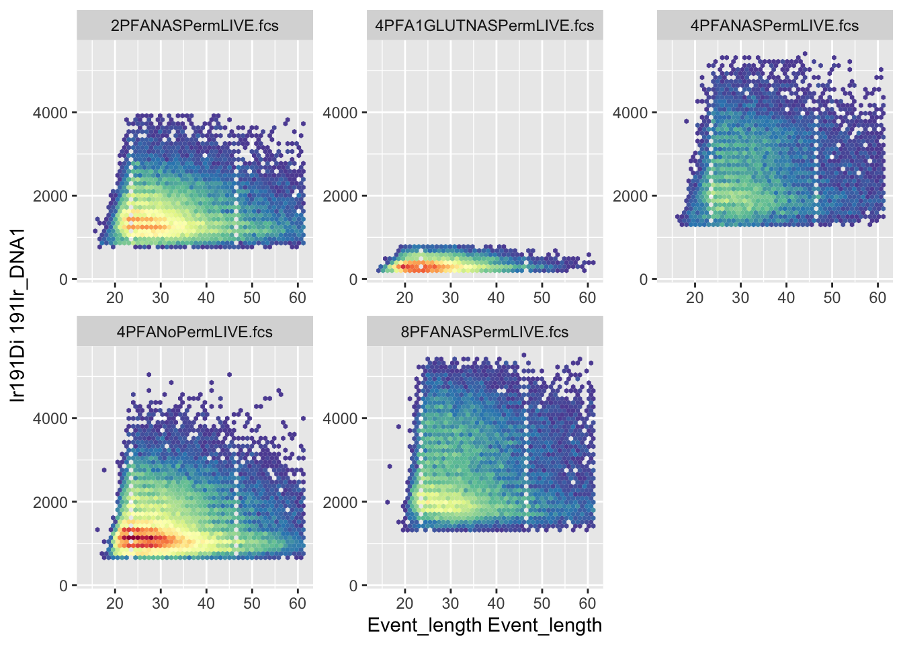
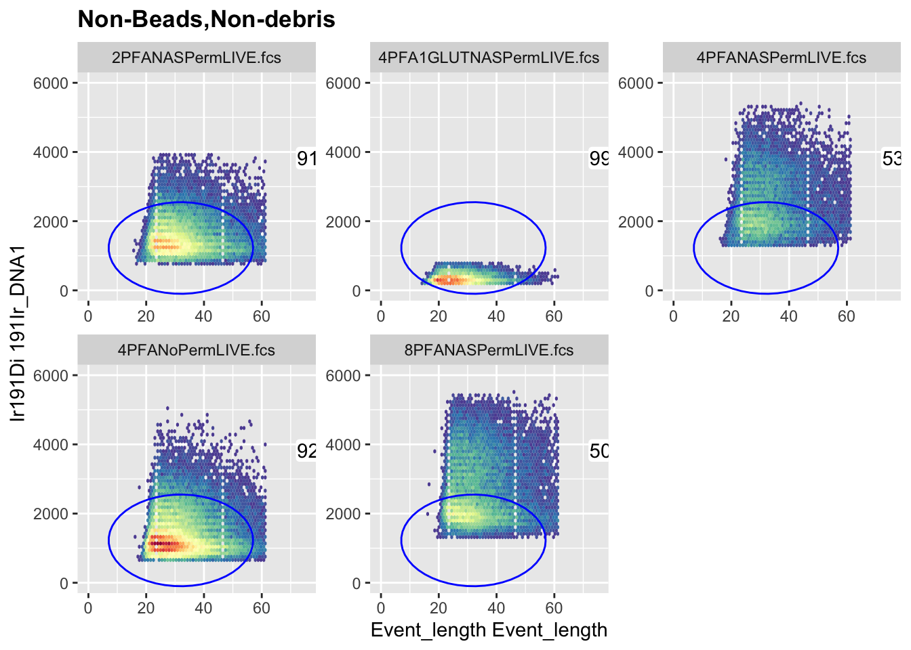

# Chapter 7 - Gating Data

## The Essentials {.essentials}

1. Gate your files to exclude debris, doublets and dead cells with a software package like FlowJo, Cytobank or FCSExpress
2. Export new fcs files that only include the `Live`, `Single` events into a new folder called 'Live Singlets'. Export a new file for every original file - we don't want a concatenated file (yet!). The ungated version of this course's 5 samples, to practice on, is a separate download from the main dataset: [**ACDwR-ungated-data-v1.zip**](https://github.com/Immun0/Analysing-Cytometry-Data-With-R-2026/releases/download/Data/ACDwR-ungated-data-v1.zip) (82 MB). Extract it at your project root and it lands in `Data/ungated/`. If you'd rather skip gating them yourself, the already-gated result is the same data already sitting in `Data/fcs/`, the main dataset every other chapter uses.

<span class="warning">For data analysis, it's essential to remove any confounding or extraneous events. In cytometry we want to get rid of dead cells and doublets. For high parameter analysis this is doubly important. The analysis is computationally taxing.  Removing irrelevant data helps speed up the analysis as well as improving its quality. </span>

<span class="warning">It is much simpler to manual gate in a graphical user interface like FlowJo or  Cytobank than to gate with the R command line. </span>

## A Deeper Dive {.deeper-dive}

Cleaning data is a one of the most important (and time consuming parts) of any data analysis. For flow cytometry data we do this in multiple ways, and often with multiple packages or software. In this analysis we will need to clean the data in 3 different ways
- `Gating` - Removing dead cells, debris and doublets
  - Removes confounding events
  - Makes files smaller
  - ensures we are spending computational power on useful events
- `Channel Administration` - Cleaning channel names and removing extraneous channels
  - Channel name parity so that our code runs smoothly
  - Removing extraneous channels that are not being used so that the analysis focuses on interesting differences between events rather than confounding ones
- `Outlier and Acquisition Artefact Removal`
  - Removing outliers protects our analysis from the effects of extreme values
  - Removing channel data recorded during blockages or other acquisition abberations improves data clarity and homogeneity

For the rest of this chapter we will gate out extraneous events using R, completing step 1 of our Data Cleaning strategy.

<span class="warning"> **I highly recommend you learn to gate and export selected events in FlowJo, Cytobank or FCSExpress** </span>. What follows here is a demonstration of what is possible with R rather than a recommendation of how handle your own data.

First let's load the packages we'll need.

``` r
# I expect you have these installed by now but if not you can install them with the following code;
# install.packages("here") etc. remember, for install.packages() we have to "quote" the package name
library(here)
library(tidyverse)
library(ggcyto)
library(flowCore)
library(flowWorkspace)
```

Next we can load up the data that we require. In the last chapter we imported the FCS files into a FLOWSET.

``` r
FLOWSET <- readRDS(here("Data", "RDS", "FLOWSET.rds"))
```
Now that we have some data to manipulate we can start to gate them the R way. Remember, this will be a little laborious compared to using a graphical user interface software specially designed for the task, like FlowJo or Cytobank.

First we'll set up a Gating Set. This is a collection of gates that we can apply to our data. First we need to give the Gating Set a name and then we can start to add gates to it.

``` r
Gates <- GatingSet(FLOWSET) # A GatingSet is a collection of gates
```

Okay, now we have a Gating Set calles `Gates`, lets look at the structure of the default Gating Set

``` r
gs_get_pop_paths(Gates) # returns the gates in a GatingSet i.e. it tells you which gates are a part of the GatingSet
#> [1] "root"
```

As you can see, without setting any gates we only have the default gate called "root". Note, you cannot change the name of root without causing an error. Several of the commnds in the flowWorkspace package are expecting a "root" gate at the top of the gating tree or hierarchy. If you change the name of the root gate you will get an error.

**Note:** these chunks are safe to actually run yourself, unlike most `eval=FALSE` examples in this book, that's exactly the point of this section, seeing the real error. They use a disposable `Demo_Gates` object instead of the real `Gates`, so running them won't break anything you need later in this chapter. The last line below is supposed to error, that's not a mistake, keep reading after it for why.


``` r
Demo_Gates <- GatingSet(FLOWSET) # a disposable copy, just for this demonstration, so the real Gates object is never touched
gs_pop_set_name(Demo_Gates, "root", "ungated") # We'll change the name of the root node to ungated
gs_get_pop_paths(Demo_Gates) # Check the outcome is as expected
```

Everything looks good. But if we try to use the `Gating Set` with the `root` renamed to `ungated`, lets see what happens. Let's try to add a gate to the hierarchy and then get counts of events in each gate:


``` r
R_demo <- rectangleGate(filterId = "demo_gate", "Ir191Di" = c(1000, 10000), "Ce140Di" = c(0, 10)) # a throwaway gate, just for this demonstration
gs_pop_add(Demo_Gates, R_demo, parent = "ungated")
gs_get_pop_paths(Demo_Gates) # Check the outcome is as expected
gs_pop_get_count_fast(Demo_Gates) # This line is the one that actually errors: flowWorkspace expects a node literally named "root" to exist somewhere in the tree, and renaming it broke that
```

Now let's continue on gating the data for real, with `root` left exactly as it was.

Lets look at the data to understand what we're dealing with. Remember, this is mass cytometry data so we're dealing with a lot of parameters. To get down to single live events we'll need to go through a gating sequence which you're not familiar with so I'll outline it here.
- First, we'll remove the QC beads and debris from the files.
- Then we'll remove doublets
- Finally we'll remove dead cells.

It's a very similar process to conventional or spectral flow cytometry but using slightly different parameters, mainly because we don't have scatter parameters to work with.

First we'll plot the data using autoplot from the `ggcyto` package. I'm going to purposefully make a few mistakes here to demonstrate why the final plotting script has 3 lines of code and multiple options rather than just using the default autoplot function.


``` r
autoplot(FLOWSET, x = "Ir191Di", y = "Ce140Di") # We'll use autoplot() from the ggcyto package to visualise the data. The DNA intercalator Iridium 191 and the QC bead marker Cesium 140 are the parameters we'll use to gate out the QC beads and debris
```


If we just use autoplot, you can see that the data looks all "squished up on the axes. We haven't yet transformed the data using arcsinh, biexponential or similar so the data is compressed onto the axes and it's difficult to see what's going on. We'll deal with transformations in an upcoming chapter so here, I'll use a little hack to transform the visualisation. By adding the `scale_x-flowCore-fasinh()` and `scale_y-flowCore-fasinh()` functions we can transform the axes to make the data more visible (and more like we're used to).


``` r
autoplot(FLOWSET, x = "Ir191Di", y = "Ce140Di") + # We'll use autoplot from the ggcyto package to visualise the data
  scale_y_flowCore_fasinh() + # We'll use the flowCore package to transform the visualisation with hyperbolic arcsin for y
  scale_x_flowCore_fasinh()# We'll use the flowCore package to transform the visualisation with hyperbolic arcsin for x
```


That's better, but the data looks "hexagonal". This is because autoplot bins the data into only 16 or 32 bins by default. All flow data is typically binned but to the amount of channels on the instrument. For 16 and 18bit machines we use today this will be over 250, 000 bins. It can be a useful visualisation to help understand the distribution of the data but it's very different to how we're used to seeing cytoemtry data. We can change this to 128 bins to make the data look more like we're used to.

``` r
autoplot(FLOWSET, x = "Ir191Di", y = "Ce140Di", bins = 128) + # We'll use autoplot from the ggcyto package to visualise the data
  scale_y_flowCore_fasinh() +
  scale_x_flowCore_fasinh()
```


This now looks like a cytometry plot. We have ~4 populations evident in each quadrant of the graph. Upper left is the QC beads identified by 140Ce expression. The upper right is bead-cell doublets that express the bead exclusive marker and the DNA marker 191Ir. The lower left is debris and the lower right is the cells expressing the DNA markers but not the bead marker. Now that we've seen the data and understand the gate required lets get back to our Gating Set and start to remove the confounding datapoints.


``` r
# We'll set up a gate to filter out the QC Beads and debris from the cell populations
# The QC beads are 140Ce positive and the cells are Ir191 and Ir193 Positive
# First we create a rectangular gate, give it a name, choose the parameters and set the co-ordinates of the 4 corners of the gate

R1 <- rectangleGate(filterId="Non-Beads,Non-debris",
"Ir191Di"=c(1000, 10000), "Ce140Di"=c(0, 10))

# Next we set the hierarchy of the gate by choosing the parent gate
if ("/Non-Beads,Non-debris" %in% gs_get_pop_paths(Gates)) gs_pop_remove(Gates, "Non-Beads,Non-debris") # remove any leftover gate from a previous run of this chunk before re-adding
gs_pop_add(Gates, R1, parent = "root")
#> [1] 2
# Next we recompute the gates to make sure the new gate is included in the analysis
gs_pop_get_count_fast(Gates)
#>                        name            Population Parent
#>                      <char>                <char> <char>
#> 1:      2PFANASPermLIVE.fcs /Non-Beads,Non-debris   root
#> 2: 4PFA1GLUTNASPermLIVE.fcs /Non-Beads,Non-debris   root
#> 3:      4PFANASPermLIVE.fcs /Non-Beads,Non-debris   root
#> 4:       4PFANoPermLIVE.fcs /Non-Beads,Non-debris   root
#> 5:      8PFANASPermLIVE.fcs /Non-Beads,Non-debris   root
#>    Count ParentCount
#>    <int>       <int>
#> 1:     0       30825
#> 2:     0       14171
#> 3:     0       15158
#> 4:     0       57521
#> 5:     0       23790

# After that we can get the stats for the gate we've just set up; in this case we'll check the percentages of the cells that are not beads or debris
gs_pop_get_stats(Gates, "Non-Beads,Non-debris", type = "percent")
#>                      sample                  pop percent
#>                      <char>               <char>   <num>
#> 1:      2PFANASPermLIVE.fcs Non-Beads,Non-debris      NA
#> 2: 4PFA1GLUTNASPermLIVE.fcs Non-Beads,Non-debris      NA
#> 3:      4PFANASPermLIVE.fcs Non-Beads,Non-debris      NA
#> 4:       4PFANoPermLIVE.fcs Non-Beads,Non-debris      NA
#> 5:      8PFANASPermLIVE.fcs Non-Beads,Non-debris      NA

# Finally we can check the hierarchy of the gates, recompute them to make sure the hierarchy is up to data....
gs_get_pop_paths(Gates)
#> [1] "root"                  "/Non-Beads,Non-debris"
recompute(Gates)
#> done!

# ... before visualising them
autoplot(FLOWSET, x = "Ir191Di", y = "Ce140Di") +
  scale_y_flowCore_fasinh() +
  scale_x_flowCore_fasinh()
```


``` r

autoplot(Gates, "Non-Beads,Non-debris", bins = 128) +
 scale_y_flowCore_fasinh() +
  scale_x_flowCore_fasinh()
```


As you can see, our gate is placed almost correctly but doesn't encapsulate the lower right population in totality for each sample in our group.

``` r
if ("/Non-Beads,Non-debris" %in% gs_get_pop_paths(Gates)) gs_pop_remove(Gates, "Non-Beads,Non-debris") # remove any leftover gate from a previous run of this chunk before re-adding
R1 <- rectangleGate(filterId="Non-Beads,Non-debris", # Add back the gate with the new parameters
"Ir191Di"=c(100, 20000), "Ce140Di"=c(-10, 10)) # Ce140Di reverted to 10 (the original, never-flagged-as-broken upper bound); real data only goes up to ~13.3, so 100 was excluding nothing

gs_pop_add(Gates, R1, parent = "root")
#> [1] 2
gs_pop_get_count_fast(Gates)
#>                        name            Population Parent
#>                      <char>                <char> <char>
#> 1:      2PFANASPermLIVE.fcs /Non-Beads,Non-debris   root
#> 2: 4PFA1GLUTNASPermLIVE.fcs /Non-Beads,Non-debris   root
#> 3:      4PFANASPermLIVE.fcs /Non-Beads,Non-debris   root
#> 4:       4PFANoPermLIVE.fcs /Non-Beads,Non-debris   root
#> 5:      8PFANASPermLIVE.fcs /Non-Beads,Non-debris   root
#>    Count ParentCount
#>    <int>       <int>
#> 1:     0       30825
#> 2:     0       14171
#> 3:     0       15158
#> 4:     0       57521
#> 5:     0       23790
gs_get_pop_paths(Gates)
#> [1] "root"                  "/Non-Beads,Non-debris"
recompute(Gates)
#> done!

autoplot(Gates, "Non-Beads,Non-debris") +
 scale_y_flowCore_fasinh() +
  scale_x_flowCore_fasinh()
```


``` r

# Once we're happy, we can create a new flowset with just this data in it
NonDebris_FLOWSET <- cytoset_to_flowSet(gs_pop_get_data(Gates, "Non-Beads,Non-debris"))

# Lets look at each of the samples in the new flowset for how many events are in each
gs_pop_get_count_fast(Gates)
#>                        name            Population Parent
#>                      <char>                <char> <char>
#> 1:      2PFANASPermLIVE.fcs /Non-Beads,Non-debris   root
#> 2: 4PFA1GLUTNASPermLIVE.fcs /Non-Beads,Non-debris   root
#> 3:      4PFANASPermLIVE.fcs /Non-Beads,Non-debris   root
#> 4:       4PFANoPermLIVE.fcs /Non-Beads,Non-debris   root
#> 5:      8PFANASPermLIVE.fcs /Non-Beads,Non-debris   root
#>    Count ParentCount
#>    <int>       <int>
#> 1: 30546       30825
#> 2: 13352       14171
#> 3: 14700       15158
#> 4: 57313       57521
#> 5: 23201       23790
```

### Event Length: A Standard First Singlet Check

Before we get to the Gaussian parameters (Width and Residual), there's a more standard first check in mass cytometry: `Event_length` (sometimes called `Cell_length`) against DNA. A single, intact cell passing through the instrument produces a signal of a fairly consistent duration, doublets and debris tend to fall outside that range, too short for debris and fragments, too long for two or more cells stuck together. Plotting it against `Ir191Di` lets us see and gate that population directly.

This is also a good place to properly introduce `ellipsoidGate()`, since polygon gates (corner points you can read off a plot) and ellipse gates (a `mean` and a covariance matrix) work quite differently. An ellipse needs two things: a `mean`, the centre point of the ellipse, one value per axis, and a `.gate` matrix, the covariance matrix that controls the ellipse's size, shape, and tilt. The diagonal values control how wide the ellipse is along each axis, the off-diagonal values control how tilted it is. There's no way to read these off a plot the way you'd read a polygon's corners by eye.

For this first ellipse, we'll set `mean` and `.gate` from the data's own real minimum and maximum, one shared ellipse sized generously against the combined data, not a precise statistical fit. It won't necessarily reach every sample's population, some real samples' populations sit in a genuinely different place than the rest, and no single ellipse can cover both without becoming impractically large, that's a real limitation of gating this way, and it should be stated rather than hidden. We're also plotting this one on a plain linear scale rather than the transformed scale used elsewhere in this chapter: `ellipsoidGate()` defines a true ellipse in raw units, but viewed through a strongly nonlinear transform it stops looking like one, it warps into whatever shape that transform maps it to. On a linear scale, what you see is what the gate actually is. This gate's job is still a rough first trim, not the final singlet/doublet call, that happens properly later in this chapter using the standard Gaussian parameters (`Width`/`Residual`). Later on, the `singlets2` ellipse shows the other option, fitting `mean` and `.gate` statistically with `flowClust`, which works well when the two parameters you're gating on genuinely separate into distinct clusters. Event_length and DNA don't do that for this data, there's no clean two-population split to find on these two axes, so a statistical fit here would be solving a problem that doesn't actually exist rather than helping.


``` r
autoplot(NonDebris_FLOWSET, x = "Event_length", y = "Ir191Di", bins = 48) # Event_length only takes 48 distinct values in this data, 256 bins spread that thin and looked faded
```



``` r

# Damian's exact bounds (2026-08-05), Event_length centre nudged right 10 units per Damian's request.

mean_length <- c("Event_length" = 32, "Ir191Di" = 1225) # Event_length centre shifted right so xmin stays fixed at 7 while xmax rises

shape_length <- matrix(c(625, 0,
                         0, 1755625), ncol = 2, dimnames = list(c("Event_length", "Ir191Di"), c("Event_length", "Ir191Di"))) # Event_length semi-axis 20 -> 25 (25^2 = 625), xmin unchanged at 7, xmax raised 47 -> 57

R_length <- flowCore::ellipsoidGate(filterId = "event_length_singlets", .gate = shape_length, mean = mean_length)

if ("/Non-Beads,Non-debris/event_length_singlets" %in% gs_get_pop_paths(Gates)) gs_pop_remove(Gates, "event_length_singlets") # remove any leftover gate from a previous run of this chunk before re-adding
gs_pop_add(Gates, R_length, parent = "Non-Beads,Non-debris", name = "event_length_singlets")
#> [1] 3
gs_get_pop_paths(Gates)
#> [1] "root"                                       
#> [2] "/Non-Beads,Non-debris"                      
#> [3] "/Non-Beads,Non-debris/event_length_singlets"
recompute(Gates)
#> done!
gs_pop_get_count_fast(Gates)
#>                         name
#>                       <char>
#>  1:      2PFANASPermLIVE.fcs
#>  2:      2PFANASPermLIVE.fcs
#>  3: 4PFA1GLUTNASPermLIVE.fcs
#>  4: 4PFA1GLUTNASPermLIVE.fcs
#>  5:      4PFANASPermLIVE.fcs
#>  6:      4PFANASPermLIVE.fcs
#>  7:       4PFANoPermLIVE.fcs
#>  8:       4PFANoPermLIVE.fcs
#>  9:      8PFANASPermLIVE.fcs
#> 10:      8PFANASPermLIVE.fcs
#>                                      Population
#>                                          <char>
#>  1:                       /Non-Beads,Non-debris
#>  2: /Non-Beads,Non-debris/event_length_singlets
#>  3:                       /Non-Beads,Non-debris
#>  4: /Non-Beads,Non-debris/event_length_singlets
#>  5:                       /Non-Beads,Non-debris
#>  6: /Non-Beads,Non-debris/event_length_singlets
#>  7:                       /Non-Beads,Non-debris
#>  8: /Non-Beads,Non-debris/event_length_singlets
#>  9:                       /Non-Beads,Non-debris
#> 10: /Non-Beads,Non-debris/event_length_singlets
#>                    Parent Count ParentCount
#>                    <char> <int>       <int>
#>  1:                  root 30546       30825
#>  2: /Non-Beads,Non-debris 28068       30546
#>  3:                  root 13352       14171
#>  4: /Non-Beads,Non-debris 13222       13352
#>  5:                  root 14700       15158
#>  6: /Non-Beads,Non-debris  7909       14700
#>  7:                  root 57313       57521
#>  8: /Non-Beads,Non-debris 52918       57313
#>  9:                  root 23201       23790
#> 10: /Non-Beads,Non-debris 11815       23201

ggcyto(Gates, aes(x = "Event_length", y = "Ir191Di"), subset = "Non-Beads,Non-debris") +
  geom_hex(bins = 48) + # matches Event_length's real 48 distinct values, 256 spread the same data too thin
  geom_gate("event_length_singlets", col = "blue", fill = "red") +
  geom_stats(adjust = c(1.5, 1.5), abs = TRUE) +
  coord_cartesian(xlim = c(0, 75), ylim = c(0, 6000)) # zoomed out to comfortably show the full population and the full ellipse on a plain linear scale, nothing clipped, no transform distortion
#> Warning in geom_label(data = stats, label.padding =
#> structure(0.05, unit = 3L, class = c("simpleUnit", :
#> Ignoring unknown parameters: `abs`
```



``` r

EventLengthSinglets_FLOWSET <- cytoset_to_flowSet(gs_pop_get_data(Gates, "event_length_singlets"))
```

Before moving on, here's a preview of `Width` and `Residual`, the parameters the next gate needs, on the real population the `event_length_singlets` gate leaves behind.

Now that we have the first gate set up we can move on to the next gate. This will be a polygon gate to remove the doublets. We'll use the same parameters as the first gate but we'll make the gate a little smaller to remove the doublets.


``` r
# Preview Width and Residual, the parameters the next gate (doublet removal) will actually use, on the real
# population that gate starts from (it's built with parent = event_length_singlets). The event_length_singlets
# gate's own before/after is already shown above, not repeated here.
A1 <- autoplot(FLOWSET, x = "Width", y = "Residual", bins = 128) +
 scale_y_flowCore_fasinh() +
  scale_x_flowCore_fasinh()

A2 <- autoplot(EventLengthSinglets_FLOWSET, x = "Width", y = "Residual", bins = 128) +
 scale_y_flowCore_fasinh() +
  scale_x_flowCore_fasinh()

library(cowplot)
#> 
#> Attaching package: 'cowplot'
#> The following object is masked from 'package:lubridate':
#> 
#>     stamp
plot_grid(as.ggplot(A1), as.ggplot(A2), ncol = 2)
```


The removal of debris and beads helps to clean up the populations. Lets continue by removing some of the doublets.


``` r
#Our next gate will be a polygon gate to remove the doublets. We'll use Width and REsidual, the so-called Gaussian parameters to create
mat <- matrix(c(100,270,1000,1100,120,
                100,920,520,170,45)
, nrow = 5)

# Rename the new matrix with the correct parameter naems for the gate
colnames(mat) <-c("Width", "Residual")

# Create the gate
R2 <- polygonGate(mat)
if ("/Non-Beads,Non-debris/event_length_singlets/singlets1" %in% gs_get_pop_paths(Gates)) gs_pop_remove(Gates, "singlets1") # remove any leftover gate from a previous run before re-adding
gs_pop_add(Gates, R2, parent = "event_length_singlets", name = "singlets1")
#> [1] 4
gs_get_pop_paths(Gates)
#> [1] "root"                                                 
#> [2] "/Non-Beads,Non-debris"                                
#> [3] "/Non-Beads,Non-debris/event_length_singlets"          
#> [4] "/Non-Beads,Non-debris/event_length_singlets/singlets1"
recompute(Gates)
#> done!
gs_pop_get_count_fast(Gates)
#>                         name
#>                       <char>
#>  1:      2PFANASPermLIVE.fcs
#>  2:      2PFANASPermLIVE.fcs
#>  3:      2PFANASPermLIVE.fcs
#>  4: 4PFA1GLUTNASPermLIVE.fcs
#>  5: 4PFA1GLUTNASPermLIVE.fcs
#>  6: 4PFA1GLUTNASPermLIVE.fcs
#>  7:      4PFANASPermLIVE.fcs
#>  8:      4PFANASPermLIVE.fcs
#>  9:      4PFANASPermLIVE.fcs
#> 10:       4PFANoPermLIVE.fcs
#> 11:       4PFANoPermLIVE.fcs
#> 12:       4PFANoPermLIVE.fcs
#> 13:      8PFANASPermLIVE.fcs
#> 14:      8PFANASPermLIVE.fcs
#> 15:      8PFANASPermLIVE.fcs
#>                                                Population
#>                                                    <char>
#>  1:                                 /Non-Beads,Non-debris
#>  2:           /Non-Beads,Non-debris/event_length_singlets
#>  3: /Non-Beads,Non-debris/event_length_singlets/singlets1
#>  4:                                 /Non-Beads,Non-debris
#>  5:           /Non-Beads,Non-debris/event_length_singlets
#>  6: /Non-Beads,Non-debris/event_length_singlets/singlets1
#>  7:                                 /Non-Beads,Non-debris
#>  8:           /Non-Beads,Non-debris/event_length_singlets
#>  9: /Non-Beads,Non-debris/event_length_singlets/singlets1
#> 10:                                 /Non-Beads,Non-debris
#> 11:           /Non-Beads,Non-debris/event_length_singlets
#> 12: /Non-Beads,Non-debris/event_length_singlets/singlets1
#> 13:                                 /Non-Beads,Non-debris
#> 14:           /Non-Beads,Non-debris/event_length_singlets
#> 15: /Non-Beads,Non-debris/event_length_singlets/singlets1
#>                                          Parent Count
#>                                          <char> <int>
#>  1:                                        root 30546
#>  2:                       /Non-Beads,Non-debris 28068
#>  3: /Non-Beads,Non-debris/event_length_singlets  9675
#>  4:                                        root 13352
#>  5:                       /Non-Beads,Non-debris 13222
#>  6: /Non-Beads,Non-debris/event_length_singlets  2819
#>  7:                                        root 14700
#>  8:                       /Non-Beads,Non-debris  7909
#>  9: /Non-Beads,Non-debris/event_length_singlets  2975
#> 10:                                        root 57313
#> 11:                       /Non-Beads,Non-debris 52918
#> 12: /Non-Beads,Non-debris/event_length_singlets 20259
#> 13:                                        root 23201
#> 14:                       /Non-Beads,Non-debris 11815
#> 15: /Non-Beads,Non-debris/event_length_singlets  4221
#>     ParentCount
#>           <int>
#>  1:       30825
#>  2:       30546
#>  3:       28068
#>  4:       14171
#>  5:       13352
#>  6:       13222
#>  7:       15158
#>  8:       14700
#>  9:        7909
#> 10:       57521
#> 11:       57313
#> 12:       52918
#> 13:       23790
#> 14:       23201
#> 15:       11815
# If you are ever unsure of your gating hierarchy you can always "plot()" the gating set to get a diagram
plot(Gates)
```


``` r
# Lets visualise the gat
autoplot(Gates, "singlets1", x = "Width", y = "Residual", bins = 128)+
  scale_y_flowCore_fasinh() +
  scale_x_flowCore_fasinh()
```


``` r
# Gate not quite the right shape so lets try again
gs_pop_remove(Gates, 'singlets1')

# Create matrix of co-ords to sketch in the gate
mat <- matrix(c(20,250,1000,1000,100,
                20,900,500,150,25)
, nrow = 5)

colnames(mat) <-c("Width", "Residual")

R2 <- polygonGate(mat)
if ("/Non-Beads,Non-debris/event_length_singlets/singlets1" %in% gs_get_pop_paths(Gates)) gs_pop_remove(Gates, "singlets1") # remove any leftover gate from a previous run before re-adding
gs_pop_add(Gates, R2, parent = "event_length_singlets", name = "singlets1")
#> [1] 4
gs_get_pop_paths(Gates)
#> [1] "root"                                                 
#> [2] "/Non-Beads,Non-debris"                                
#> [3] "/Non-Beads,Non-debris/event_length_singlets"          
#> [4] "/Non-Beads,Non-debris/event_length_singlets/singlets1"
recompute(Gates)
#> done!
gs_pop_get_count_fast(Gates)
#>                         name
#>                       <char>
#>  1:      2PFANASPermLIVE.fcs
#>  2:      2PFANASPermLIVE.fcs
#>  3:      2PFANASPermLIVE.fcs
#>  4: 4PFA1GLUTNASPermLIVE.fcs
#>  5: 4PFA1GLUTNASPermLIVE.fcs
#>  6: 4PFA1GLUTNASPermLIVE.fcs
#>  7:      4PFANASPermLIVE.fcs
#>  8:      4PFANASPermLIVE.fcs
#>  9:      4PFANASPermLIVE.fcs
#> 10:       4PFANoPermLIVE.fcs
#> 11:       4PFANoPermLIVE.fcs
#> 12:       4PFANoPermLIVE.fcs
#> 13:      8PFANASPermLIVE.fcs
#> 14:      8PFANASPermLIVE.fcs
#> 15:      8PFANASPermLIVE.fcs
#>                                                Population
#>                                                    <char>
#>  1:                                 /Non-Beads,Non-debris
#>  2:           /Non-Beads,Non-debris/event_length_singlets
#>  3: /Non-Beads,Non-debris/event_length_singlets/singlets1
#>  4:                                 /Non-Beads,Non-debris
#>  5:           /Non-Beads,Non-debris/event_length_singlets
#>  6: /Non-Beads,Non-debris/event_length_singlets/singlets1
#>  7:                                 /Non-Beads,Non-debris
#>  8:           /Non-Beads,Non-debris/event_length_singlets
#>  9: /Non-Beads,Non-debris/event_length_singlets/singlets1
#> 10:                                 /Non-Beads,Non-debris
#> 11:           /Non-Beads,Non-debris/event_length_singlets
#> 12: /Non-Beads,Non-debris/event_length_singlets/singlets1
#> 13:                                 /Non-Beads,Non-debris
#> 14:           /Non-Beads,Non-debris/event_length_singlets
#> 15: /Non-Beads,Non-debris/event_length_singlets/singlets1
#>                                          Parent Count
#>                                          <char> <int>
#>  1:                                        root 30546
#>  2:                       /Non-Beads,Non-debris 28068
#>  3: /Non-Beads,Non-debris/event_length_singlets 27873
#>  4:                                        root 13352
#>  5:                       /Non-Beads,Non-debris 13222
#>  6: /Non-Beads,Non-debris/event_length_singlets 12921
#>  7:                                        root 14700
#>  8:                       /Non-Beads,Non-debris  7909
#>  9: /Non-Beads,Non-debris/event_length_singlets  7895
#> 10:                                        root 57313
#> 11:                       /Non-Beads,Non-debris 52918
#> 12: /Non-Beads,Non-debris/event_length_singlets 52800
#> 13:                                        root 23201
#> 14:                       /Non-Beads,Non-debris 11815
#> 15: /Non-Beads,Non-debris/event_length_singlets 11810
#>     ParentCount
#>           <int>
#>  1:       30825
#>  2:       30546
#>  3:       28068
#>  4:       14171
#>  5:       13352
#>  6:       13222
#>  7:       15158
#>  8:       14700
#>  9:        7909
#> 10:       57521
#> 11:       57313
#> 12:       52918
#> 13:       23790
#> 14:       23201
#> 15:       11815
plot(Gates)
```


``` r
autoplot(Gates, "singlets1", x = "Width", y = "Residual", bins = 128)+
   scale_y_flowCore_fasinh() +
  scale_x_flowCore_fasinh()
```


### Oval (Ellipse) Gates

Polygon gates, like the ones above, are defined by a list of corner points, straightforward to read off a plot. Ellipse gates work differently, and it's not obvious at first what the numbers actually mean.

An `ellipsoidGate()` needs two things: a `mean`, the centre point of the ellipse (one value per axis), and a `.gate` matrix, the ellipse's covariance matrix, which controls its size, shape, and tilt. A covariance matrix isn't something you can read off a plot the way you'd read a polygon's corners, the diagonal values control how wide the ellipse is along each axis, and the off-diagonal values control how tilted it is. There's no shortcut to picking these by eye, in practice this usually means trial and error: draw the gate, plot it over your data, adjust the numbers, repeat.


``` r
library(ggcyto)
library(flowCore)

# Next singlet gate
autoplot(NonDebris_FLOWSET, x = "Ir191Di", y = "Ir193Di", bins = 256) +
  scale_y_flowCore_fasinh() +
  scale_x_flowCore_fasinh()
```


``` r

shape <- matrix(c(2045156,	3265186,
3265186,	5815469), ncol = 2, dimnames = list(c("Ir191Di", "Ir193Di"), c("Ir191Di", "Ir193Di"))) # whole original matrix scaled by 0.25 (each semi-axis halved: variance x0.25, covariance x0.25) so the shape and rotation are identical to before, just smaller, centre unchanged
mean <- c("Ir191Di"= 1570, "Ir193Di"=2500) # Ir191Di reverted back to 1570, Ir193Di down 500 (3000 -> 2500) per Damian, shape untouched

R3 <- flowCore::ellipsoidGate(filterId="singlets2",
.gate = shape, mean = mean)

if ("/Non-Beads,Non-debris/event_length_singlets/singlets1/singlets2" %in% gs_get_pop_paths(Gates)) gs_pop_remove(Gates, "singlets2") # remove any leftover gate from a previous run before re-adding
gs_pop_add(Gates, R3, parent = "singlets1", name = "singlets2")
#> [1] 5
gs_get_pop_paths(Gates)
#> [1] "root"                                                           
#> [2] "/Non-Beads,Non-debris"                                          
#> [3] "/Non-Beads,Non-debris/event_length_singlets"                    
#> [4] "/Non-Beads,Non-debris/event_length_singlets/singlets1"          
#> [5] "/Non-Beads,Non-debris/event_length_singlets/singlets1/singlets2"
recompute(Gates)
#> done!
gs_pop_get_count_fast(Gates)
#>                         name
#>                       <char>
#>  1:      2PFANASPermLIVE.fcs
#>  2:      2PFANASPermLIVE.fcs
#>  3:      2PFANASPermLIVE.fcs
#>  4:      2PFANASPermLIVE.fcs
#>  5: 4PFA1GLUTNASPermLIVE.fcs
#>  6: 4PFA1GLUTNASPermLIVE.fcs
#>  7: 4PFA1GLUTNASPermLIVE.fcs
#>  8: 4PFA1GLUTNASPermLIVE.fcs
#>  9:      4PFANASPermLIVE.fcs
#> 10:      4PFANASPermLIVE.fcs
#> 11:      4PFANASPermLIVE.fcs
#> 12:      4PFANASPermLIVE.fcs
#> 13:       4PFANoPermLIVE.fcs
#> 14:       4PFANoPermLIVE.fcs
#> 15:       4PFANoPermLIVE.fcs
#> 16:       4PFANoPermLIVE.fcs
#> 17:      8PFANASPermLIVE.fcs
#> 18:      8PFANASPermLIVE.fcs
#> 19:      8PFANASPermLIVE.fcs
#> 20:      8PFANASPermLIVE.fcs
#>                         name
#>                       <char>
#>                                                          Population
#>                                                              <char>
#>  1:                                           /Non-Beads,Non-debris
#>  2:                     /Non-Beads,Non-debris/event_length_singlets
#>  3:           /Non-Beads,Non-debris/event_length_singlets/singlets1
#>  4: /Non-Beads,Non-debris/event_length_singlets/singlets1/singlets2
#>  5:                                           /Non-Beads,Non-debris
#>  6:                     /Non-Beads,Non-debris/event_length_singlets
#>  7:           /Non-Beads,Non-debris/event_length_singlets/singlets1
#>  8: /Non-Beads,Non-debris/event_length_singlets/singlets1/singlets2
#>  9:                                           /Non-Beads,Non-debris
#> 10:                     /Non-Beads,Non-debris/event_length_singlets
#> 11:           /Non-Beads,Non-debris/event_length_singlets/singlets1
#> 12: /Non-Beads,Non-debris/event_length_singlets/singlets1/singlets2
#> 13:                                           /Non-Beads,Non-debris
#> 14:                     /Non-Beads,Non-debris/event_length_singlets
#> 15:           /Non-Beads,Non-debris/event_length_singlets/singlets1
#> 16: /Non-Beads,Non-debris/event_length_singlets/singlets1/singlets2
#> 17:                                           /Non-Beads,Non-debris
#> 18:                     /Non-Beads,Non-debris/event_length_singlets
#> 19:           /Non-Beads,Non-debris/event_length_singlets/singlets1
#> 20: /Non-Beads,Non-debris/event_length_singlets/singlets1/singlets2
#>                                                          Population
#>                                                              <char>
#>                                                    Parent
#>                                                    <char>
#>  1:                                                  root
#>  2:                                 /Non-Beads,Non-debris
#>  3:           /Non-Beads,Non-debris/event_length_singlets
#>  4: /Non-Beads,Non-debris/event_length_singlets/singlets1
#>  5:                                                  root
#>  6:                                 /Non-Beads,Non-debris
#>  7:           /Non-Beads,Non-debris/event_length_singlets
#>  8: /Non-Beads,Non-debris/event_length_singlets/singlets1
#>  9:                                                  root
#> 10:                                 /Non-Beads,Non-debris
#> 11:           /Non-Beads,Non-debris/event_length_singlets
#> 12: /Non-Beads,Non-debris/event_length_singlets/singlets1
#> 13:                                                  root
#> 14:                                 /Non-Beads,Non-debris
#> 15:           /Non-Beads,Non-debris/event_length_singlets
#> 16: /Non-Beads,Non-debris/event_length_singlets/singlets1
#> 17:                                                  root
#> 18:                                 /Non-Beads,Non-debris
#> 19:           /Non-Beads,Non-debris/event_length_singlets
#> 20: /Non-Beads,Non-debris/event_length_singlets/singlets1
#>                                                    Parent
#>                                                    <char>
#>     Count ParentCount
#>     <int>       <int>
#>  1: 30546       30825
#>  2: 28068       30546
#>  3: 27873       28068
#>  4: 27823       27873
#>  5: 13352       14171
#>  6: 13222       13352
#>  7: 12921       13222
#>  8: 12917       12921
#>  9: 14700       15158
#> 10:  7909       14700
#> 11:  7895        7909
#> 12:  7810        7895
#> 13: 57313       57521
#> 14: 52918       57313
#> 15: 52800       52918
#> 16: 52748       52800
#> 17: 23201       23790
#> 18: 11815       23201
#> 19: 11810       11815
#> 20: 11723       11810
#>     Count ParentCount
#>     <int>       <int>

ggcyto(Gates, aes("191", "193"), subset = "singlets1") +
  geom_hex(bins = 256) +
  geom_gate("singlets2", col = "blue", fill = "red") +
  geom_stats(adjust = c(1.5, 1.5), abs = TRUE) +
  coord_cartesian(xlim = c(0, 8000), ylim = c(0, 12000)) # linear scale, wide view: log10 was warping this tilted ellipse into two near-straight lines instead of a closed oval, same issue as the event_length ellipse
```


``` r

Singlets2_FLOWSET <- gs_pop_get_data(Gates, "singlets2")
```

### A Better Way: Fitting the Ellipse Statistically

Trial and error works, but it isn't the only option. The `flowClust` package fits a statistical cluster model to your events and returns a mean and covariance matrix as the actual output of that fit, the exact two things `ellipsoidGate()` needs, rather than numbers you adjust by hand:


``` r
if(!require(flowClust)) BiocManager::install("flowClust")
library(flowClust)

NonDebris_frame2 <- as(NonDebris_FLOWSET, "flowFrame")
raw_vals2 <- exprs(NonDebris_frame2)[, c("Ir191Di", "Ir193Di")]
centers_fit <- colMeans(raw_vals2)
scales_fit <- apply(raw_vals2, 2, sd) # standardise before fitting, same reasoning as the event-length ellipse above

Scaled_frame2 <- NonDebris_frame2
exprs(Scaled_frame2)[, c("Ir191Di", "Ir193Di")] <- scale(raw_vals2, center = centers_fit, scale = scales_fit)

fit <- flowClust(Scaled_frame2, varNames = c("Ir191Di", "Ir193Di"), K = 1, trans = 0)

mean_fit <- fit@mu[1, ] * scales_fit + centers_fit
names(mean_fit) <- c("Ir191Di", "Ir193Di")

S_fit <- diag(scales_fit)
shape_fit <- S_fit %*% fit@sigma[1, , ] %*% S_fit
dimnames(shape_fit) <- list(c("Ir191Di", "Ir193Di"), c("Ir191Di", "Ir193Di"))

R3_fit <- flowCore::ellipsoidGate(filterId = "singlets2", .gate = shape_fit, mean = mean_fit, distance = qchisq(0.95, df = 2))
```

`K = 1` tells `flowClust` to fit a single cluster (one ellipse) to the data you feed it, here the debris/doublet-excluded population from the previous gate. The resulting `mean_fit` and `shape_fit` describe an ellipse actually estimated from your data's real spread, rather than one you dialled in by eye.

**Note:** this hasn't been run against real data as part of writing this course, `flowClust`'s exact behaviour and argument names should be checked against its documentation and tested on your own files before relying on it.

Viability is plotted against Time rather than against DNA here for two reasons. Practically, Time gives a simple rectangle to draw, a straightforward low-viability cutoff across the whole run, rather than a polygon or ellipse shape you'd need if plotting viability against DNA directly. More importantly, it also works as a diagnostic: if viability drifts or spikes at particular points in the run rather than sitting flat across Time, that's exactly the kind of acquisition instability Chapter 9's `flowCut` is built to catch.


``` r
autoplot(FLOWSET, x = "Time", y = "Pt195Di", bins = 128) +
  scale_y_logicle()
```


``` r

# Create gate 4 on Live cells
R4 <- rectangleGate(filterId="Non-Beads,Non-debris",
"Time"=c(0, 1500000), "Pt195Di"=c(0, 1000))

if ("/Non-Beads,Non-debris/event_length_singlets/singlets1/singlets2/LIVE" %in% gs_get_pop_paths(Gates)) gs_pop_remove(Gates, "LIVE") # remove any leftover gate from a previous run before re-adding
gs_pop_add(Gates, R4, parent = "singlets2", name = "LIVE")
#> [1] 6
gs_get_pop_paths(Gates)
#> [1] "root"                                                                
#> [2] "/Non-Beads,Non-debris"                                               
#> [3] "/Non-Beads,Non-debris/event_length_singlets"                         
#> [4] "/Non-Beads,Non-debris/event_length_singlets/singlets1"               
#> [5] "/Non-Beads,Non-debris/event_length_singlets/singlets1/singlets2"     
#> [6] "/Non-Beads,Non-debris/event_length_singlets/singlets1/singlets2/LIVE"
recompute(Gates)
#> done!
gs_pop_get_count_fast(Gates)
#>                         name
#>                       <char>
#>  1:      2PFANASPermLIVE.fcs
#>  2:      2PFANASPermLIVE.fcs
#>  3:      2PFANASPermLIVE.fcs
#>  4:      2PFANASPermLIVE.fcs
#>  5:      2PFANASPermLIVE.fcs
#>  6: 4PFA1GLUTNASPermLIVE.fcs
#>  7: 4PFA1GLUTNASPermLIVE.fcs
#>  8: 4PFA1GLUTNASPermLIVE.fcs
#>  9: 4PFA1GLUTNASPermLIVE.fcs
#> 10: 4PFA1GLUTNASPermLIVE.fcs
#> 11:      4PFANASPermLIVE.fcs
#> 12:      4PFANASPermLIVE.fcs
#> 13:      4PFANASPermLIVE.fcs
#> 14:      4PFANASPermLIVE.fcs
#> 15:      4PFANASPermLIVE.fcs
#> 16:       4PFANoPermLIVE.fcs
#> 17:       4PFANoPermLIVE.fcs
#> 18:       4PFANoPermLIVE.fcs
#> 19:       4PFANoPermLIVE.fcs
#> 20:       4PFANoPermLIVE.fcs
#> 21:      8PFANASPermLIVE.fcs
#> 22:      8PFANASPermLIVE.fcs
#> 23:      8PFANASPermLIVE.fcs
#> 24:      8PFANASPermLIVE.fcs
#> 25:      8PFANASPermLIVE.fcs
#>                         name
#>                       <char>
#>                                                               Population
#>                                                                   <char>
#>  1:                                                /Non-Beads,Non-debris
#>  2:                          /Non-Beads,Non-debris/event_length_singlets
#>  3:                /Non-Beads,Non-debris/event_length_singlets/singlets1
#>  4:      /Non-Beads,Non-debris/event_length_singlets/singlets1/singlets2
#>  5: /Non-Beads,Non-debris/event_length_singlets/singlets1/singlets2/LIVE
#>  6:                                                /Non-Beads,Non-debris
#>  7:                          /Non-Beads,Non-debris/event_length_singlets
#>  8:                /Non-Beads,Non-debris/event_length_singlets/singlets1
#>  9:      /Non-Beads,Non-debris/event_length_singlets/singlets1/singlets2
#> 10: /Non-Beads,Non-debris/event_length_singlets/singlets1/singlets2/LIVE
#> 11:                                                /Non-Beads,Non-debris
#> 12:                          /Non-Beads,Non-debris/event_length_singlets
#> 13:                /Non-Beads,Non-debris/event_length_singlets/singlets1
#> 14:      /Non-Beads,Non-debris/event_length_singlets/singlets1/singlets2
#> 15: /Non-Beads,Non-debris/event_length_singlets/singlets1/singlets2/LIVE
#> 16:                                                /Non-Beads,Non-debris
#> 17:                          /Non-Beads,Non-debris/event_length_singlets
#> 18:                /Non-Beads,Non-debris/event_length_singlets/singlets1
#> 19:      /Non-Beads,Non-debris/event_length_singlets/singlets1/singlets2
#> 20: /Non-Beads,Non-debris/event_length_singlets/singlets1/singlets2/LIVE
#> 21:                                                /Non-Beads,Non-debris
#> 22:                          /Non-Beads,Non-debris/event_length_singlets
#> 23:                /Non-Beads,Non-debris/event_length_singlets/singlets1
#> 24:      /Non-Beads,Non-debris/event_length_singlets/singlets1/singlets2
#> 25: /Non-Beads,Non-debris/event_length_singlets/singlets1/singlets2/LIVE
#>                                                               Population
#>                                                                   <char>
#>                                                              Parent
#>                                                              <char>
#>  1:                                                            root
#>  2:                                           /Non-Beads,Non-debris
#>  3:                     /Non-Beads,Non-debris/event_length_singlets
#>  4:           /Non-Beads,Non-debris/event_length_singlets/singlets1
#>  5: /Non-Beads,Non-debris/event_length_singlets/singlets1/singlets2
#>  6:                                                            root
#>  7:                                           /Non-Beads,Non-debris
#>  8:                     /Non-Beads,Non-debris/event_length_singlets
#>  9:           /Non-Beads,Non-debris/event_length_singlets/singlets1
#> 10: /Non-Beads,Non-debris/event_length_singlets/singlets1/singlets2
#> 11:                                                            root
#> 12:                                           /Non-Beads,Non-debris
#> 13:                     /Non-Beads,Non-debris/event_length_singlets
#> 14:           /Non-Beads,Non-debris/event_length_singlets/singlets1
#> 15: /Non-Beads,Non-debris/event_length_singlets/singlets1/singlets2
#> 16:                                                            root
#> 17:                                           /Non-Beads,Non-debris
#> 18:                     /Non-Beads,Non-debris/event_length_singlets
#> 19:           /Non-Beads,Non-debris/event_length_singlets/singlets1
#> 20: /Non-Beads,Non-debris/event_length_singlets/singlets1/singlets2
#> 21:                                                            root
#> 22:                                           /Non-Beads,Non-debris
#> 23:                     /Non-Beads,Non-debris/event_length_singlets
#> 24:           /Non-Beads,Non-debris/event_length_singlets/singlets1
#> 25: /Non-Beads,Non-debris/event_length_singlets/singlets1/singlets2
#>                                                              Parent
#>                                                              <char>
#>     Count ParentCount
#>     <int>       <int>
#>  1: 30546       30825
#>  2: 28068       30546
#>  3: 27873       28068
#>  4: 27823       27873
#>  5: 27823       27823
#>  6: 13352       14171
#>  7: 13222       13352
#>  8: 12921       13222
#>  9: 12917       12921
#> 10: 11688       12917
#> 11: 14700       15158
#> 12:  7909       14700
#> 13:  7895        7909
#> 14:  7810        7895
#> 15:  7810        7810
#> 16: 57313       57521
#> 17: 52918       57313
#> 18: 52800       52918
#> 19: 52748       52800
#> 20: 52748       52748
#> 21: 23201       23790
#> 22: 11815       23201
#> 23: 11810       11815
#> 24: 11723       11810
#> 25: 11098       11723
#>     Count ParentCount
#>     <int>       <int>

autoplot(Gates, "LIVE", bins = 128) +
  scale_y_logicle()
```


``` r

# Lets grab the data for the gated events; flowworkspace uses the cytoset rather than the flowSet...
LIVE_SINGLET_FLOWSET <- gs_pop_get_data(Gates, "LIVE")
# ... so we'll convert it to a flowSet ready to use for our downstream analyses
LIVE_SINGLET_FLOWSET <- cytoset_to_flowSet(LIVE_SINGLET_FLOWSET)

# Finally lets save the LIVE_SINGLET_FLOWSET to the RDS folder so that we can use it in the next chapters
saveRDS(LIVE_SINGLET_FLOWSET, here("Data","RDS", "LIVE_SINGLET_FLOWSET.rds"))
```

### Choosing the Time Cutoff

The upper Time bound in the Live gate above (`1500000`) isn't a universal constant. CyTOF runs vary a lot in length, some samples take 10 minutes to acquire, others take 30, so this number has to fit the actual length of your own run, not be copied from someone else's.

Setting it wrong in either direction costs you real data. Too short, and you clip off live events that were acquired perfectly well near the end of a longer run, cells you'd otherwise keep. Too long, and you drag in whatever happened after the sample actually finished, instrument idle time, a clog, anything that shows up as a spike or flatline past the real endpoint, exactly the kind of thing that should be excluded, not kept.


``` r
# A cutoff set at roughly half the true run length would silently discard the back half of every sample's live events
R4_too_short <- rectangleGate(filterId = "Live_TooShort", "Time" = c(0, 750000), "Pt195Di" = c(0, 1000))
```


``` r
# A cutoff set well past where acquisition actually stopped would keep in whatever came after real cell data ended
R4_too_long <- rectangleGate(filterId = "Live_TooLong", "Time" = c(0, 3000000), "Pt195Di" = c(0, 1000))
```

There's no shortcut around this: look at your own Time-versus-viability plot for each run, and set the bound to where that specific sample's acquisition actually ends, not a number carried over from a different dataset.

Now that we have completed the gating we can create a table to show how each gate has affected the samples: how many cells are in each gate, and how many have been removed at each step. Compare the numbers across your own samples once you run this, different fixation conditions can affect how many events survive gating.

``` r
# Now we can create a table of the gating hierarchy, showing how many cells
ALL_cell_numbers <- fsApply(FLOWSET, nrow)
NonDebris_cell_numbers <- fsApply(NonDebris_FLOWSET, nrow)
Singlets_cell_numbers <- fsApply(Singlets2_FLOWSET, nrow)
LSF_cell_numbers <- fsApply(LIVE_SINGLET_FLOWSET, nrow)

# Combine all of these into a data frame
Gating_table <- data.frame(ALL = ALL_cell_numbers, ND = NonDebris_cell_numbers, Singlets = Singlets_cell_numbers, LIVE_SINGLET = LSF_cell_numbers)

Gating_table
#>                            ALL    ND Singlets LIVE_SINGLET
#> 2PFANASPermLIVE.fcs      30825 30546    27823        27823
#> 4PFA1GLUTNASPermLIVE.fcs 14171 13352    12917        11688
#> 4PFANASPermLIVE.fcs      15158 14700     7810         7810
#> 4PFANoPermLIVE.fcs       57521 57313    52748        52748
#> 8PFANASPermLIVE.fcs      23790 23201    11723        11098
```

This table reveals how much data was lost to doublets and debris at each step.

Finally we need to save the LIVE_SINGLET_FLOWSET to the RDS folder so that we can use it in the next chapters.

``` r
saveRDS(LIVE_SINGLET_FLOWSET, here("Data","RDS", "LIVE_SINGLET_FLOWSET.rds"))
```

Additionally, it might be useful to save the flowSet into individual fcs fiels again so that we can use them in other software or analyses.

``` r
dir.create(here("Data","fcs", "3_fcs-files_Live Singlets_R-Gated"), recursive = TRUE, showWarnings = FALSE)

write.flowSet(LIVE_SINGLET_FLOWSET, here("Data","fcs", "3_fcs-files_Live Singlets_R-Gated"))
#> [1] "/Volumes/T31/CLAUDE/Analysing-Cytometry-Data-With-R/Data/fcs/3_fcs-files_Live Singlets_R-Gated"
```

<span class="warning">For data analysis it's essential to remove any confounding or extraneous events. In cytometry this means getting rid of dead cells and doublets. For high parameter analysis this is doubly important. The analysis is computationally taxing so removing irrelevant data helps speed up the analysis as well as improving its quality. </span>

<span class="warning">It is much simpler to manual gate in a graphical user interface like FlowJo or  Cytobank than to gate with the R command line. So go do that rather than trying to brute force the gates through with co-ordinates. I would only use this method if there was no other option or I knew the gates were good for thousands of samples</span>
