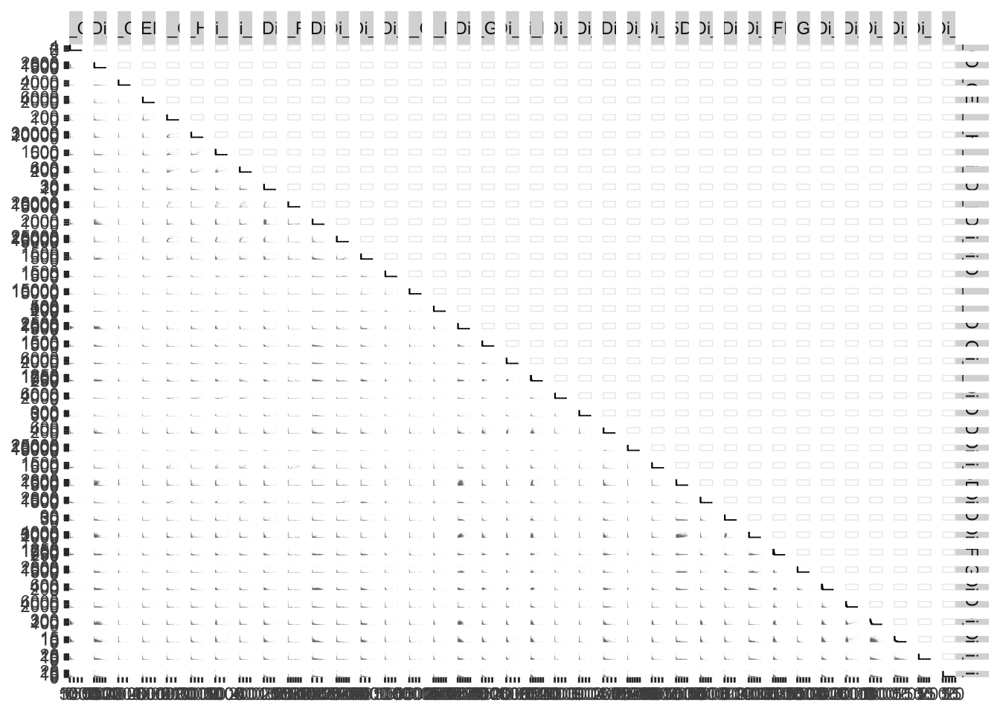

# Chapter 8 - Cleaning Channel Names with Premessa

## What You'll Learn

Every downstream chapter assumes every file uses exactly the same channel names, no typos, no variants. This chapter uses the `premessa` package to check and standardise channel names across your FCS files, then loads the result back into R and saves it as an RDS file so later chapters can pick it up directly.

## The Essentials {.essentials}

### Step 1: Load Required Packages


``` r
library(flowCore)
library(here)
#> Warning in readLines(f, n): line 1 appears to contain an
#> embedded nul
#> here() starts at /Volumes/T31/CLAUDE/Analysing-Cytometry-Data-With-R
if(!require(premessa)) devtools::install_github("ParkerICI/premessa")
#> Loading required package: premessa
```

### Step 2: Run premessa's Channel-Renaming Tool

Run this from RStudio. `premessa` includes an interactive tool, it opens in your web browser rather than running as a normal function call:


``` r
premessa::paneleditor_GUI()
```

Once it opens:

a) A file browser opens. Navigate into `Data/fcs` and select any one of the `.fcs` files inside it. You can't pick the folder itself, premessa asks for a file, then loads every FCS file sitting alongside it in that same folder. Which one you click doesn't matter, they all lead to the same place.
b) The browser window shows every channel across all your files, highlighting any that differ.
c) Check the channel names match; where they don't, choose which name should be used.
d) Tick the Remove box for every channel you don't need. For this course's data that means removing 22 of them, leaving 39. The next section lists exactly which, and why.
e) Enter a new folder name for the cleaned files. This tutorial uses `pruned`.

Closing the browser window writes the cleaned FCS files to `Data/fcs/pruned/`, it does not modify your original files.

### Which Channels to Remove, and Why

Twenty-two channels are removed at this step, leaving thirty-nine: `Time`, `Event_length`, and thirty-seven markers. The panel sheet in `Data/other/` is the definitive list of what should survive, and Step 8 later checks the two match exactly, so if you remove the wrong set you'll find out then.

**Channels whose job is already finished.** `Pt195Di` (Live-Dead) goes because Chapter 7's gating already removed the dead cells, so the viability measurement has served its purpose and carries nothing into the analysis that follows. The same reasoning covers `Ce140Di`, the EQ4 bead channel the bead gate ran on, `Ir191Di` and `Ir193Di`, the DNA channels behind the debris and singlet gates, and the four Gaussian discrimination parameters `Center`, `Offset`, `Width` and `Residual`, of which `Width` and `Residual` drew the doublet gate.

**Debarcoding channels.** `Pd102Di`, `Pd104Di`, `Pd105Di`, `Pd106Di`, `Pd108Di` and `Pd110Di` carried the palladium barcodes that separated multiplexed samples back into one file each. As Chapter 5 explains, that happened before the data ever reached you, so these have nothing left to contribute.

**Environmental and background channels.** `Ba138Di`, `Cs133Di`, `Xe131Di`, `Sn120Di`, `Pb208Di`, `BCKG190Di` and `Bi209Di` monitor instrument background and contamination. They measure the machine, not the cells.

**Unused.** `Rh103Di` is labelled unused in the panel itself.

**What stays, besides the markers.** `Time` has to stay, because Chapter 9's cleaning tools work along the Time axis to find acquisition anomalies, and removing it here would break that chapter. `Event_length` stays as well; both appear in the panel sheet with `marker_class` set to `none`, marking them as real channels that aren't measuring a marker.

**Nothing seems to happen?** Your R console will show as busy while the tool is running, that's normal, it's a live Shiny app, not a function that returns instantly. Check for a new browser tab: some browsers open it in the background rather than switching to it automatically. If no tab appears within a few seconds, check your default browser is set correctly, or try running the command again after closing other browser windows.

### Step 3: Verify the Pruned Files


``` r
here::here() # check we're in the right folder
#> [1] "/Volumes/T31/CLAUDE/Analysing-Cytometry-Data-With-R"
list.files(here::here("Data", "fcs", "pruned")) # list cleaned fcs files
#> [1] "2PFANASPermLIVE.fcs"      "4PFA1GLUTNASPermLIVE.fcs"
#> [3] "4PFANASPermLIVE.fcs"      "4PFANoPermLIVE.fcs"      
#> [5] "8PFANASPermLIVE.fcs"
list.files(here::here("Data", "other")) # list any peripheral/supporting files
#> [1] "ACDwR_metadata.xlsx" "ACDwR_panel.csv"
```

### Step 4: Load the Cleaned Files Back into R


``` r
RENAMED_FLOWSET <- read.flowSet(path = here::here("Data", "fcs", "pruned"), pattern = "\\.fcs$")
```

### Step 5: Save Your Work


``` r
saveRDS(RENAMED_FLOWSET, here::here("Data", "RDS", "RENAMED_FLOWSET.rds"))
```

`saveRDS()` doesn't print anything when it works, so check the file exists instead:


``` r
file.exists(here::here("Data", "RDS", "RENAMED_FLOWSET.rds"))
#> [1] TRUE
```

**Success looks like this:**
```
[1] TRUE
```

### Step 6: Give Samples Readable Names

`read.flowSet()` names each sample after its raw acquisition filename. Real filenames are often long and unwieldy, and even here, giving samples short, meaningful names makes every later table and plot easier to read. The metadata sheet introduced in Chapter 4 has exactly what you need, a `sample_id` column matching each file to a readable label:


``` r
library(readxl)
metadata <- read_xlsx(here::here("Data", "other", "ACDwR_metadata.xlsx"))
metadata
#> # A tibble: 5 × 4
#>   file_name                sample_id    condition patient_id
#>   <chr>                    <chr>        <chr>     <chr>     
#> 1 2PFANASPermLIVE.fcs      2%PFA - NAS… 2%PFA+NAS 025       
#> 2 4PFA1GLUTNASPermLIVE.fcs PFA+GLUT-NA… 4%PFA+1%… 025       
#> 3 4PFANASPermLIVE.fcs      4%PFA - NAS… 4%PFA+NAS 025       
#> 4 4PFANoPermLIVE.fcs       4%PFA - NO … 4%_PFA    025       
#> 5 8PFANASPermLIVE.fcs      8%PFA - NAS… 8%PFA+NAS 025
```


``` r
sampleNames(RENAMED_FLOWSET) # check the current order
#> [1] "2PFANASPermLIVE.fcs"      "4PFA1GLUTNASPermLIVE.fcs"
#> [3] "4PFANASPermLIVE.fcs"      "4PFANoPermLIVE.fcs"      
#> [5] "8PFANASPermLIVE.fcs"
metadata$file_name # confirm this lists the same files in the same order as above
#> [1] "2PFANASPermLIVE.fcs"      "4PFA1GLUTNASPermLIVE.fcs"
#> [3] "4PFANASPermLIVE.fcs"      "4PFANoPermLIVE.fcs"      
#> [5] "8PFANASPermLIVE.fcs"

sampleNames(RENAMED_FLOWSET) <- metadata$sample_id
sampleNames(RENAMED_FLOWSET)
#> [1] "2%PFA - NAS PERM"  "PFA+GLUT-NAS PERM"
#> [3] "4%PFA - NAS PERM"  "4%PFA - NO PERM"  
#> [5] "8%PFA - NAS PERM"
saveRDS(RENAMED_FLOWSET, here::here("Data", "RDS", "RENAMED_FLOWSET.rds"))
```

**Important:** `sampleNames()<-` assigns by position, not by matching filenames. If `sampleNames(RENAMED_FLOWSET)` and `metadata$file_name` aren't already in the same order, reorder `metadata` to match before assigning, otherwise you'll silently mislabel samples.

### Step 7: Reorder the Samples

`read.flowSet()` also reads files in alphabetical order, which won't necessarily match a sensible display order. Plotting these five conditions alphabetically would jumble what's actually a dose/treatment progression, so you'll usually want to reorder into a more logical sequence, letting autoplot's facets read in a sensible order rather than alphabetically. Use the `[,]` notation with the index order you want:


``` r
RENAMED_FLOWSET <- readRDS(here::here("Data", "RDS", "RENAMED_FLOWSET.rds"))
sampleNames(RENAMED_FLOWSET)
#> [1] "2%PFA - NAS PERM"  "PFA+GLUT-NAS PERM"
#> [3] "4%PFA - NAS PERM"  "4%PFA - NO PERM"  
#> [5] "8%PFA - NAS PERM"

Reordered_RENAMED_FLOWSET <- RENAMED_FLOWSET[c(1, 3, 5, 2, 4)] # example order, replace with whatever order makes sense for your own data
sampleNames(Reordered_RENAMED_FLOWSET)
#> [1] "2%PFA - NAS PERM"  "4%PFA - NAS PERM" 
#> [3] "8%PFA - NAS PERM"  "PFA+GLUT-NAS PERM"
#> [5] "4%PFA - NO PERM"

pData(Reordered_RENAMED_FLOWSET)$name <- sampleNames(Reordered_RENAMED_FLOWSET) # ggcyto uses pData()$name for graph labels, so we update it to match

saveRDS(Reordered_RENAMED_FLOWSET, file = here::here("Data", "RDS", "Reordered_RENAMED_FLOWSET.rds"))
```

### Step 8: Rename Channels to Include Marker Names

Right now your channels are still named after their raw metal-isotope detector, like `Y89Di`. That tells you nothing about what was actually measured. The panel sheet you saw introduced in Chapter 4 fixes this, it maps each channel to the antibody it carried.


``` r
panel <- read.csv(here::here("Data", "other", "ACDwR_panel.csv"))
head(panel)
#>    fcs_colname      antigen marker_class
#> 1         Time         Time         none
#> 2 Event_length Event_length         none
#> 3        Y89Di       CD41           type
#> 4       I127Di          IdU        state
#> 5      Pr141Di      CD235ab         type
#> 6      Nd142Di     EMP-MAEA         type
```

Combine the channel name and the antigen into one readable label:


``` r
panel$desc <- paste(panel$fcs_colname, panel$antigen, sep = "_")

# Time and Event_length aren't markers. They're the two channels the panel marks as marker_class "none",
# so leave their names exactly as they are. This matters beyond tidiness: flowCut identifies the time
# channel by name in the next chapter, and a channel called "Time_Time" isn't one it recognises.
panel$desc[panel$marker_class == "none"] <- panel$fcs_colname[panel$marker_class == "none"]
```

Every real marker now gets the combined label, while `Time` and `Event_length` keep their original names.

Before applying it, check the panel actually matches your flowSet's channels, in the same order:


``` r
all(panel$fcs_colname == colnames(Reordered_RENAMED_FLOWSET))
#> [1] TRUE
```

**Success looks like this:**
```
[1] TRUE
```

If this returns `FALSE`, don't proceed, your panel sheet and flowSet are out of sync, likely a different channel order or a channel present in one but not the other. Compare `panel$fcs_colname` against `colnames(Reordered_RENAMED_FLOWSET)` directly to find the mismatch before continuing.

Once they match, apply the new names:


``` r
colnames(Reordered_RENAMED_FLOWSET) <- panel$desc
colnames(Reordered_RENAMED_FLOWSET)
#>  [1] "Time"               "Event_length"      
#>  [3] "Y89Di_CD41  "       "I127Di_IdU"        
#>  [5] "Pr141Di_CD235ab"    "Nd142Di_EMP-MAEA"  
#>  [7] "Nd143Di_CD45RA"     "Nd144Di_HBB-FITC"  
#>  [9] "Nd145Di_C-EBPa"     "Nd146Di_CD203c"    
#> [11] "Sm147Di_CD70"       "Nd148Di_ProMBP1"   
#> [13] "Sm149Di_CD34"       "Nd150Di_BACH1"     
#> [15] "Eu151Di_CD123"      "Sm152Di_MAFG"      
#> [17] "Eu153Di_CyclinB1"   "Sm154Di_NFE2p45"   
#> [19] "Gd155Di_CD36"       "Gd156Di_GATA1-PE"  
#> [21] "Gd158Di_RUNX1"      "Tb159Di_IKAROS"    
#> [23] "Gd160Di_CD105"      "Dy161Di_CD90"      
#> [25] "Dy162Di_Ki-67"      "Dy163Di_Gata2"     
#> [27] "Dy164Di_CD49F"      "Ho165Di_Klf1"      
#> [29] "Er166Di_CD44"       "Er167Di_PU.1"      
#> [31] "Er168Di_CD71"       "Tm169Di_FLI1 abcam"
#> [33] "Er170Di_GlobinHBA"  "Yb171Di_Tbx15"     
#> [35] "Yb172Di_CD38"       "Yb173Di_CD184"     
#> [37] "Yb174Di_HA.11"      "Lu175Di_CD135"     
#> [39] "Yb176Di_CD164"
saveRDS(Reordered_RENAMED_FLOWSET, file = here::here("Data", "RDS", "Reordered_RENAMED_FLOWSET.rds"))
```

Every later chapter now sees channels like `Y89Di_CD41` instead of `Y89Di`, plots and tables are readable without cross-referencing the panel sheet every time.

This is the file every later chapter actually reads, `Reordered_RENAMED_FLOWSET.rds`, not `RENAMED_FLOWSET.rds`.

## A Deeper Dive {.deeper-dive}

Cleaning data is a large part of cytometry analysis, and it happens in stages. The FCS files you loaded in Chapter 5 have already been gated to live singlets before you ever received them, removing dead cells and doublets, so that part of the cleaning is done for you. `premessa` is the first cleaning step you perform yourself in this course:

- Channel name consistency, so every later function call works the same way across every file
- Removing extraneous channels that aren't needed for analysis

### See What Channel Matching Actually Bought You

Before `premessa`, your files' channel names didn't necessarily agree with each other, you couldn't reliably plot the same marker across every sample at once. Now that they match, you can build a proper NxN grid, every channel against every other channel, and trust that the same column means the same thing in every file.

`GGally::ggpairs()` is a better tool for this than base R's `pairs()`, both plot raw points by default, which get slow and badly overplotted with the tens of thousands of events a single cytometry file holds. `ggpairs()` lets you swap in hexbin panels instead, which handle large event counts properly:


``` r
library(GGally)
#> Loading required package: ggplot2
EXPRS_DF <- as.data.frame(
  exprs(Reordered_RENAMED_FLOWSET[[1]])
)

hex_panel <- function(data, mapping, ...) {
  ggplot(data, mapping) +
    geom_hex(bins = 30)
}

marker_cols <- setdiff(colnames(EXPRS_DF), c("Time", "Event_length")) # the 37 real markers; drops the two channels that aren't markers

NXN_GRID <- ggpairs(
  EXPRS_DF[, marker_cols],
  lower = list(continuous = hex_panel)
)

NXN_GRID
```



Taking everything except `Time` and `Event_length` means you get every marker and only the markers, without typing a range that goes stale the moment your panel changes. Chapters 14 and 16 exclude the same two channels the same way, for the same reason.

**This is a big computation.** Thirty-seven markers means over 1,300 individual hexbin panels, each drawn from tens of thousands of events. Expect it to take a while and to use a lot of memory. If it's too slow on your machine, cut `marker_cols` down to the markers you actually care about, `marker_cols[1:15]` for instance, and the rest of the code is unchanged.

An NxN grid this size is far too dense to read on screen, every panel ends up thumbnail-sized. Save it out large instead, as a PDF: it's vector, so you can zoom right into any single panel without it going blurry, and the whole grid stays in one file.


``` r
library(cowplot)

ggsave2(
  here::here("Figures", "channel_check_NxN.pdf"),
  plot = NXN_GRID,
  width = 50,
  height = 50,
  limitsize = FALSE
)
```

The PDF is the one to use, since zooming into a vector file keeps every panel sharp.

Building this grid is slow enough that it's worth keeping the finished object, so you can come back and re-save it at a different size or format without recomputing all 1,300 panels:


``` r
saveRDS(NXN_GRID, here::here("Data", "RDS", "NXN_GRID.rds"))
```

Open it from your `Figures/` folder and zoom in, the same way you'd look at any large figure. A PNG version is possible too, but at this size you need a high `dpi` to keep it legible and the file gets very large, so the PDF is the better default.

**Fair warning:** even with hexbin panels, a full panel's NxN grid is dense, this isn't something you'll read every individual plot of closely, it's a sanity check that channel names line up and a broad-strokes look at pairwise relationships. You can loop the same call across `Reordered_RENAMED_FLOWSET[[i]]` for each sample the same way you would with any other plot, now that channel matching guarantees every sample's grid compares the same channels in the same positions.

### A Fallback If GGally Isn't Available

`ggpairs()` is the recommended approach, but it's one more package dependency, and packages do occasionally get orphaned or pulled from CRAN/Bioconductor. If that ever happens to `GGally`, the same NxN grid is buildable with nothing but base `ggplot2`, one scatter plot per marker pair, arranged into a grid:


``` r
library(ggplot2)
library(gridExtra)

EXPRS_DF <- as.data.frame(exprs(Reordered_RENAMED_FLOWSET[[1]]))
markers <- colnames(EXPRS_DF)

plot_list <- list()
counter <- 1
for (i in markers) {
  for (j in markers) {
    if (i != j) {
      plot_list[[counter]] <- ggplot(EXPRS_DF, aes(x = .data[[i]], y = .data[[j]])) +
        geom_point(alpha = 0.5) +
        theme_minimal() +
        labs(title = paste(i, "vs", j), x = i, y = j)
      counter <- counter + 1
    }
  }
}

do.call(grid.arrange, c(plot_list, ncol = length(markers) - 1))
```

To save this one out, use `arrangeGrob()` rather than `grid.arrange()`. They build the same grid, but `grid.arrange()` draws straight to the device and hands nothing back, whereas `arrangeGrob()` returns the arranged object so you can pass it to `ggsave2()`:


``` r
library(cowplot)

NXN_FALLBACK <- do.call(arrangeGrob, c(plot_list, ncol = length(markers) - 1))

ggsave2(
  here::here("Figures", "channel_check_NxN_fallback.pdf"),
  plot = NXN_FALLBACK,
  width = 50,
  height = 50,
  limitsize = FALSE
)
```

Slower to write, slower to run (raw points rather than `ggpairs()`'s hexbin option, so the overplotting problem from earlier returns), and every marker pair gets its own axis labels rather than `ggpairs()`'s shared grid layout. Expect just under ten minutes on a recent laptop, measured on a MacBook Pro 16 with an M3, so give it time rather than assuming it has hung. But it depends on nothing beyond `ggplot2` itself, so keep it in mind as a fallback, not a replacement.

### Taking Your Renamed Data Back Out of R

Everything so far stays inside R, saved as an RDS file. Sometimes you want the opposite, your renamed channels back out as real FCS files, so you can open them in FlowJo, Cytobank, or another tool outside R. `write.flowSet()` does that:


``` r
write.flowSet(Reordered_RENAMED_FLOWSET, here::here("Data", "renamed"))
```

This writes one `.fcs` file per sample into `Data/renamed/`, with the new channel names baked in, readable by any cytometry software, not just R. Useful any time you want to do the renaming once in R, then hand the result to a colleague or a different analysis tool.

### What's Next

With `Reordered_RENAMED_FLOWSET.rds` saved, the next chapter removes acquisition anomalies with `PeacoQC`, a cleaning step that builds on the consistent, correctly ordered channel names you've just created here.
