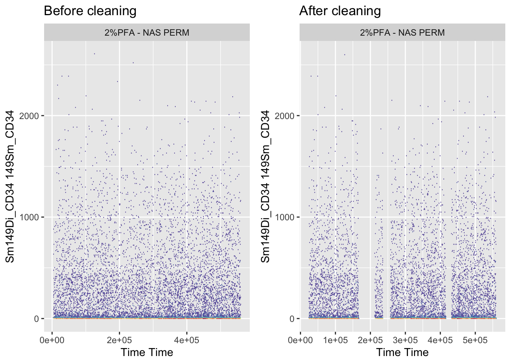
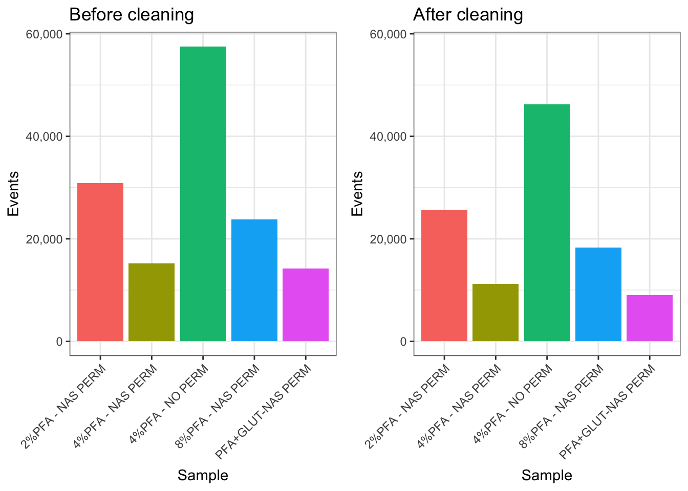

# Chapter 9 - Removing Acquisition Anomalies

## What You'll Learn

Cytometry acquisition isn't always stable, clogs, voltage drift, or air bubbles can corrupt segments of a file partway through a run. Signal can also drift steadily across a long acquisition without any single dramatic event. `PeacoQC` detects both kinds of problem and removes the affected events. This chapter runs it across every file and saves the result as `CLEANED_FLOWSET.rds`.

`flowCut` is covered in the Deeper Dive as an alternative, along with a direct comparison of what the two tools do to the same data.

## The Essentials {.essentials}

### Step 1: Load Required Packages


``` r
library(here)
#> Warning in readLines(f, n): line 1 appears to contain an
#> embedded nul
#> here() starts at /Volumes/T31/CLAUDE/Analysing-Cytometry-Data-With-R
library(flowCore)
if(!require(PeacoQC)) BiocManager::install("PeacoQC")
#> Loading required package: PeacoQC
library(PeacoQC)
```

### Step 2: Load Your Data (if needed)

If `Reordered_RENAMED_FLOWSET` isn't already in your Environment tab from Chapter 8, load it:


``` r
Reordered_RENAMED_FLOWSET <- readRDS(here("Data", "RDS", "Reordered_RENAMED_FLOWSET.rds"))
```

### Step 3: Clean Each File

`PeacoQC()` works on one flowFrame at a time, not a whole flowSet, so we apply it across the flowSet with `fsApply()`, one file at a time.

`Time` and `Event_length` are excluded from the channels being checked. They aren't markers, and asking a cleaning algorithm to look for anomalies in the time channel itself makes no sense:


``` r
channels_to_check <- colnames(Reordered_RENAMED_FLOWSET)[
  !colnames(Reordered_RENAMED_FLOWSET) %in% c("Time", "Event_length")
]

CLEANED_FLOWSET <- fsApply(Reordered_RENAMED_FLOWSET, function(x) {
  PeacoQC(
    ff               = x,
    channels         = channels_to_check,
    plot             = TRUE,
    save_fcs         = FALSE,
    output_directory = here("Outputs", "PeacoQC")
  )$FinalFF
})
```

The `FinalFF` element of what `PeacoQC()` returns is the cleaned flowFrame. The function hands back a list containing diagnostics as well, and `$FinalFF` is the part we want.

### Step 4: Save Your Work

Sample names are reassigned from the flowSet you started with before saving. This is cheap insurance, if the names ever fail to survive the `fsApply()`, every chapter after this one would be working with mislabelled samples and it wouldn't be obvious:


``` r
sampleNames(CLEANED_FLOWSET) <- sampleNames(Reordered_RENAMED_FLOWSET)
pData(CLEANED_FLOWSET)$name <- sampleNames(CLEANED_FLOWSET)

saveRDS(CLEANED_FLOWSET, here("Data", "RDS", "CLEANED_FLOWSET.rds"))
```

`saveRDS()` doesn't print anything when it works, so check the file exists instead:


``` r
file.exists(here("Data", "RDS", "CLEANED_FLOWSET.rds"))
#> [1] TRUE
```

**Success looks like this:**
```
[1] TRUE
```

### Step 5: See What Was Actually Removed

Saving the file isn't proof the cleaning did anything. Plot a channel against Time, before and after, and you can see what came out:


``` r
library(cowplot)
library(ggcyto)
#> Loading required package: ggplot2
#> Loading required package: ncdfFlow
#> Loading required package: BH
#> Loading required package: flowWorkspace
#> As part of improvements to flowWorkspace, some behavior of
#> GatingSet objects has changed. For details, please read the section
#> titled "The cytoframe and cytoset classes" in the package vignette:
#> 
#>   vignette("flowWorkspace-Introduction", "flowWorkspace")

Reordered_RENAMED_FLOWSET <- readRDS(here("Data", "RDS", "Reordered_RENAMED_FLOWSET.rds"))
CLEANED_FLOWSET <- readRDS(here("Data", "RDS", "CLEANED_FLOWSET.rds"))

# Pick any channel and any sample, adjust to whatever's relevant for your own data
BEFORE <- autoplot(Reordered_RENAMED_FLOWSET[[1]], "Time", "Sm149Di_CD34", bins = 256) +
  ggtitle("Before cleaning")

AFTER <- autoplot(CLEANED_FLOWSET[[1]], "Time", "Sm149Di_CD34", bins = 256) +
  ggtitle("After cleaning")

plot_grid(as.ggplot(BEFORE), as.ggplot(AFTER))
```



``` r

ggsave2(here("Figures", "PeacoQC_before_after.pdf"), width = 11, height = 8.5)
ggsave2(here("Figures", "PeacoQC_before_after.png"), width = 11, height = 8.5)
```

`PeacoQC` also writes its own diagnostic plot for every file into `Outputs/PeacoQC/`, plus a summary table at `Outputs/PeacoQC/PeacoQC_results/PeacoQC_report.txt`. That report is worth opening: it breaks each file's removals down by which check triggered them, which tells you *why* events were removed, not just how many.

**A note on output volume:** every tool in this chapter writes a diagnostic report for each file you run it on. With more than a handful of samples this adds up fast, expect `Outputs/` to fill with one report per file per tool, not a single summary. Bear that in mind before you run this on a real dataset with dozens of files.

### Step 6: Check Cell Counts Before and After

Cleaning can remove a meaningful chunk of a file. Compare the counts directly rather than looking at the cleaned numbers alone, a bar chart of what survived tells you nothing without the original beside it:


``` r
library(ggplot2)

BEFORE_COUNTS <- as.data.frame(fsApply(Reordered_RENAMED_FLOWSET, nrow))
colnames(BEFORE_COUNTS) <- "Events"
BEFORE_COUNTS <- tibble::rownames_to_column(BEFORE_COUNTS, "Sample")

AFTER_COUNTS <- as.data.frame(fsApply(CLEANED_FLOWSET, nrow))
colnames(AFTER_COUNTS) <- "Events"
AFTER_COUNTS <- tibble::rownames_to_column(AFTER_COUNTS, "Sample")

# Both panels must share a y axis, or ggplot scales each one to its own data
# and a large drop looks like a small one
Y_MAX <- max(BEFORE_COUNTS$Events)

p_before <- ggplot(BEFORE_COUNTS, aes(x = Sample, y = Events, fill = Sample)) +
  geom_bar(stat = "identity") +
  ggtitle("Before cleaning") +
  scale_y_continuous(labels = scales::comma, limits = c(0, Y_MAX)) +
  theme_bw() +
  theme(legend.position = "none", axis.text.x = element_text(angle = 45, hjust = 1))

p_after <- ggplot(AFTER_COUNTS, aes(x = Sample, y = Events, fill = Sample)) +
  geom_bar(stat = "identity") +
  ggtitle("After cleaning") +
  scale_y_continuous(labels = scales::comma, limits = c(0, Y_MAX)) +
  theme_bw() +
  theme(legend.position = "none", axis.text.x = element_text(angle = 45, hjust = 1))

plot_grid(p_before, p_after)
```



``` r

ggsave2(here("Figures", "cleaning_counts_before_after.pdf"), width = 11, height = 8.5)
ggsave2(here("Figures", "cleaning_counts_before_after.png"), width = 11, height = 8.5)
```

Both panels are forced onto the same y axis with `limits = c(0, Y_MAX)`. Without that, `ggplot` scales each panel to its own data, so the "after" panel stretches its bars back up to fill the space and a 25% loss looks like almost nothing. Any before-and-after bar chart needs this, and it's an easy thing to miss because each panel looks perfectly reasonable on its own.

A sample that drops far more than the others is worth investigating in its `PeacoQC` diagnostic plot before continuing. It might mean rough acquisition, or it might mean that sample drifted more than the rest, which is a different problem with different consequences.

## A Deeper Dive {.deeper-dive}

Cleaning data happens in stages, and by this chapter three are done: gating to live singlets (already applied to the delivered dataset before Chapter 5), channel name cleanup with `premessa` (Chapter 8), and now acquisition anomaly removal.

### Why PeacoQC Rather Than flowCut

`flowCut` and `flowAI` are the established tools, and this chapter used to be built around `flowCut`. A 2022 benchmark (Emmaneel et al., *Cytometry Part A*) tested `PeacoQC` against both across nine flow, three mass, and four spectral cytometry datasets. `PeacoQC` had the highest median balanced accuracy and scaled better to large files; `flowAI` tended to over-filter, removing more good data than necessary, and `flowCut`/`flowClean` sometimes missed anomalies the others caught.

The mechanism explains the results you'll see below. `PeacoQC`, from the same lab that built `FlowSOM`, finds density peaks per channel over time and flags events that fall too far from them. It runs two checks: an isolation tree (IT) analysis for abrupt events, and a mean-absolute-deviation (MAD) distance check. The first catches clogs and bubbles. The second catches gradual drift, signal creeping up or down across a run with no single dramatic moment.

That second check is the important one, and it's what `flowCut` doesn't act on.

### flowCut, and What Happens When You Run Both

`flowCut` looks for abrupt changes over time in each channel, the signature of a clog, bubble, or voltage event, and flags the affected segment. It takes one flowFrame at a time, same as `PeacoQC`:


``` r
if(!require(flowCut)) BiocManager::install("flowCut")
library(flowCut)

CLEANED <- fsApply(
  Reordered_RENAMED_FLOWSET,
  function(x) flowCut(
    x,
    Directory = here("Outputs", "flowCut")
  )
)
```

`CLEANED` is a list, not a flowSet, `flowCut()` returns diagnostics alongside the cleaned data, so pull out just the frames and rebuild a flowSet from them:


``` r
files <- list()
for (x in 1:length(CLEANED)) {
  files <- append(files, list(CLEANED[[x]]$frame))
}

CLEANED_FLOWCUT <- flowSet(files)
sampleNames(CLEANED_FLOWCUT) <- sampleNames(Reordered_RENAMED_FLOWSET)
pData(CLEANED_FLOWCUT)$name <- sampleNames(CLEANED_FLOWCUT)

saveRDS(CLEANED_FLOWCUT, here("Data", "RDS", "CLEANED_FLOWCUT.rds"))
```

Note this saves to `CLEANED_FLOWCUT.rds`, not `CLEANED_FLOWSET.rds`. The rest of the course reads `CLEANED_FLOWSET.rds`, so running this section won't overwrite what the Essentials produced.

Now compare the two directly, on the same files:


``` r
COMPARISON_COUNTS <- data.frame(
  Sample   = sampleNames(Reordered_RENAMED_FLOWSET),
  Before   = as.vector(fsApply(Reordered_RENAMED_FLOWSET, nrow)),
  PeacoQC  = as.vector(fsApply(CLEANED_FLOWSET, nrow)),
  flowCut  = as.vector(fsApply(CLEANED_FLOWCUT, nrow))
)

COMPARISON_COUNTS$PeacoQC_pct <- round(
  100 * (COMPARISON_COUNTS$Before - COMPARISON_COUNTS$PeacoQC) / COMPARISON_COUNTS$Before, 2
)
COMPARISON_COUNTS$flowCut_pct <- round(
  100 * (COMPARISON_COUNTS$Before - COMPARISON_COUNTS$flowCut) / COMPARISON_COUNTS$Before, 2
)

COMPARISON_COUNTS
#>              Sample Before PeacoQC flowCut PeacoQC_pct
#> 1  2%PFA - NAS PERM  30825   25575   30825       17.03
#> 2  4%PFA - NAS PERM  15158   11250   11997       25.78
#> 3  8%PFA - NAS PERM  23790   18250   23172       23.29
#> 4 PFA+GLUT-NAS PERM  14171    9000   14171       36.49
#> 5   4%PFA - NO PERM  57521   46250   56000       19.59
#>   flowCut_pct
#> 1        0.00
#> 2       20.85
#> 3        2.60
#> 4        0.00
#> 5        2.64
```

On this course's dataset, `PeacoQC` removes roughly 17% to 36% per file while `flowCut` removes nothing at all. Both are behaving correctly, and the reason is in `PeacoQC`'s own report: its IT analysis, the abrupt-event check that is `flowCut`'s direct counterpart, removes essentially nothing either. Every event `PeacoQC` removes here comes from the MAD check, and every file in the report is flagged with an increasing or decreasing channel. The data has no clogs or bubbles. What it has is steady drift, which has no abrupt boundary for `flowCut`'s segment comparison to find.

This is the single most useful thing in this chapter: **two respectable tools can disagree completely and both be right, because they are not asking the same question.** Always check which mechanism did the removing, not just how much came out.

### Making flowCut Cut Anyway

By default `flowCut` runs three cleanliness tests and, if a file passes all of them, decides it's clean enough and skips further cleaning. `AlwaysClean = TRUE` overrides that:


``` r
CLEANED_AC <- fsApply(
  Reordered_RENAMED_FLOWSET,
  function(x) flowCut(
    x,
    Directory   = here("Outputs", "flowCut_AlwaysClean"),
    AlwaysClean = TRUE
  )
)

before <- as.vector(fsApply(Reordered_RENAMED_FLOWSET, nrow))
after  <- sapply(CLEANED_AC, function(x) nrow(x$frame))

data.frame(
  file    = sampleNames(Reordered_RENAMED_FLOWSET),
  before  = before,
  after   = after,
  removed = before - after,
  percent = round(100 * (before - after) / before, 2)
)
```

On this dataset that shifts `flowCut` from removing nothing to removing about 3.7% overall, and the removals are wildly uneven: one file loses 20.85%, two lose around 2.6%, and two still lose nothing. It's a useful demonstration of how much a single default can change a result, and a reminder to read what a function's arguments actually do before trusting its output.

### Other Tools Exist

`flowAI` is the third tool in the benchmark above, and there are others. It won't run on this course's data, though.

`flowAI` bins events by time in fractions of a second, converting raw time values using the FCS `$TIMESTEP` keyword. Mass cytometry files from a Helios don't carry that keyword. Without it, `flowAI` treats the raw time values as seconds, and this dataset's time channel runs to roughly 559,000, so it tries to bin a nominal 155 hour acquisition at tenth-of-a-second resolution and exhausts memory before finishing the first file.

That isn't a bug in `flowAI` so much as a mismatch between a tool built for conventional flow cytometry and a mass cytometry file. It's a good illustration of a general point: cleaning tools carry assumptions about your data, and when one fails outright it's usually one of those assumptions, not your code.

### What's Next

With `CLEANED_FLOWSET.rds` saved, the next chapter downsamples the data to a manageable size before transformation.
