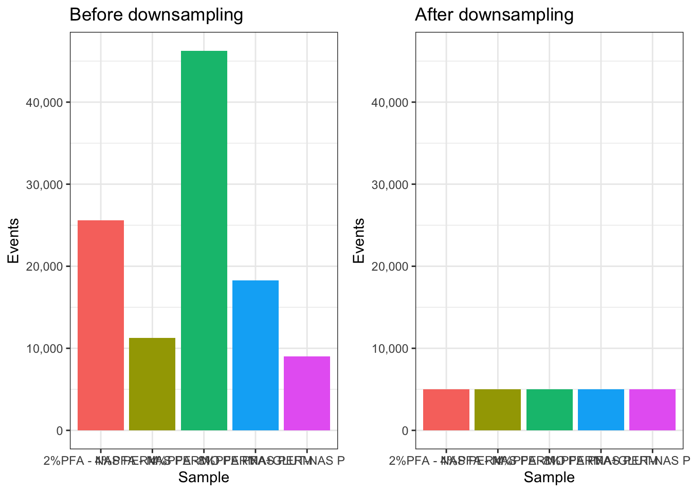

# Chapter 10 - Downsampling

## What You'll Learn

Some downstream analyses (clustering, dimensionality reduction) get slow or unwieldy with the full event count from every file. This chapter downsamples every file in the flowSet to a fixed number of events each, so later steps run on a consistent, manageable dataset.

## The Essentials {.essentials}

### Step 1: Load Required Packages and Data


``` r
library(here)
#> Warning in readLines(f, n): line 1 appears to contain an
#> embedded nul
#> here() starts at /Volumes/T31/CLAUDE/Analysing-Cytometry-Data-With-R
library(flowCore)

CLEANED_FLOWSET <- readRDS(here("Data", "RDS", "CLEANED_FLOWSET.rds"))
```

### Step 2: Downsample Every File

`sampleFilter()` defines a filter that keeps a fixed number of events per file, then `Subset()` actually applies it. `sampleFilter()` picks events randomly, so set a seed first, otherwise you'll get a different 5000 cells every time you re-run this chapter:


``` r
set.seed(1234)
Downsample_filter <- sampleFilter(size = 5000, filterId = "dsFilter")
DOWNSAMPLER <- flowCore::filter(CLEANED_FLOWSET, Downsample_filter)

DOWNSAMPLED_CLEANED_FLOWSET <- Subset(CLEANED_FLOWSET, DOWNSAMPLER)
sampleNames(DOWNSAMPLED_CLEANED_FLOWSET)
#> [1] "2%PFA - NAS PERM"  "4%PFA - NAS PERM" 
#> [3] "8%PFA - NAS PERM"  "PFA+GLUT-NAS PERM"
#> [5] "4%PFA - NO PERM"
```

### Step 3: Verify the Event Counts


``` r
fsApply(DOWNSAMPLED_CLEANED_FLOWSET, nrow)
#>                   [,1]
#> 2%PFA - NAS PERM  5000
#> 4%PFA - NAS PERM  5000
#> 8%PFA - NAS PERM  5000
#> PFA+GLUT-NAS PERM 5000
#> 4%PFA - NO PERM   5000
```

**Success looks like this:** every file showing 5000 (or fewer, if a file had fewer events than that to begin with, `sampleFilter()` can't invent events that aren't there).

### Step 4: Save Your Work


``` r
saveRDS(DOWNSAMPLED_CLEANED_FLOWSET, here("Data", "RDS", "DOWNSAMPLED_CLEANED_FLOWSET.rds"))
```


``` r
file.exists(here("Data", "RDS", "DOWNSAMPLED_CLEANED_FLOWSET.rds"))
#> [1] TRUE
```

**Success looks like this:**
```
[1] TRUE
```

### Step 5: Compare Event Counts Before and After


``` r
library(ggplot2)
library(cowplot)

BEFORE_COUNTS <- as.data.frame(fsApply(CLEANED_FLOWSET, nrow))
colnames(BEFORE_COUNTS) <- "Events"
BEFORE_COUNTS <- tibble::rownames_to_column(BEFORE_COUNTS, "Sample")

AFTER_COUNTS <- as.data.frame(fsApply(DOWNSAMPLED_CLEANED_FLOWSET, nrow))
colnames(AFTER_COUNTS) <- "Events"
AFTER_COUNTS <- tibble::rownames_to_column(AFTER_COUNTS, "Sample")

# Both panels must share a y axis, or ggplot scales each one to its own data
# and a large drop looks like a small one
Y_MAX <- max(BEFORE_COUNTS$Events)

p_before <- ggplot(BEFORE_COUNTS, aes(x = Sample, y = Events, fill = Sample)) +
  geom_bar(stat = "identity") +
  ggtitle("Before downsampling") +
  scale_y_continuous(labels = scales::comma, limits = c(0, Y_MAX)) +
  theme_bw() +
  theme(legend.position = "none")

p_after <- ggplot(AFTER_COUNTS, aes(x = Sample, y = Events, fill = Sample)) +
  geom_bar(stat = "identity") +
  ggtitle("After downsampling") +
  scale_y_continuous(labels = scales::comma, limits = c(0, Y_MAX)) +
  theme_bw() +
  theme(legend.position = "none")

plot_grid(p_before, p_after)
```



``` r

ggsave2(here("Figures", "downsampling_before_after.pdf"), width = 11, height = 8.5)
ggsave2(here("Figures", "downsampling_before_after.png"), width = 11, height = 8.5)
```

### Step 6: Reorder the Samples

If you want your samples in a specific display order for plotting, reorder here:


``` r
Reordered_DOWNSAMPLED_CLEANED_FLOWSET <- DOWNSAMPLED_CLEANED_FLOWSET[c(1, 3, 5, 2, 4)] # example order, replace with your real order
pData(Reordered_DOWNSAMPLED_CLEANED_FLOWSET)$name <- sampleNames(Reordered_DOWNSAMPLED_CLEANED_FLOWSET)

saveRDS(Reordered_DOWNSAMPLED_CLEANED_FLOWSET, here("Data", "RDS", "Reordered_DOWNSAMPLED_CLEANED_FLOWSET.rds"))
```

## A Deeper Dive {.deeper-dive}

Downsampling to a fixed number of events per file matters for two reasons: it keeps computationally expensive steps (UMAP, tSNE, clustering) tractable, and it stops files with far more events than others from dominating those analyses just by sheer count. 5000 is a reasonable default for a tutorial dataset, real experiments often use a different number depending on how many events each file actually has and how much compute is available.

### What sampleFilter() Is Actually Doing

`sampleFilter()` isn't running any special cytometry-aware logic, it's random sampling without replacement, the same thing `sample()` does on a vector of row indices. `flowCore` wraps it in a filter object so it works with `Subset()` and the rest of the flowSet machinery, but conceptually it's no different from `exprs(x)[sample(nrow(exprs(x)), 5000), ]`. So everything you already understand about random sampling, including the need to set a seed, applies here directly, and there's no hidden cytometry-specific behaviour to learn.

### The Cost of a Fixed Downsample

Sampling 5000 events at random assumes whatever's rare in the full file is still represented, at roughly the same proportion, in the smaller sample. That holds up reasonably well at 5000 out of tens of thousands of events, it holds up much worse if you push the number down. Try re-running Step 2 with `size = 500` instead of `5000` and compare the results:


``` r
set.seed(1234)
Downsample_filter_small <- sampleFilter(size = 500, filterId = "dsFilterSmall")
DOWNSAMPLER_SMALL <- flowCore::filter(CLEANED_FLOWSET, Downsample_filter_small)
DOWNSAMPLED_SMALL <- Subset(CLEANED_FLOWSET, DOWNSAMPLER_SMALL)
```

A population that made up 2% of a file's events is, on average, only about 10 cells at `size = 500`, sparse enough that it can look noisy, get missed by clustering entirely, or vanish through ordinary sampling variation from one run to the next. The same population at `size = 5000` averages around 100 cells, still small, but far more stable. There's no single correct downsample size, it's a real trade-off between speed and how much you trust your smallest populations to survive the cut.

### Fixed-Per-File vs Proportional Downsampling

This chapter downsamples every file to the same fixed number, 5000 regardless of how many events that file started with. That's a deliberate choice, not the only valid one. It means a file that started with 8,000 live singlets and a file that started with 80,000 end up contributing equally to every downstream analysis, each file's biological signal gets the same weight, regardless of how much data actually backs it. The alternative, proportional downsampling, keeps a fixed percentage of each file rather than a fixed count, preserving each file's relative size but risking a single very large file dominating the combined analysis just by sheer numbers. Neither approach is universally correct, which one matters depends on whether you want every sample treated as an equal unit of evidence, or every event treated as an equal unit of evidence.

### What's Next

With `Reordered_DOWNSAMPLED_CLEANED_FLOWSET.rds` saved, the next chapter transforms the data (arcsinh) to make it suitable for visualisation and downstream analysis.
