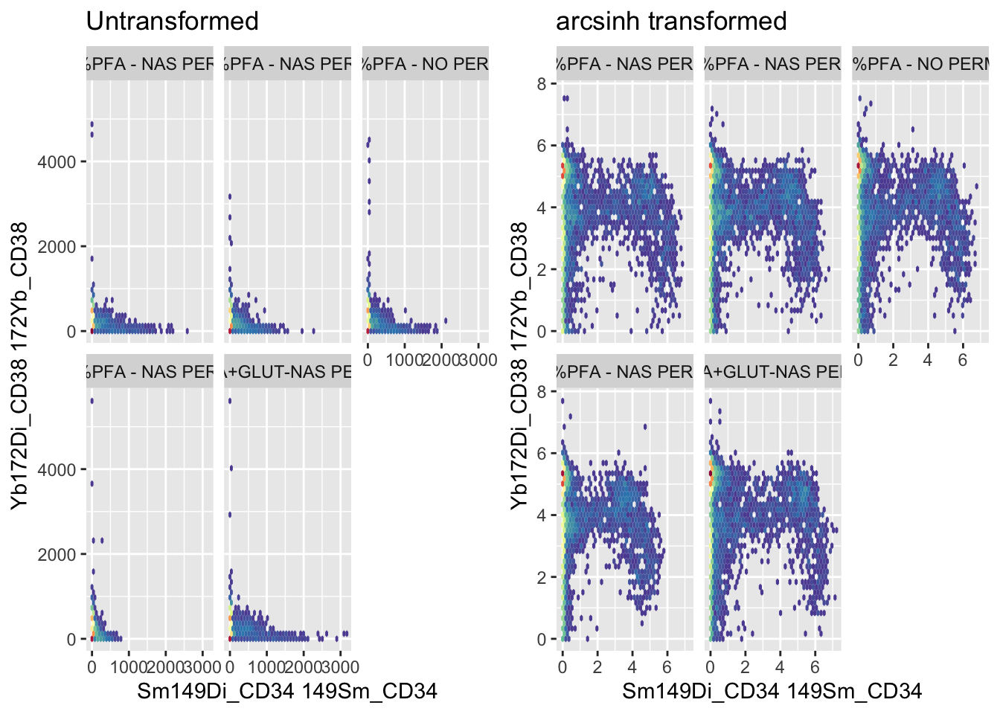
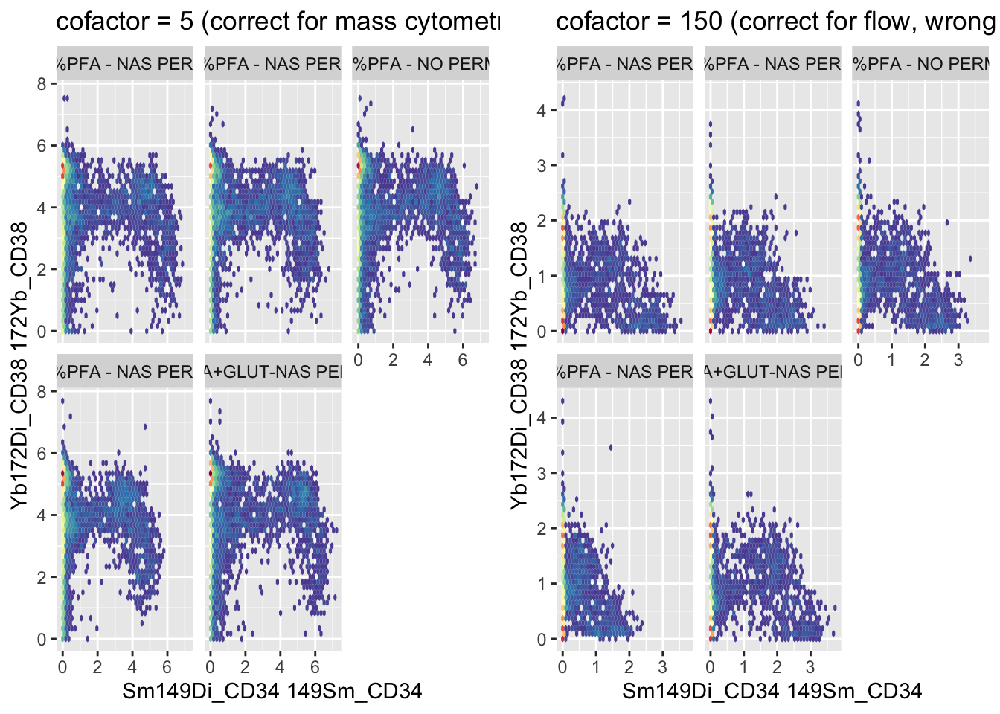
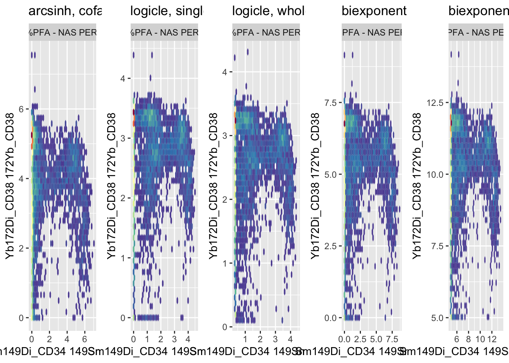

# Chapter 11 - Data Transformation

## What You'll Learn

Raw cytometry data is compressed near zero for negative populations and spread across orders of magnitude for positive ones. This chapter applies an arcsinh transformation, making the data usable for visualisation, dimensionality reduction, and clustering.

## The Essentials {.essentials}

### Step 1: Load Required Packages and Data


``` r
library(here)
#> Warning in readLines(f, n): line 1 appears to contain an
#> embedded nul
#> here() starts at /Volumes/T31/CLAUDE/Analysing-Cytometry-Data-With-R
library(flowCore)

Reordered_DOWNSAMPLED_CLEANED_FLOWSET <- readRDS(here("Data", "RDS", "Reordered_DOWNSAMPLED_CLEANED_FLOWSET.rds"))
```

### Step 2: Apply the arcsinh Transformation


``` r
ARCSINH_DOWNSAMPLED_CLEANED_FLOWSET <- fsApply(Reordered_DOWNSAMPLED_CLEANED_FLOWSET, function(x, cofactor = 5) {
  expr <- exprs(x)
  expr <- asinh(expr / cofactor)
  exprs(x) <- expr
  x
})
```

`cofactor = 5` is the standard scale factor for mass cytometry (CyTOF) data. Conventional/spectral flow cytometry typically uses a much larger cofactor, around 150, since the dynamic range and noise characteristics are different.

### Step 3: Save Your Work


``` r
saveRDS(ARCSINH_DOWNSAMPLED_CLEANED_FLOWSET, here("Data", "RDS", "ARCSINH_DOWNSAMPLED_CLEANED_FLOWSET.rds"))
```


``` r
file.exists(here("Data", "RDS", "ARCSINH_DOWNSAMPLED_CLEANED_FLOWSET.rds"))
#> [1] TRUE
```

**Success looks like this:**
```
[1] TRUE
```

### Step 4: Compare Transformed vs Untransformed


``` r
library(ggcyto)
#> Loading required package: ggplot2
#> Loading required package: ncdfFlow
#> Loading required package: BH
#> Loading required package: flowWorkspace
#> As part of improvements to flowWorkspace, some behavior of
#> GatingSet objects has changed. For details, please read the section
#> titled "The cytoframe and cytoset classes" in the package vignette:
#> 
#>   vignette("flowWorkspace-Introduction", "flowWorkspace")
library(cowplot)

# `bins = 40`, not the 128 used earlier in the book, because Chapter 10 downsampled
# every file to 5000 events. 128 bins carves the plot into roughly 16000 hex cells,
# which leaves most cells holding a single event and nothing for the density colour
# scale to show. Earlier chapters plot 18000 to 24000 events per sample, where 128
# is fine. Fewer events means fewer, larger bins.
UNTRANSFORMED_PLOT <- ggcyto(Reordered_DOWNSAMPLED_CLEANED_FLOWSET, aes(x = "Sm149Di_CD34", y = "Yb172Di_CD38")) +
  geom_hex(bins = 40) +
  facet_wrap(~name) +
  ggtitle("Untransformed") +
  theme(legend.position = "none")

TRANSFORMED_PLOT <- ggcyto(ARCSINH_DOWNSAMPLED_CLEANED_FLOWSET, aes(x = "Sm149Di_CD34", y = "Yb172Di_CD38")) +
  geom_hex(bins = 40) +
  facet_wrap(~name) +
  ggtitle("arcsinh transformed") +
  theme(legend.position = "none")

plot_grid(as.ggplot(UNTRANSFORMED_PLOT), as.ggplot(TRANSFORMED_PLOT))
```



``` r

ggsave2(here("Figures", "arcsinh_transform_comparison.pdf"), width = 11, height = 8.5)
ggsave2(here("Figures", "arcsinh_transform_comparison.png"), width = 11, height = 8.5)
```

## A Deeper Dive {.deeper-dive}

Why arcsinh rather than log10? Log transforms can't handle zero or negative values, which mass cytometry data genuinely has (background-subtracted signal can go slightly negative). Arcsinh behaves like a log transform for large values but stays well-defined through zero and into negative numbers, which is why it's the standard choice for CyTOF data specifically.

There's a common workaround, adding a small pseudocount before taking the log (`log10(x + pseudocount)`), which does dodge the zero/negative problem. It's a real technique, but it doesn't make log10 the better choice here: the pseudocount is an arbitrary tuning value with no principled way to set it for a given dataset, unlike arcsinh's cofactor, which has an established, defensible value for a given cytometry platform. Arcsinh solves the same problem without introducing a new arbitrary parameter.

### What Happens With the Wrong Cofactor

The cofactor isn't a minor tuning knob, using the wrong one visibly distorts the data. `cofactor = 5` is correct for mass cytometry; `cofactor = 150` is correct for conventional/spectral flow cytometry. Applying flow's cofactor to mass cytometry data (or vice versa) shows exactly why that number matters, rather than just asserting it does:


``` r
WRONG_COFACTOR_FLOWSET <- fsApply(Reordered_DOWNSAMPLED_CLEANED_FLOWSET, function(x, cofactor = 150) {
  expr <- exprs(x)
  expr <- asinh(expr / cofactor)
  exprs(x) <- expr
  x
})

CORRECT_PLOT <- ggcyto(ARCSINH_DOWNSAMPLED_CLEANED_FLOWSET, aes(x = "Sm149Di_CD34", y = "Yb172Di_CD38")) +
  geom_hex(bins = 40) +
  facet_wrap(~name) +
  ggtitle("cofactor = 5 (correct for mass cytometry)") +
  theme(legend.position = "none")

WRONG_PLOT <- ggcyto(WRONG_COFACTOR_FLOWSET, aes(x = "Sm149Di_CD34", y = "Yb172Di_CD38")) +
  geom_hex(bins = 40) +
  facet_wrap(~name) +
  ggtitle("cofactor = 150 (correct for flow, wrong here)") +
  theme(legend.position = "none")

plot_grid(as.ggplot(CORRECT_PLOT), as.ggplot(WRONG_PLOT))
```



``` r

ggsave2(here("Figures", "cofactor_comparison.pdf"), width = 11, height = 8.5)
ggsave2(here("Figures", "cofactor_comparison.png"), width = 11, height = 8.5)
```

Too large a cofactor under-transforms mass cytometry data, populations stay compressed near the origin, closer to how the raw, untransformed plot looked in Step 4, because the divisor is too big relative to the actual signal range. The lesson isn't "memorise 5 and 150", it's that the right cofactor depends on the instrument's actual dynamic range and noise characteristics, and picking one for the wrong platform reintroduces the exact compression problem transformation is supposed to fix. Worth trying other values yourself (1, 20, 500) on this same data to see the full range of distortion, not just these two.

### Other Transforms: Logicle and Biexponential

Arcsinh isn't the only transform built for compressed, wide-dynamic-range cytometry data, `logicle` and `biexponential` are the other two you'll see most often, both from conventional flow cytometry rather than CyTOF specifically. Worth seeing what they do to the same data, not just taking on faith that arcsinh is the right call. Both transforms also have more than one way to set their parameters, worth comparing directly rather than picking one arbitrarily:


``` r
library(flowCore)
library(openCyto)

channels_to_transform <- c("Sm149Di_CD34", "Yb172Di_CD38")

# Logicle, fit A: parameters estimated from a single sample
logicle_params <- estimateLogicle(Reordered_DOWNSAMPLED_CLEANED_FLOWSET[[1]], channels = channels_to_transform)
LOGICLE_FLOWSET <- transform(Reordered_DOWNSAMPLED_CLEANED_FLOWSET, logicle_params)

# Logicle, fit B: parameters estimated across the whole flowSet, using the median of each channel's negative population
logicle_median_params <- estimateMedianLogicle(Reordered_DOWNSAMPLED_CLEANED_FLOWSET, channels = channels_to_transform)
LOGICLE_MEDIAN_FLOWSET <- transform(Reordered_DOWNSAMPLED_CLEANED_FLOWSET, logicle_median_params)

# Biexponential, fit A: flowCore's own defaults
biexp_list <- transformList(channels_to_transform, biexponentialTransform())
BIEXP_FLOWSET <- transform(Reordered_DOWNSAMPLED_CLEANED_FLOWSET, biexp_list)

# Biexponential, fit B: explicit width parameter (w = 5)
biexp_list_w5 <- transformList(channels_to_transform, biexponentialTransform("biexpTransformW5", w = 5))
BIEXP_W5_FLOWSET <- transform(Reordered_DOWNSAMPLED_CLEANED_FLOWSET, biexp_list_w5)

# One sample is enough for this figure. It compares transforms, not samples, and
# Step 4 above already shows all five. Plotting the whole flowSet here puts five
# facets inside each of five panels, twenty five scatters in one figure, and every
# one of them is too small to read. Sample 1 is also the sample the single-sample
# logicle fit was estimated from, so this is a like-for-like comparison.
SAMPLE <- 1

# `bins` is set well below the usual 128 here on purpose. Chapter 10 downsampled
# every file to 5000 events, and 128 bins carves the plot into roughly 16000 hex
# cells, so almost every occupied hex holds a single event and the density colour
# scale has nothing to show. Fewer, larger hexes put enough events in each cell for
# the dense core to actually read as dense.
ARCSINH_ONE_PLOT <- ggcyto(ARCSINH_DOWNSAMPLED_CLEANED_FLOWSET[[SAMPLE]], aes(x = "Sm149Di_CD34", y = "Yb172Di_CD38")) +
  geom_hex(bins = 40) +
  ggtitle("arcsinh, cofactor 5") +
  theme(legend.position = "none")

LOGICLE_PLOT <- ggcyto(LOGICLE_FLOWSET[[SAMPLE]], aes(x = "Sm149Di_CD34", y = "Yb172Di_CD38")) +
  geom_hex(bins = 40) +
  ggtitle("logicle, single-sample fit") +
  theme(legend.position = "none")

LOGICLE_MEDIAN_PLOT <- ggcyto(LOGICLE_MEDIAN_FLOWSET[[SAMPLE]], aes(x = "Sm149Di_CD34", y = "Yb172Di_CD38")) +
  geom_hex(bins = 40) +
  ggtitle("logicle, whole-flowSet median fit") +
  theme(legend.position = "none")

BIEXP_PLOT <- ggcyto(BIEXP_FLOWSET[[SAMPLE]], aes(x = "Sm149Di_CD34", y = "Yb172Di_CD38")) +
  geom_hex(bins = 40) +
  ggtitle("biexponential, defaults") +
  theme(legend.position = "none")

BIEXP_W5_PLOT <- ggcyto(BIEXP_W5_FLOWSET[[SAMPLE]], aes(x = "Sm149Di_CD34", y = "Yb172Di_CD38")) +
  geom_hex(bins = 40) +
  ggtitle("biexponential, w = 5") +
  theme(legend.position = "none")

plot_grid(as.ggplot(ARCSINH_ONE_PLOT), as.ggplot(LOGICLE_PLOT), as.ggplot(LOGICLE_MEDIAN_PLOT),
  as.ggplot(BIEXP_PLOT), as.ggplot(BIEXP_W5_PLOT), ncol = 5)
```



``` r

ggsave2(here("Figures", "transform_type_comparison.pdf"), width = 20, height = 5)
ggsave2(here("Figures", "transform_type_comparison.png"), width = 20, height = 5)
```

Two genuine choices are being compared here, not just two functions with different names.

For logicle: `estimateLogicle()` fits parameters to a single flowFrame, here the first sample in the set, then applies that one fit to every sample. `estimateMedianLogicle()` (from `openCyto`) instead fits across the whole flowSet at once, using the median of each channel's negative population over all samples. The single-sample version is doing less work and trusting that sample 1 is representative of the rest, the whole-set version is the more defensible choice when samples might differ in background or offset, which is the more usual case with multiple files from different conditions, as here.

For biexponential: `biexponentialTransform()` with no arguments runs on `flowCore`'s built-in defaults. Setting `w` explicitly (`w = 5`) sets the width of the linear region around zero, in asymptotic decades, rather than leaving it at whatever the default assumes. A wider linear region pulls more of the near-zero, noisy signal into a straight line instead of compressing it logarithmically, which matters more the noisier your negative population is.

What that `w` parameter is actually controlling: biexponential is a piecewise function, not one formula applied everywhere. Near zero, where log-style transforms compress and distort noisy negative/low signal, it behaves close to linear, an ordinary straight line, avoiding the zero/negative problem the same way arcsinh does. Further from zero, where the signal is large and log-scale spread actually helps, it switches over to behaving exponentially. `w` sets how wide that near-zero linear region is before the exponential part takes over, a small `w` switches to exponential behaviour quickly, a large `w` keeps more of the range linear. This is the same underlying idea arcsinh and logicle both use, linear near zero, log-like further out, just a different specific formula for the transition between the two.

Both logicle transforms and both biexponential transforms were designed around conventional flow cytometry's signal and noise characteristics, not CyTOF's, which is the deeper reason arcsinh with a mass-cytometry cofactor stays the standard choice for this kind of data, not just convention for its own sake. Run on this dataset, the two logicle panels come out near identical, and the two biexponential panels share a shape while sitting on different ranges, the defaults spanning roughly 0 to 8 and `w = 5` roughly 5 to 12.5. The transform family matters more than how its parameters are fitted.

**Note:** the whole-flowSet logicle fit and the `w = 5` biexponential parameter come from an earlier, unpublished draft chapter (`Draft Chapters/09-Data-Transformation.Rmd`) that used real course data at the time it was written, which is why they are better-grounded starting points than bare defaults.

### What's Next

With `ARCSINH_DOWNSAMPLED_CLEANED_FLOWSET.rds` saved, the next chapter extracts the expression data into a simpler table format and applies dimensionality reduction (UMAP and tSNE).
