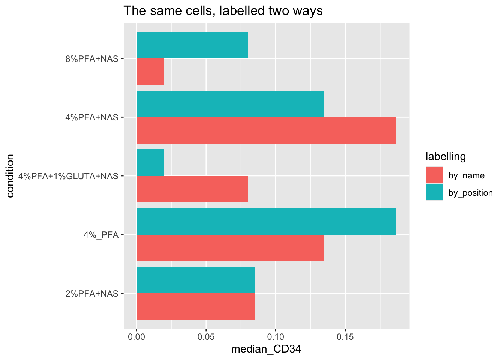

# Chapter 12 - Extracting Expression Data

## What You'll Learn

So far you've worked with flowSet and flowFrame objects, specialised structures built for cytometry. Most further analysis, comparing conditions, plotting distributions, statistics, is easier in a plain data frame: one row per cell, one column per marker, plus sample and condition labels. This chapter converts your cleaned, transformed flowSet into that format.

**Why convert at all?** Chapter 5 introduced flowSets and flowFrames as S4 objects, R's more rigid, formally-defined object system, built for packages like Bioconductor's where structure needs to be strictly enforced. A plain data frame, by contrast, is an S3 object, R's older, looser system. S3 objects are what most of R's ecosystem expects: `ggplot2`, `dplyr`, base subsetting with `[` and `$`, all assume S3-style data frames, not S4 flowSets. You can't hand a flowSet straight to `ggplot()` and get a sensible plot out, the object doesn't have rows and columns in the way `ggplot()` expects. That's not a limitation of this course's data, it's true of any flowSet. Converting to a data frame here is what makes the rest of standard R, and everything downstream in this course, usable.

## The Essentials {.essentials}

### Step 1: Load Required Packages and Data


``` r
library(here)
#> Warning in readLines(f, n): line 1 appears to contain an
#> embedded nul
#> here() starts at /Volumes/T31/CLAUDE/Analysing-Cytometry-Data-With-R
library(flowCore)
library(readxl)
library(tidyr)

ARCSINH_DOWNSAMPLED_CLEANED_FLOWSET <- readRDS(here("Data", "RDS", "ARCSINH_DOWNSAMPLED_CLEANED_FLOWSET.rds"))
metadata <- read_xlsx(here("Data", "other", "ACDwR_metadata.xlsx"))
head(data.frame(metadata))
#>                  file_name         sample_id
#> 1      2PFANASPermLIVE.fcs  2%PFA - NAS PERM
#> 2 4PFA1GLUTNASPermLIVE.fcs PFA+GLUT-NAS PERM
#> 3      4PFANASPermLIVE.fcs  4%PFA - NAS PERM
#> 4       4PFANoPermLIVE.fcs   4%PFA - NO PERM
#> 5      8PFANASPermLIVE.fcs  8%PFA - NAS PERM
#>           condition patient_id
#> 1         2%PFA+NAS        025
#> 2 4%PFA+1%GLUTA+NAS        025
#> 3         4%PFA+NAS        025
#> 4            4%_PFA        025
#> 5         8%PFA+NAS        025
```

### Step 2: Extract the Expression Matrix


``` r
EXPRESSION_DATA <- fsApply(ARCSINH_DOWNSAMPLED_CLEANED_FLOWSET, exprs)
dim(EXPRESSION_DATA)
#> [1] 25000    40
colnames(EXPRESSION_DATA)
#>  [1] "Time"               "Event_length"      
#>  [3] "Y89Di_CD41  "       "I127Di_IdU"        
#>  [5] "Pr141Di_CD235ab"    "Nd142Di_EMP-MAEA"  
#>  [7] "Nd143Di_CD45RA"     "Nd144Di_HBB-FITC"  
#>  [9] "Nd145Di_C-EBPa"     "Nd146Di_CD203c"    
#> [11] "Sm147Di_CD70"       "Nd148Di_ProMBP1"   
#> [13] "Sm149Di_CD34"       "Nd150Di_BACH1"     
#> [15] "Eu151Di_CD123"      "Sm152Di_MAFG"      
#> [17] "Eu153Di_CyclinB1"   "Sm154Di_NFE2p45"   
#> [19] "Gd155Di_CD36"       "Gd156Di_GATA1-PE"  
#> [21] "Gd158Di_RUNX1"      "Tb159Di_IKAROS"    
#> [23] "Gd160Di_CD105"      "Dy161Di_CD90"      
#> [25] "Dy162Di_Ki-67"      "Dy163Di_Gata2"     
#> [27] "Dy164Di_CD49F"      "Ho165Di_Klf1"      
#> [29] "Er166Di_CD44"       "Er167Di_PU.1"      
#> [31] "Er168Di_CD71"       "Tm169Di_FLI1 abcam"
#> [33] "Er170Di_GlobinHBA"  "Yb171Di_Tbx15"     
#> [35] "Yb172Di_CD38"       "Yb173Di_CD184"     
#> [37] "Yb174Di_HA.11"      "Lu175Di_CD135"     
#> [39] "Yb176Di_CD164"      "Original_ID"
saveRDS(EXPRESSION_DATA, here("Data", "RDS", "EXPRESSION_DATA.rds"))
```

**What this does:** `fsApply(..., exprs)` pulls the expression matrix out of every flowFrame and stacks them into one table, every cell from every sample, one row each.

### Step 3: Label Each Cell With Its Sample

The expression matrix alone doesn't say which sample each row came from, that has to be added back in. The obvious way is to assume the metadata sheet and the flowSet are in the same order and pair them up position by position. Don't. Sample order is not a stable thing: Chapters 8 and 10 both reorder the flowSet, a file that fails QC gets dropped, a sheet gets re-sorted in Excel. Any of those and a positional pairing silently attaches the wrong labels to real cells. Join on the sample name instead, which survives all of it.

The check to run is not "are these in the same order" but "are these the same five samples at all":


``` r
setequal(sampleNames(ARCSINH_DOWNSAMPLED_CLEANED_FLOWSET), metadata$sample_id)
#> [1] TRUE
```

**Success looks like this:**
```
[1] TRUE
```

If this returns `FALSE`, your sheet and your data disagree about which samples exist, and no amount of careful joining will fix that. Compare the two lists directly and resolve it before going further.

Now label each cell, taking the names from the flowSet itself rather than from the sheet. The flowSet is the source of truth for which cells you actually have:


``` r
sample_ids <- rep(sampleNames(ARCSINH_DOWNSAMPLED_CLEANED_FLOWSET),
                  fsApply(ARCSINH_DOWNSAMPLED_CLEANED_FLOWSET, nrow))
length(sample_ids) == nrow(EXPRESSION_DATA)
#> [1] TRUE
```

**Success looks like this:**
```
[1] TRUE
```

### Step 4: Build the Combined Table


``` r
EXPRESSION_DATA_SAMPLE_ID <- data.frame(sample_id = sample_ids, EXPRESSION_DATA)
dim(EXPRESSION_DATA_SAMPLE_ID)
#> [1] 25000    41
saveRDS(EXPRESSION_DATA_SAMPLE_ID, here("Data", "RDS", "EXPRESSION_DATA_SAMPLE_ID.rds"))
```

### Step 5: Reshape to Long Format and Add Condition

Most plotting and statistics want one row per cell per marker, not one row per cell with a column per marker. `pivot_longer()` reshapes it, and we attach each row's experimental condition from the metadata sheet at the same time:


``` r
# Exclude the three columns that are not antigens: Time and Event_length come from the
# instrument, and Original_ID was added by PeacoQC in Chapter 9 to track event indices.
# Left in, they become "antigen" values and appear as facet panels in Chapter 13.
EXPRESSION_DATA_SAMPLE_ID_MELTED <- tidyr::pivot_longer(EXPRESSION_DATA_SAMPLE_ID,
  -c(sample_id, Time, Event_length, Original_ID),
  names_to = "antigen", values_to = "expression")

mm <- match(EXPRESSION_DATA_SAMPLE_ID_MELTED$sample_id, metadata$sample_id)
EXPRESSION_DATA_SAMPLE_ID_MELTED$condition <- metadata$condition[mm]

saveRDS(EXPRESSION_DATA_SAMPLE_ID_MELTED, here("Data", "RDS", "EXPRESSION_DATA_SAMPLE_ID_MELTED.rds"))
head(EXPRESSION_DATA_SAMPLE_ID_MELTED)
#> # A tibble: 6 × 7
#>   sample_id         Time Event_length Original_ID antigen   
#>   <chr>            <dbl>        <dbl>       <dbl> <chr>     
#> 1 2%PFA - NAS PERM  9.20         2.46        6.01 Y89Di_CD4…
#> 2 2%PFA - NAS PERM  9.20         2.46        6.01 I127Di_IdU
#> 3 2%PFA - NAS PERM  9.20         2.46        6.01 Pr141Di_C…
#> 4 2%PFA - NAS PERM  9.20         2.46        6.01 Nd142Di_E…
#> 5 2%PFA - NAS PERM  9.20         2.46        6.01 Nd143Di_C…
#> 6 2%PFA - NAS PERM  9.20         2.46        6.01 Nd144Di_H…
#> # ℹ 2 more variables: expression <dbl>, condition <chr>
```

`match()` looks up each cell's `sample_id` against the metadata sheet and pulls back the matching `condition`, this is the same join logic as `VLOOKUP` in Excel.

## A Deeper Dive {.deeper-dive}

### What Positional Joining Actually Does

See it fail rather than take the warning on trust, because the failure does not look like a failure. Build the labels both ways on the real data and compare.


``` r
n_cells <- fsApply(ARCSINH_DOWNSAMPLED_CLEANED_FLOWSET, nrow)

labels_by_name     <- rep(sampleNames(ARCSINH_DOWNSAMPLED_CLEANED_FLOWSET), n_cells)
labels_by_position <- rep(metadata$sample_id, n_cells)

mean(labels_by_name != labels_by_position)
#> [1] 0.8
```

**Success looks like this:**
```
[1] 0.8
```

Eighty per cent of the cells in the dataset carry the wrong sample name. Only the first sample survives, because position one happens to agree. Nothing errors, nothing warns.

Now look at what that does to an actual result. CD34 is the marker Chapter 13 uses, so compare its median per condition under both labellings:


``` r
CD34 <- fsApply(ARCSINH_DOWNSAMPLED_CLEANED_FLOWSET, exprs)[, "Sm149Di_CD34"]

condition_of <- function(ids) metadata$condition[match(ids, metadata$sample_id)]

conditions <- sort(unique(metadata$condition))
COMPARISON <- data.frame(
  condition   = conditions,
  by_name     = tapply(CD34, condition_of(labels_by_name),     median)[conditions],
  by_position = tapply(CD34, condition_of(labels_by_position), median)[conditions]
)
COMPARISON
#>                           condition    by_name by_position
#> 2%PFA+NAS                 2%PFA+NAS 0.08467258  0.08467258
#> 4%_PFA                       4%_PFA 0.13482420  0.18662449
#> 4%PFA+1%GLUTA+NAS 4%PFA+1%GLUTA+NAS 0.08012901  0.01979156
#> 4%PFA+NAS                 4%PFA+NAS 0.18662449  0.13482420
#> 8%PFA+NAS                 8%PFA+NAS 0.01979156  0.08012901
```

**Success looks like this:**
```
                          condition    by_name by_position
2%PFA+NAS                 2%PFA+NAS 0.08467258  0.08467258
4%_PFA                       4%_PFA 0.13482420  0.18662449
4%PFA+1%GLUTA+NAS 4%PFA+1%GLUTA+NAS 0.08012901  0.01979156
4%PFA+NAS                 4%PFA+NAS 0.18662449  0.13482420
8%PFA+NAS                 8%PFA+NAS 0.01979156  0.08012901
```


``` r
library(ggplot2)

ggplot(tidyr::pivot_longer(COMPARISON, -condition,
                           names_to = "labelling", values_to = "median_CD34"),
       aes(x = condition, y = median_CD34, fill = labelling)) +
  geom_col(position = "dodge") +
  coord_flip() +
  labs(title = "The same cells, labelled two ways")
```



Every number is plausible. Nothing is negative, nothing is enormous, nothing looks like a bug. The medians have simply swapped between conditions, in pairs, and the conclusion swaps with them. Joined by name, 8% PFA has the lowest CD34 and glutaraldehyde is mid-range. Joined by position, glutaraldehyde has the lowest and 8% PFA is mid-range. Both are clean results. One is fiction.

This is the failure mode to be afraid of in cytometry analysis. It does not crash, it does not warn, and it survives every plot you draw and every statistic you run, because the arithmetic is all correct. Only the labels are wrong. Join on names, and check that the two sides agree about which samples exist, every time.

### Why This Shape Matters

`EXPRESSION_DATA_SAMPLE_ID_MELTED` (sample_id, antigen, expression, condition, one row per cell per marker) is the shape the next two chapters build on directly: ggridges density plots facet by `antigen` and colour by `condition` straight off this table, and later summary statistics group by `sample_id` or `condition` the same way. Getting this table right once means every later chapter is a `ggplot()` or `group_by()` call away, not another data-wrangling exercise.

### What's Next

With `EXPRESSION_DATA_SAMPLE_ID_MELTED.rds` saved, the next chapter uses it to build full visualisations, density and ridge plots faceted by marker, before moving on to dimensionality reduction.
