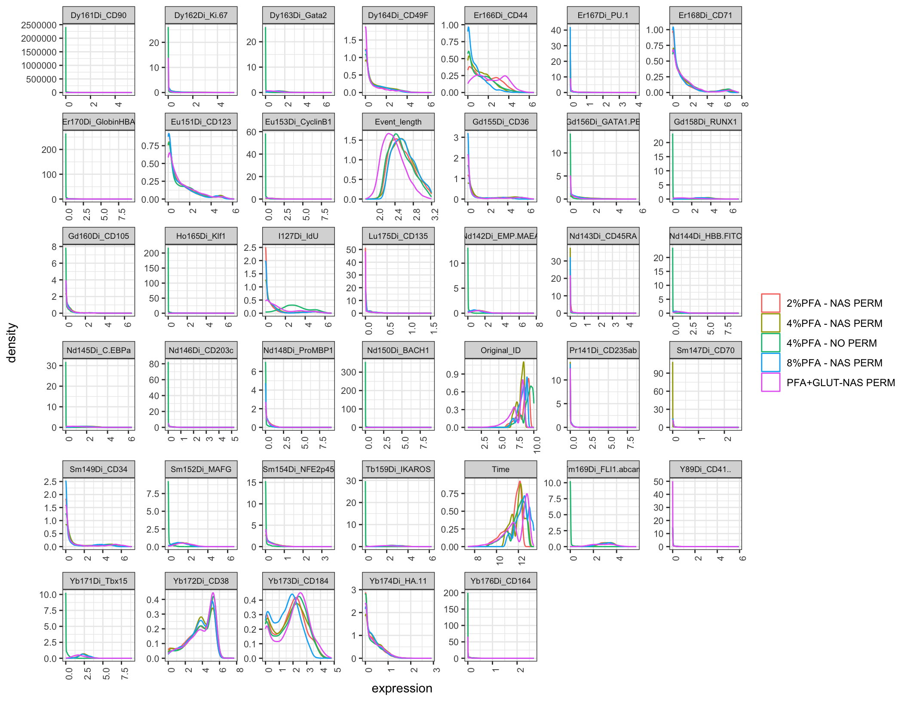
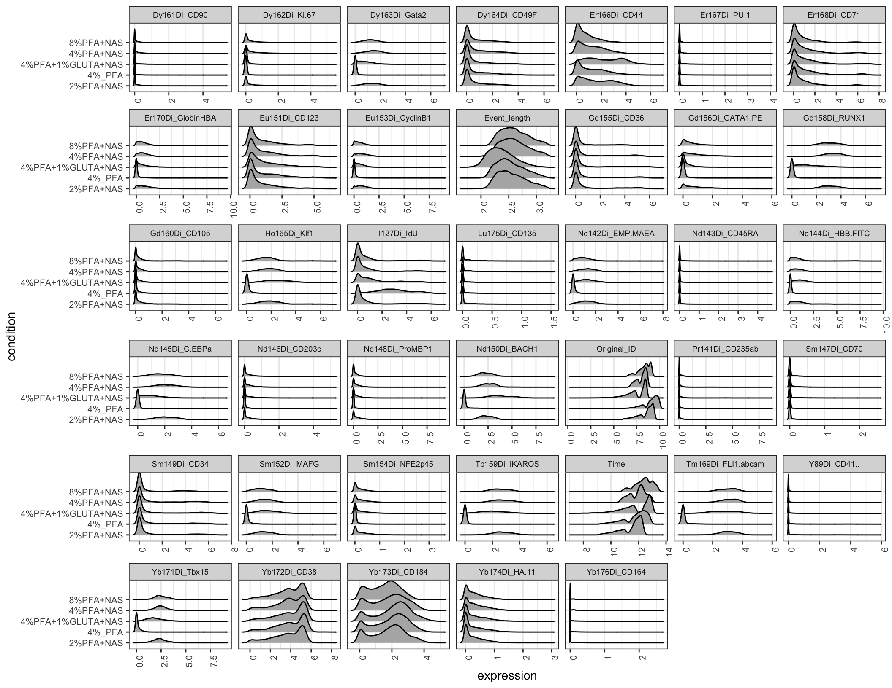
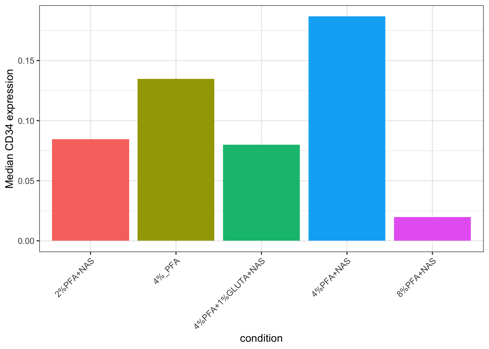
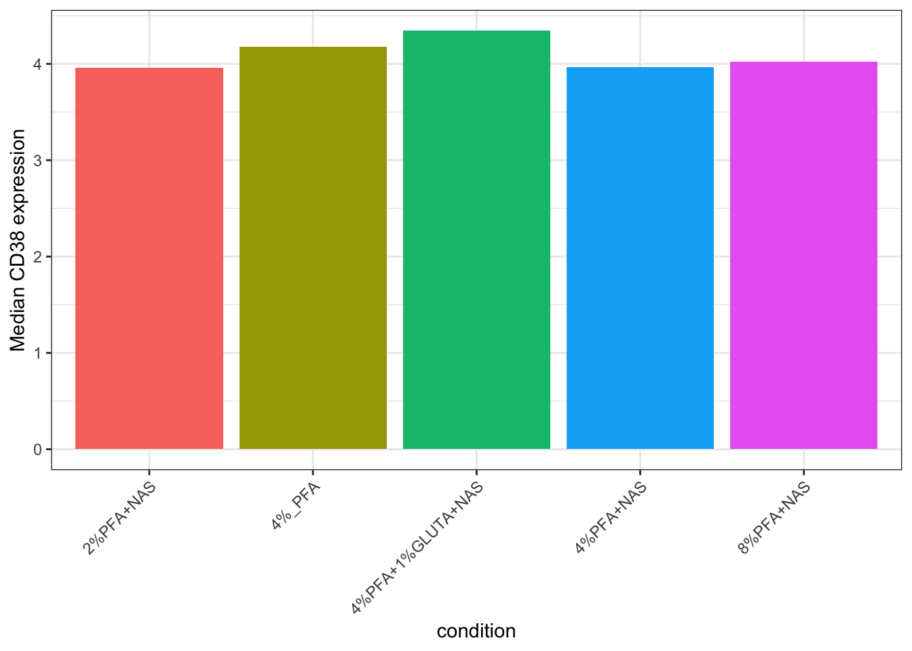
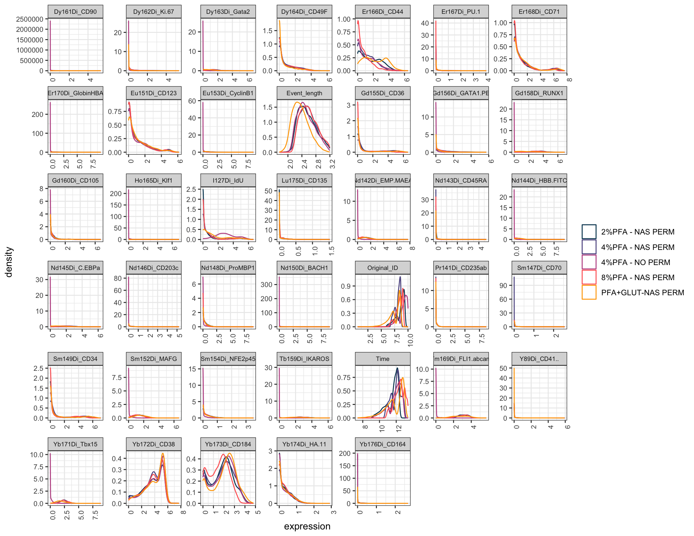

# Chapter 13 - Full Visualisation

## What You'll Learn

Chapter 6 covered the basics of plotting cytometry data. This chapter goes further: visualising every marker's full expression distribution at once, across every sample, so you can spot differences between conditions directly rather than one plot at a time.

## The Essentials {.essentials}

### Step 1: Load Required Packages and Data


``` r
library(here)
#> Warning in readLines(f, n): line 1 appears to contain an
#> embedded nul
#> here() starts at /Volumes/T31/CLAUDE/Analysing-Cytometry-Data-With-R
library(ggplot2)
library(ggridges)
library(cowplot)

EXPRESSION_DATA_SAMPLE_ID_MELTED <- readRDS(here("Data", "RDS", "EXPRESSION_DATA_SAMPLE_ID_MELTED.rds"))
```

### Step 2: Density Plot, All Markers

One density curve per sample, one panel per marker:


``` r
ggplot(EXPRESSION_DATA_SAMPLE_ID_MELTED, aes(x = expression, color = sample_id)) +
  geom_density() +
  facet_wrap(~ antigen, scales = "free") +
  theme_bw() +
  theme(axis.text.x = element_text(angle = 90, hjust = 1),
    strip.text = element_text(size = 7), axis.text = element_text(size = 8),
    legend.title = element_blank())
```



``` r

ggsave2(here("Figures", "all_markers_density.pdf"), width = 11, height = 8.5)
ggsave2(here("Figures", "all_markers_density.png"), width = 11, height = 8.5)
```

Look for markers where one sample's curve sits clearly apart from the others, that's a marker worth a closer look for that specific fixation condition.

### Step 3: Ridge Plot, All Markers

The same information, laid out so each sample's distribution is a separate horizontal ridge rather than an overlaid line, easier to compare shapes across many samples at once:


``` r
ggplot(EXPRESSION_DATA_SAMPLE_ID_MELTED, aes(x = expression, y = condition)) +
  geom_density_ridges() +
  facet_wrap(~ antigen, scales = "free_x") +   # free_x, not free: y is `condition`, the same
                                               # five categories in every panel. Freeing y makes
                                               # ggplot repeat that whole list on all 40 facets,
                                               # which is wider than the panels themselves.
  theme_bw() +
  theme(axis.text.x = element_text(angle = 90, hjust = 1),
    strip.text = element_text(size = 7), axis.text = element_text(size = 8))
#> Picking joint bandwidth of 0.0198
#> Picking joint bandwidth of 0.0649
#> Picking joint bandwidth of 0.0933
#> Picking joint bandwidth of 0.152
#> Picking joint bandwidth of 0.185
#> Picking joint bandwidth of 0.0128
#> Picking joint bandwidth of 0.182
#> Picking joint bandwidth of 0.0915
#> Picking joint bandwidth of 0.192
#> Picking joint bandwidth of 0.0775
#> Picking joint bandwidth of 0.04
#> Picking joint bandwidth of 0.158
#> Picking joint bandwidth of 0.0967
#> Picking joint bandwidth of 0.114
#> Picking joint bandwidth of 0.0497
#> Picking joint bandwidth of 0.112
#> Picking joint bandwidth of 0.159
#> Picking joint bandwidth of 0.0111
#> Picking joint bandwidth of 0.099
#> Picking joint bandwidth of 0.0161
#> Picking joint bandwidth of 0.0961
#> Picking joint bandwidth of 0.101
#> Picking joint bandwidth of 0.0356
#> Picking joint bandwidth of 0.0593
#> Picking joint bandwidth of 0.12
#> Picking joint bandwidth of 0.126
#> Picking joint bandwidth of 0.0186
#> Picking joint bandwidth of 0.0199
#> Picking joint bandwidth of 0.158
#> Picking joint bandwidth of 0.0959
#> Picking joint bandwidth of 0.0442
#> Picking joint bandwidth of 0.106
#> Picking joint bandwidth of 0.125
#> Picking joint bandwidth of 0.0982
#> Picking joint bandwidth of 0.0158
#> Picking joint bandwidth of 0.0924
#> Picking joint bandwidth of 0.243
#> Picking joint bandwidth of 0.167
#> Picking joint bandwidth of 0.0573
#> Picking joint bandwidth of 0.00525
```



``` r

ggsave2(here("Figures", "all_markers_ridgeplot.pdf"), width = 11, height = 8.5)
#> Picking joint bandwidth of 0.0198
#> Picking joint bandwidth of 0.0649
#> Picking joint bandwidth of 0.0933
#> Picking joint bandwidth of 0.152
#> Picking joint bandwidth of 0.185
#> Picking joint bandwidth of 0.0128
#> Picking joint bandwidth of 0.182
#> Picking joint bandwidth of 0.0915
#> Picking joint bandwidth of 0.192
#> Picking joint bandwidth of 0.0775
#> Picking joint bandwidth of 0.04
#> Picking joint bandwidth of 0.158
#> Picking joint bandwidth of 0.0967
#> Picking joint bandwidth of 0.114
#> Picking joint bandwidth of 0.0497
#> Picking joint bandwidth of 0.112
#> Picking joint bandwidth of 0.159
#> Picking joint bandwidth of 0.0111
#> Picking joint bandwidth of 0.099
#> Picking joint bandwidth of 0.0161
#> Picking joint bandwidth of 0.0961
#> Picking joint bandwidth of 0.101
#> Picking joint bandwidth of 0.0356
#> Picking joint bandwidth of 0.0593
#> Picking joint bandwidth of 0.12
#> Picking joint bandwidth of 0.126
#> Picking joint bandwidth of 0.0186
#> Picking joint bandwidth of 0.0199
#> Picking joint bandwidth of 0.158
#> Picking joint bandwidth of 0.0959
#> Picking joint bandwidth of 0.0442
#> Picking joint bandwidth of 0.106
#> Picking joint bandwidth of 0.125
#> Picking joint bandwidth of 0.0982
#> Picking joint bandwidth of 0.0158
#> Picking joint bandwidth of 0.0924
#> Picking joint bandwidth of 0.243
#> Picking joint bandwidth of 0.167
#> Picking joint bandwidth of 0.0573
#> Picking joint bandwidth of 0.00525
ggsave2(here("Figures", "all_markers_ridgeplot.png"), width = 11, height = 8.5)
#> Picking joint bandwidth of 0.0198
#> Picking joint bandwidth of 0.0649
#> Picking joint bandwidth of 0.0933
#> Picking joint bandwidth of 0.152
#> Picking joint bandwidth of 0.185
#> Picking joint bandwidth of 0.0128
#> Picking joint bandwidth of 0.182
#> Picking joint bandwidth of 0.0915
#> Picking joint bandwidth of 0.192
#> Picking joint bandwidth of 0.0775
#> Picking joint bandwidth of 0.04
#> Picking joint bandwidth of 0.158
#> Picking joint bandwidth of 0.0967
#> Picking joint bandwidth of 0.114
#> Picking joint bandwidth of 0.0497
#> Picking joint bandwidth of 0.112
#> Picking joint bandwidth of 0.159
#> Picking joint bandwidth of 0.0111
#> Picking joint bandwidth of 0.099
#> Picking joint bandwidth of 0.0161
#> Picking joint bandwidth of 0.0961
#> Picking joint bandwidth of 0.101
#> Picking joint bandwidth of 0.0356
#> Picking joint bandwidth of 0.0593
#> Picking joint bandwidth of 0.12
#> Picking joint bandwidth of 0.126
#> Picking joint bandwidth of 0.0186
#> Picking joint bandwidth of 0.0199
#> Picking joint bandwidth of 0.158
#> Picking joint bandwidth of 0.0959
#> Picking joint bandwidth of 0.0442
#> Picking joint bandwidth of 0.106
#> Picking joint bandwidth of 0.125
#> Picking joint bandwidth of 0.0982
#> Picking joint bandwidth of 0.0158
#> Picking joint bandwidth of 0.0924
#> Picking joint bandwidth of 0.243
#> Picking joint bandwidth of 0.167
#> Picking joint bandwidth of 0.0573
#> Picking joint bandwidth of 0.00525
```

### Step 4: A Simpler View, Median Expression for One Marker

Full distributions are thorough but busy. Sometimes you just want a quick, simple comparison, is this marker higher or lower in one condition versus another. Pick a marker and summarise it down to one number per sample, its median expression:


``` r
library(dplyr)
#> 
#> Attaching package: 'dplyr'
#> The following objects are masked from 'package:stats':
#> 
#>     filter, lag
#> The following objects are masked from 'package:base':
#> 
#>     intersect, setdiff, setequal, union

MEDIAN_CD34 <- EXPRESSION_DATA_SAMPLE_ID_MELTED %>%
  filter(antigen == "Sm149Di_CD34") %>%
  group_by(sample_id, condition) %>%
  summarize(median_expression = median(expression), .groups = "drop")

ggplot(MEDIAN_CD34, aes(x = condition, y = median_expression, fill = condition)) +
  geom_col() +
  ylab("Median CD34 expression") +
  theme_bw() +
  theme(legend.position = "none", axis.text.x = element_text(angle = 45, hjust = 1))
```



``` r

ggsave2(here("Figures", "cd34_median_expression.pdf"), width = 11, height = 8.5)
ggsave2(here("Figures", "cd34_median_expression.png"), width = 11, height = 8.5)
```

Do the same for a second marker to compare:


``` r
MEDIAN_CD38 <- EXPRESSION_DATA_SAMPLE_ID_MELTED %>%
  filter(antigen == "Yb172Di_CD38") %>%
  group_by(sample_id, condition) %>%
  summarize(median_expression = median(expression), .groups = "drop")

ggplot(MEDIAN_CD38, aes(x = condition, y = median_expression, fill = condition)) +
  geom_col() +
  ylab("Median CD38 expression") +
  theme_bw() +
  theme(legend.position = "none", axis.text.x = element_text(angle = 45, hjust = 1))
```



``` r

ggsave2(here("Figures", "cd38_median_expression.pdf"), width = 11, height = 8.5)
ggsave2(here("Figures", "cd38_median_expression.png"), width = 11, height = 8.5)
```

**Note:** the antigen column values here, `Sm149Di_CD34`, `Yb172Di_CD38`, are the combined channel_marker names Chapter 8 created. Check `unique(EXPRESSION_DATA_SAMPLE_ID_MELTED$antigen)` if you're unsure of the exact spelling for a marker in your own panel.

## A Deeper Dive {.deeper-dive}

### The Colours Don't Actually Match Each Other

Look back at Chapter 9's cell-count bar chart, then at Step 2's density plot above. Both describe the same 5 samples. But Chapter 9 colours by the raw FCS filename (`2PFANASPermLIVE.fcs`), this chapter colours by `sample_id` or `condition`, a completely different label (`2%PFA - NAS PERM`, `2%PFA+NAS`). ggplot2 assigns default colours by alphabetical order of whatever labels are present in that specific plot, so even though both charts describe the same 5 samples, the colour-to-sample mapping in one chart has no relationship to the colour-to-sample mapping in the other. A reader can't glance between the two and know they're looking at the same sample by colour alone.

Fix it properly from here on: one fixed colour per sample, reused in every chapter going forward.

### Building a Shared Colour Palette

The palette lives in its own file, `Scripts/palette.R`, rather than being typed into a chapter. It is one definition, sourced wherever it is needed, so it cannot drift into two versions that disagree:


``` r
source(here("Scripts", "palette.R"))

colour_conditions
#> [1] "#003f5c" "#58508d" "#bc5090" "#ff6361" "#ffa600"
```

**Success looks like this:**
```
[1] "#003f5c" "#58508d" "#bc5090" "#ff6361" "#ffa600"
```

That file defines `colour_conditions` and two helpers, `custom_colour_manual()` and `custom_fill_manual()`, which you drop into any plot in place of letting ggplot choose. Sourcing a file rather than putting the definition in a chapter matters here because chapters are meant to be runnable on their own: a reader starting at Chapter 14 still gets the same colours.

Five colours for five samples, running dark blue, purple, magenta, coral, amber. Size the list to the number of groups you actually have. A long palette used for a short list is not harmless: `scale_colour_manual()` simply takes the first *n* values, so a thirteen-colour ramp applied to five samples hands out its first five, and if those five sit close together on the ramp every sample comes out a slightly different shade of the same colour. Distinguishable is the whole requirement here, so pick colours that are far apart across the range you need and no more of them than that.

`custom_colour_manual()` and `custom_fill_manual()` are small helper functions that apply this fixed list wherever you'd normally use ggplot2's own colour or fill scale, so every plot draws from the same fixed list instead of picking its own colours based on whatever's alphabetically present in that one plot.

Re-running Step 2's density plot with the shared palette applied:


``` r
ggplot(EXPRESSION_DATA_SAMPLE_ID_MELTED, aes(x = expression, color = sample_id)) +
  geom_density() +
  facet_wrap(~ antigen, scales = "free") +
  theme_bw() +
  theme(axis.text.x = element_text(angle = 90, hjust = 1),
    strip.text = element_text(size = 7), axis.text = element_text(size = 8),
    legend.title = element_blank()) +
  custom_colour_manual()
```



The colours here are now fixed to specific samples, not reassigned per plot. The same `custom_colour_manual()`/`custom_fill_manual()` calls can be dropped into any later chapter's plots to keep that fixed mapping going forward.

### What's Next

With the shared colour palette established, the next chapter reduces this data to two dimensions with UMAP and tSNE.
