# Chapter 14 - Dimensionality Reduction (UMAP and tSNE)

## What You'll Learn

Cytometry data has many dimensions, one per marker. Dimensionality reduction techniques like UMAP and tSNE project that high-dimensional data down to two dimensions for visualisation, while trying to preserve the relationships between similar cells. This chapter runs both twice, once on every marker, once on a smaller lineage-only subset, since these answer different questions and aren't meant to be unified into a single "correct" version.

## The Essentials {.essentials}

### Step 1: Load Required Packages and Data


``` r
library(here)
#> Warning in readLines(f, n): line 1 appears to contain an
#> embedded nul
#> here() starts at /Volumes/T31/CLAUDE/Analysing-Cytometry-Data-With-R
library(uwot)
#> Loading required package: Matrix
#> Warning: package 'Matrix' was built under R version 4.6.1
library(Rtsne)
library(ggplot2)
library(cowplot)
library(dplyr)
#> 
#> Attaching package: 'dplyr'
#> The following objects are masked from 'package:stats':
#> 
#>     filter, lag
#> The following objects are masked from 'package:base':
#> 
#>     intersect, setdiff, setequal, union
library(viridis)
#> Loading required package: viridisLite
library(readxl)
library(dbscan)    # density clustering, used to gate regions in the Deep Dive
#> 
#> Attaching package: 'dbscan'
#> The following object is masked from 'package:stats':
#> 
#>     as.dendrogram
library(ggforce)   # geom_mark_hull(), draws those gates as outlines

source(here("Scripts", "palette.R"))   # colour_conditions and the custom_*_manual() helpers

EXPRESSION_DATA_SAMPLE_ID <- readRDS(here("Data", "RDS", "EXPRESSION_DATA_SAMPLE_ID.rds"))
metadata <- read_xlsx(here("Data", "other", "ACDwR_metadata.xlsx"))
```

The palette comes from `Scripts/palette.R`, the same file Chapter 13 sources. Sourcing it rather than retyping the hex codes means one definition, so a sample is the same colour here as it was there, and changing it once changes it everywhere.

### Step 2: Run UMAP on All Markers

`EXPRESSION_DATA_SAMPLE_ID` carries more than markers: `sample_id` is a label, `Time` and `Event_length` are acquisition metadata, and `Original_ID` is an event index PeacoQC added back in Chapter 9. None of those belong in a UMAP or tSNE run, and listing them by hand to exclude them is a trap, because the next tool that appends a column will silently get treated as a marker.

Take the list from your panel file instead. `ACDwR_panel.csv` already classifies every channel in a `marker_class` column, so it can say which columns are markers rather than you maintaining a second list that has to be kept in step:


``` r
panel <- read.csv(here("Data", "other", "ACDwR_panel.csv"))
panel_cols <- make.names(paste(panel$fcs_colname, panel$antigen, sep = "_"))

marker_cols <- panel_cols[panel$marker_class != "none"]
length(marker_cols)
#> [1] 37
```

**Success looks like this:**
```
[1] 37
```

`paste()` rebuilds the same combined `channel_marker` names Chapter 8 created, and `make.names()` applies the same tidying `data.frame()` applied in Chapter 12, so these match the table's actual column names exactly, including the awkward ones. `marker_class == "none"` is how the panel labels `Time` and `Event_length`. `Original_ID` never appears because it is not in the panel at all, which is the point of deriving the list rather than writing it out.

UMAP is a randomised algorithm, so `set.seed()` before every run is what makes your projection reproducible, and what lets your figures match the ones in this book.

**One setting quietly cancels that out.** `uwot::umap()` has a `fast_sgd` argument, and turning it on makes the run about twice as fast. It also sets `n_sgd_threads = "auto"`, `approx_pow = TRUE` and `pcg_rand = FALSE` all at once, and the result is no longer reproducible **even with a seed**. Two runs on identical data with identical seeds came out with coordinates differing by more than the entire width of the plot, and forcing the thread count back to one does not rescue it. On this dataset the speed saved was four seconds. Leave `fast_sgd` off, which is the default, and the seed does its job:


``` r
set.seed(1234)
EDU_umap <- umap(EXPRESSION_DATA_SAMPLE_ID[, marker_cols], n_neighbors = 15, metric = "cosine", min_dist = 0.001, verbose = TRUE)
#> 18:42:53 UMAP embedding parameters a = 1.929 b = 0.7915
#> 18:42:53 Converting dataframe to numerical matrix
#> 18:42:53 Read 25000 rows and found 37 numeric columns
#> 18:42:53 Using Annoy for neighbor search, n_neighbors = 15
#> 18:42:53 Building Annoy index with metric = cosine, n_trees = 50
#> 0%   10   20   30   40   50   60   70   80   90   100%
#> [----|----|----|----|----|----|----|----|----|----|
#> **************************************************|
#> 18:42:54 Writing NN index file to temp file /var/folders/b9/5sf7xbjx7dvf_sp2yq0ctcnc0000gq/T//Rtmp7eebUq/filea38050167d16
#> 18:42:54 Searching Annoy index using 6 threads, search_k = 1500
#> 18:42:55 Annoy recall = 100%
#> 18:42:55 Commencing smooth kNN distance calibration using 6 threads with target n_neighbors = 15
#> 18:42:55 Initializing from normalized Laplacian + noise (using RSpectra)
#> 18:42:55 Commencing optimization for 200 epochs, with 536332 positive edges
#> 18:42:55 Using rng type: pcg
#> 18:43:01 Optimization finished
EDU_umap <- as.data.frame(EDU_umap)
colnames(EDU_umap) <- c("UMAP1", "UMAP2")

EXPRESSION_DATA_SAMPLE_ID_UMAPPED <- cbind(EDU_umap, EXPRESSION_DATA_SAMPLE_ID)

# Bring the experimental condition across from the metadata sheet, joined on sample name
# rather than on position, the same rule as Chapter 12.
EXPRESSION_DATA_SAMPLE_ID_UMAPPED$condition <-
  metadata$condition[match(EXPRESSION_DATA_SAMPLE_ID_UMAPPED$sample_id, metadata$sample_id)]

saveRDS(EXPRESSION_DATA_SAMPLE_ID_UMAPPED, here("Data", "RDS", "EXPRESSION_DATA_SAMPLE_ID_UMAPPED.rds"))
```

A seed makes a run repeatable on the same machine with the same package versions. It does not survive an R or uwot upgrade, so record versions alongside any figure you intend to reproduce later.

### Step 2b: Fix the Axis Limits Once

Every plot from here uses the same limits, taken from the data. Panels drawn on their own scales are not comparable, and a reader will compare them anyway:


``` r
xmin <- round(min(EXPRESSION_DATA_SAMPLE_ID_UMAPPED$UMAP1) - 1, 1)
xmax <- round(max(EXPRESSION_DATA_SAMPLE_ID_UMAPPED$UMAP1) + 1, 1)
ymin <- round(min(EXPRESSION_DATA_SAMPLE_ID_UMAPPED$UMAP2) - 1, 1)
ymax <- round(max(EXPRESSION_DATA_SAMPLE_ID_UMAPPED$UMAP2) + 1, 1)

c(xmin, xmax, ymin, ymax)
#> [1] -12.4  11.1 -15.1  11.3
```

### Step 3: Plot the All-Markers UMAP

Three things here that the earlier chapters' plots did not need, and **every plot in this chapter that colours by sample or condition uses all of them.** A palette applied to one figure and forgotten on the next three is worse than no palette at all, because the same sample changes colour between figures and the reader has no way to know.

`custom_colour_manual()` comes from `Scripts/palette.R`, so a sample is the same colour here as in Chapter 13. `override.aes` rebuilds the legend keys at a visible size: the plotted points are deliberately tiny and semi-transparent so 25,000 of them can be drawn at once, and a legend key inherits those aesthetics unless you say otherwise, which leaves you with a legend nobody can read.

The `xlim`/`ylim` are the fixed limits from Step 2b, and those belong to **this** projection only. The tSNE and the lineage-only runs produce their own coordinate ranges, so forcing this projection's limits onto them would crop the plot. Fixed limits are for comparing panels of the same projection, which is what the Deep Dive does; they are not a general setting to paste everywhere.


``` r
ggplot(EXPRESSION_DATA_SAMPLE_ID_UMAPPED, aes(x = UMAP1, y = UMAP2, color = sample_id)) +
  geom_point(size = 0.5, alpha = 0.5) +
  xlim(c(xmin, xmax)) + ylim(c(ymin, ymax)) +
  custom_colour_manual() +
  guides(colour = guide_legend(override.aes = list(size = 8, alpha = 1))) +
  theme_bw() +
  theme(legend.title = element_blank()) +
  ggtitle("UMAP, all markers, coloured by sample")
```

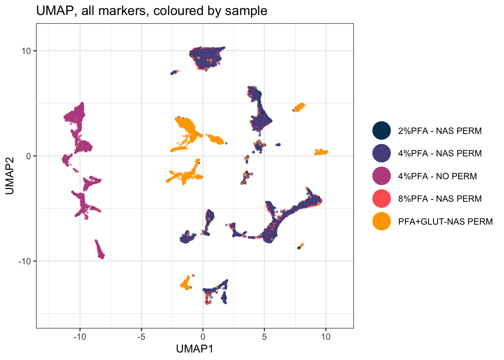

``` r

ggsave2(here("Figures", "umap_all_markers.pdf"), width = 11, height = 8.5)
ggsave2(here("Figures", "umap_all_markers.png"), width = 11, height = 8.5)
```

### Step 4: Run tSNE on All Markers


``` r
tsne_in <- as.data.frame(EXPRESSION_DATA_SAMPLE_ID[, marker_cols])

set.seed(1234)
tsne_out <- Rtsne(tsne_in, pca = TRUE, verbose = TRUE, check_duplicates = FALSE)
#> Performing PCA
#> Read the 25000 x 37 data matrix successfully!
#> Using no_dims = 2, perplexity = 30.000000, and theta = 0.500000
#> Computing input similarities...
#> Building tree...
#>  - point 10000 of 25000
#>  - point 20000 of 25000
#> Done in 4.33 seconds (sparsity = 0.005214)!
#> Learning embedding...
#> Iteration 50: error is 107.617945 (50 iterations in 1.67 seconds)
#> Iteration 100: error is 107.494785 (50 iterations in 1.74 seconds)
#> Iteration 150: error is 91.439048 (50 iterations in 1.54 seconds)
#> Iteration 200: error is 87.592434 (50 iterations in 1.58 seconds)
#> Iteration 250: error is 85.915933 (50 iterations in 1.67 seconds)
#> Iteration 300: error is 3.724382 (50 iterations in 1.53 seconds)
#> Iteration 350: error is 3.355635 (50 iterations in 1.46 seconds)
#> Iteration 400: error is 3.122446 (50 iterations in 1.46 seconds)
#> Iteration 450: error is 2.957886 (50 iterations in 1.46 seconds)
#> Iteration 500: error is 2.833609 (50 iterations in 1.45 seconds)
#> Iteration 550: error is 2.735669 (50 iterations in 1.45 seconds)
#> Iteration 600: error is 2.656206 (50 iterations in 1.45 seconds)
#> Iteration 650: error is 2.590256 (50 iterations in 1.46 seconds)
#> Iteration 700: error is 2.534433 (50 iterations in 1.46 seconds)
#> Iteration 750: error is 2.486316 (50 iterations in 1.45 seconds)
#> Iteration 800: error is 2.444342 (50 iterations in 1.46 seconds)
#> Iteration 850: error is 2.407324 (50 iterations in 1.46 seconds)
#> Iteration 900: error is 2.374716 (50 iterations in 1.47 seconds)
#> Iteration 950: error is 2.345861 (50 iterations in 1.45 seconds)
#> Iteration 1000: error is 2.320109 (50 iterations in 1.46 seconds)
#> Fitting performed in 30.12 seconds.

EXPRESSION_DATA_SAMPLE_ID_UMAPPED_TSNE <- data.frame(EXPRESSION_DATA_SAMPLE_ID_UMAPPED, tsne1 = tsne_out$Y[, 1], tsne2 = tsne_out$Y[, 2])

saveRDS(EXPRESSION_DATA_SAMPLE_ID_UMAPPED_TSNE, here("Data", "RDS", "EXPRESSION_DATA_SAMPLE_ID_UMAPPED_TSNE.rds"))
```

### Step 5: Plot the All-Markers tSNE


``` r
ggplot(EXPRESSION_DATA_SAMPLE_ID_UMAPPED_TSNE, aes(x = tsne1, y = tsne2, color = sample_id)) +
  geom_point(size = 0.5, alpha = 0.5) +
  custom_colour_manual() +
  guides(colour = guide_legend(override.aes = list(size = 8, alpha = 1))) +
  theme_bw() +
  theme(legend.title = element_blank()) +
  ggtitle("tSNE, all markers, coloured by sample")
```

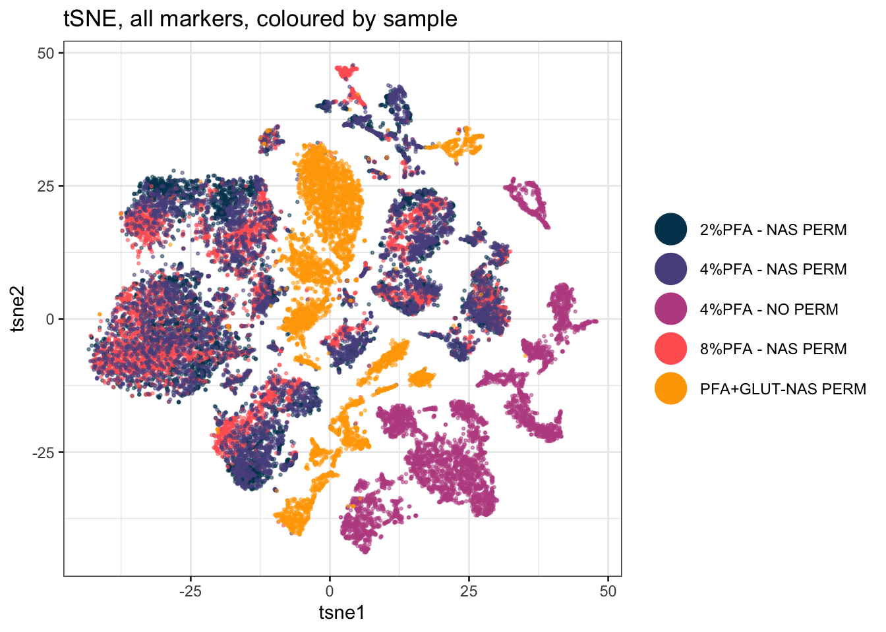

``` r

ggsave2(here("Figures", "tsne_all_markers.pdf"), width = 11, height = 8.5)
ggsave2(here("Figures", "tsne_all_markers.png"), width = 11, height = 8.5)
```

### Step 6: Choose Lineage Markers

Running UMAP/tSNE on every column, including markers that don't define cell identity, can dilute the structure you actually care about. A second run on just your lineage/phenotyping markers often shows cleaner population separation:

Same principle as Step 2: the panel already knows. `marker_class` distinguishes `type` markers, the ones that define what a cell *is*, from `state` markers, the ones that describe what it is *doing*:


``` r
lineage_markers <- panel_cols[panel$marker_class == "type"]
length(lineage_markers)
#> [1] 32
```

**Success looks like this:**
```
[1] 32
```

The five left out are `I127Di_IdU`, `Eu153Di_CyclinB1`, `Dy162Di_Ki.67`, `Gd156Di_GATA1.PE` and `Dy163Di_Gata2`, all proliferation, cell-cycle or transcription-factor readouts. A cell in S phase is not a different lineage from the same cell in G1, so letting those drive the embedding spreads a population out by what it is doing rather than what it is.

Classifying markers once, in the panel file, pays off here: every later step can then ask for the markers it needs instead of carrying its own hand-written list. This list doesn't have to match the marker list you cluster on in Chapter 15. Visualising on one set and clustering on a different one is a legitimate choice, not an inconsistency, decide each independently based on what you're trying to see or define.

### Step 7: Run UMAP on Lineage Markers Only


``` r
set.seed(1234)
EDU_umap_lineage <- umap(EXPRESSION_DATA_SAMPLE_ID[, lineage_markers], n_neighbors = 15, metric = "cosine", min_dist = 0.001, verbose = TRUE)
#> 18:43:40 UMAP embedding parameters a = 1.929 b = 0.7915
#> 18:43:40 Converting dataframe to numerical matrix
#> 18:43:40 Read 25000 rows and found 32 numeric columns
#> 18:43:40 Using Annoy for neighbor search, n_neighbors = 15
#> 18:43:40 Building Annoy index with metric = cosine, n_trees = 50
#> 0%   10   20   30   40   50   60   70   80   90   100%
#> [----|----|----|----|----|----|----|----|----|----|
#> **************************************************|
#> 18:43:41 Writing NN index file to temp file /var/folders/b9/5sf7xbjx7dvf_sp2yq0ctcnc0000gq/T//Rtmp7eebUq/filea3803511c71a
#> 18:43:41 Searching Annoy index using 6 threads, search_k = 1500
#> 18:43:41 Annoy recall = 100%
#> 18:43:41 Commencing smooth kNN distance calibration using 6 threads with target n_neighbors = 15
#> 18:43:41 Initializing from normalized Laplacian + noise (using RSpectra)
#> 18:43:42 Commencing optimization for 200 epochs, with 539940 positive edges
#> 18:43:42 Using rng type: pcg
#> 18:43:47 Optimization finished
EDU_umap_lineage <- as.data.frame(EDU_umap_lineage)
colnames(EDU_umap_lineage) <- c("UMAP1_lineage", "UMAP2_lineage")

EXPRESSION_DATA_SAMPLE_ID_UMAPPED_LINEAGE <- cbind(EDU_umap_lineage, EXPRESSION_DATA_SAMPLE_ID)
saveRDS(EXPRESSION_DATA_SAMPLE_ID_UMAPPED_LINEAGE, here("Data", "RDS", "EXPRESSION_DATA_SAMPLE_ID_UMAPPED_LINEAGE.rds"))
```

### Step 8: Plot the Lineage-Only UMAP


``` r
ggplot(EXPRESSION_DATA_SAMPLE_ID_UMAPPED_LINEAGE, aes(x = UMAP1_lineage, y = UMAP2_lineage, color = sample_id)) +
  geom_point(size = 0.5, alpha = 0.5) +
  custom_colour_manual() +
  guides(colour = guide_legend(override.aes = list(size = 8, alpha = 1))) +
  theme_bw() +
  theme(legend.title = element_blank()) +
  ggtitle("UMAP, lineage markers only, coloured by sample")
```

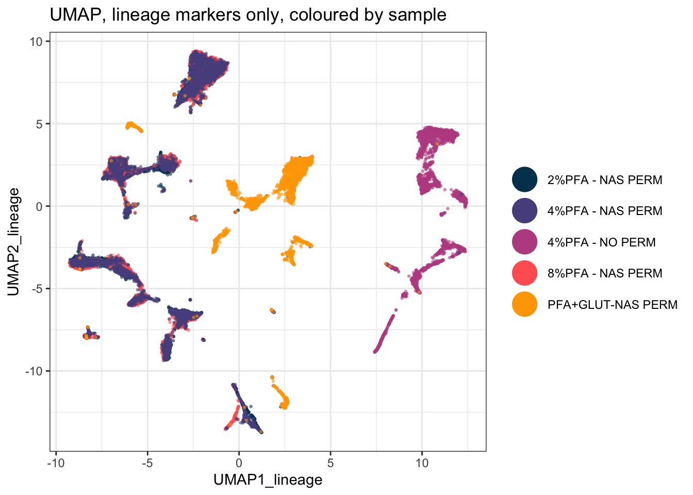

``` r

ggsave2(here("Figures", "umap_lineage_markers.pdf"), width = 11, height = 8.5)
ggsave2(here("Figures", "umap_lineage_markers.png"), width = 11, height = 8.5)
```

### Step 9: Run tSNE on Lineage Markers Only


``` r
tsne_in_lineage <- as.data.frame(EXPRESSION_DATA_SAMPLE_ID[, lineage_markers])

set.seed(1234)
tsne_out_lineage <- Rtsne(tsne_in_lineage, pca = TRUE, verbose = TRUE, check_duplicates = FALSE)
#> Performing PCA
#> Read the 25000 x 32 data matrix successfully!
#> Using no_dims = 2, perplexity = 30.000000, and theta = 0.500000
#> Computing input similarities...
#> Building tree...
#>  - point 10000 of 25000
#>  - point 20000 of 25000
#> Done in 3.25 seconds (sparsity = 0.005216)!
#> Learning embedding...
#> Iteration 50: error is 107.615936 (50 iterations in 1.56 seconds)
#> Iteration 100: error is 107.490985 (50 iterations in 1.81 seconds)
#> Iteration 150: error is 91.375371 (50 iterations in 1.55 seconds)
#> Iteration 200: error is 87.218854 (50 iterations in 1.51 seconds)
#> Iteration 250: error is 85.611740 (50 iterations in 1.53 seconds)
#> Iteration 300: error is 3.720626 (50 iterations in 1.47 seconds)
#> Iteration 350: error is 3.358805 (50 iterations in 1.46 seconds)
#> Iteration 400: error is 3.136466 (50 iterations in 1.45 seconds)
#> Iteration 450: error is 2.979606 (50 iterations in 1.44 seconds)
#> Iteration 500: error is 2.861771 (50 iterations in 1.44 seconds)
#> Iteration 550: error is 2.769302 (50 iterations in 1.44 seconds)
#> Iteration 600: error is 2.693772 (50 iterations in 1.45 seconds)
#> Iteration 650: error is 2.630995 (50 iterations in 1.44 seconds)
#> Iteration 700: error is 2.577232 (50 iterations in 1.44 seconds)
#> Iteration 750: error is 2.531071 (50 iterations in 1.45 seconds)
#> Iteration 800: error is 2.490709 (50 iterations in 1.44 seconds)
#> Iteration 850: error is 2.455517 (50 iterations in 1.44 seconds)
#> Iteration 900: error is 2.424385 (50 iterations in 1.44 seconds)
#> Iteration 950: error is 2.396727 (50 iterations in 1.44 seconds)
#> Iteration 1000: error is 2.372034 (50 iterations in 1.44 seconds)
#> Fitting performed in 29.62 seconds.

EXPRESSION_DATA_SAMPLE_ID_UMAPPED_TSNE_LINEAGE <- data.frame(EXPRESSION_DATA_SAMPLE_ID_UMAPPED_LINEAGE, tsne1_lineage = tsne_out_lineage$Y[, 1], tsne2_lineage = tsne_out_lineage$Y[, 2])

saveRDS(EXPRESSION_DATA_SAMPLE_ID_UMAPPED_TSNE_LINEAGE, here("Data", "RDS", "EXPRESSION_DATA_SAMPLE_ID_UMAPPED_TSNE_LINEAGE.rds"))
```

### Step 10: Plot the Lineage-Only tSNE


``` r
ggplot(EXPRESSION_DATA_SAMPLE_ID_UMAPPED_TSNE_LINEAGE, aes(x = tsne1_lineage, y = tsne2_lineage, color = sample_id)) +
  geom_point(size = 0.5, alpha = 0.5) +
  custom_colour_manual() +
  guides(colour = guide_legend(override.aes = list(size = 8, alpha = 1))) +
  theme_bw() +
  theme(legend.title = element_blank()) +
  ggtitle("tSNE, lineage markers only, coloured by sample")
```

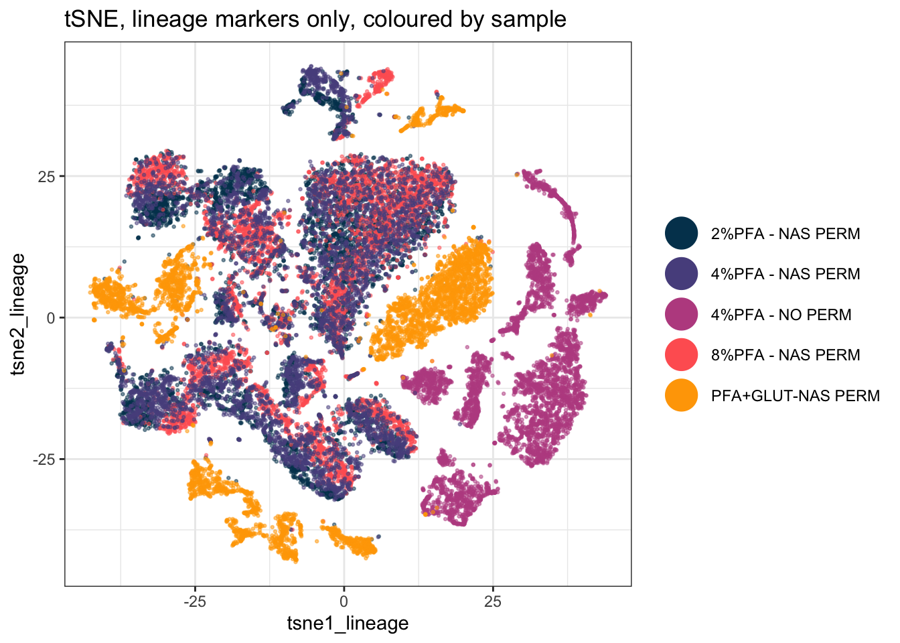

``` r

ggsave2(here("Figures", "tsne_lineage_markers.pdf"), width = 11, height = 8.5)
ggsave2(here("Figures", "tsne_lineage_markers.png"), width = 11, height = 8.5)
```

## A Deeper Dive {.deeper-dive}

UMAP and tSNE both aim to preserve local structure (similar cells stay close together) when squashing high-dimensional data into two dimensions, but they use different underlying math and can produce visibly different layouts from the same data. Neither one's axes have a direct, interpretable meaning, distance and clustering in the plot are informative, but exact coordinates are not.

### How Much of This Picture Is Real? Change the Seed and Find Out

A projection is one draw from a randomised algorithm. Before interpreting anything in it, find out which parts of the picture survive a different seed and which parts were never real to begin with. Run it four times and look:


``` r
seed_plot <- function(s) {
  set.seed(s)
  u <- umap(EXPRESSION_DATA_SAMPLE_ID[, marker_cols], n_neighbors = 15,
            metric = "cosine", min_dist = 0.001, verbose = FALSE)
  d <- data.frame(UMAP1 = u[, 1], UMAP2 = u[, 2],
                  condition = EXPRESSION_DATA_SAMPLE_ID_UMAPPED$condition)
  ggplot(d, aes(x = UMAP1, y = UMAP2, colour = condition)) +
    geom_point(size = 0.01, alpha = 1/3) +
    custom_colour_manual() +
    theme_bw() + theme(legend.position = "none") +
    labs(title = paste0("set.seed(", s, ")"))
}

plot_grid(plotlist = lapply(c(1234, 42, 2026, 7), seed_plot), ncol = 4)
```

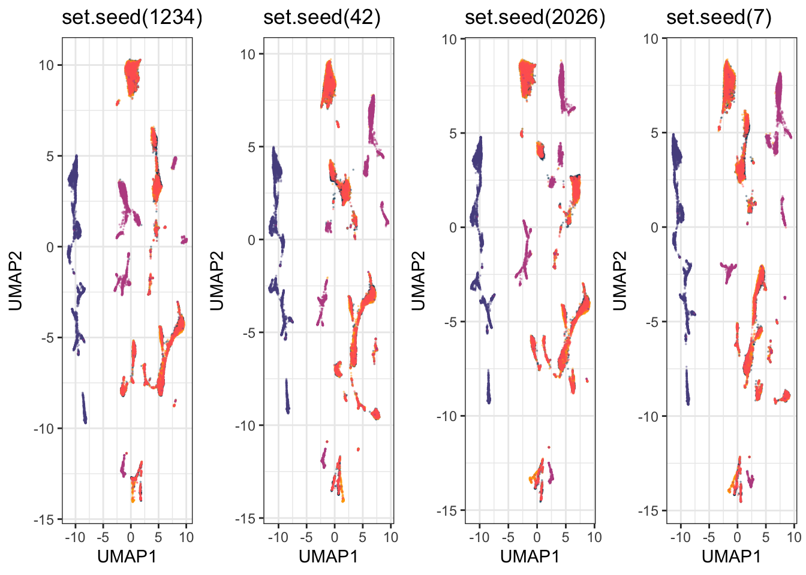

On this dataset, three things hold in every one of the four: the no-permeabilisation samples form their own isolated island, the glutaraldehyde samples stay separate from everything else, and the three PFA-plus-NAS conditions sit mixed together. Three things do not hold: the coordinates, the orientation of the whole map, and the exact number and arrangement of the small sub-islands.

That distinction is the practical rule. A statement about which groups separate from which is safe. A statement that counts clusters, or quotes a position, or reads meaning into which island is next to which, is a statement about one random draw.

### What Is This Projection Actually Separating On?

Colour the same projection two ways, once by fixation protocol and once by a lineage marker:


``` r
by_protocol <- ggplot(EXPRESSION_DATA_SAMPLE_ID_UMAPPED,
                      aes(x = UMAP1, y = UMAP2, colour = condition)) +
  geom_point(size = 0.01, alpha = 1/2) +
  xlim(c(xmin, xmax)) + ylim(c(ymin, ymax)) +
  custom_colour_manual() +
  guides(colour = guide_legend(override.aes = list(size = 6, alpha = 1))) +
  theme_bw() + theme(legend.title = element_blank(), legend.position = "bottom") +
  labs(title = "Coloured by fixation protocol")

by_marker <- ggplot(EXPRESSION_DATA_SAMPLE_ID_UMAPPED,
                    aes(x = UMAP1, y = UMAP2, colour = Sm149Di_CD34)) +
  geom_point(size = 0.01, alpha = 1/5) +
  xlim(c(xmin, xmax)) + ylim(c(ymin, ymax)) +
  viridis::scale_colour_viridis(option = "turbo") +
  theme_bw() + theme(legend.position = "bottom") +
  labs(title = "Coloured by CD34 expression", colour = NULL)

plot_grid(by_protocol, by_marker, ncol = 2)
```

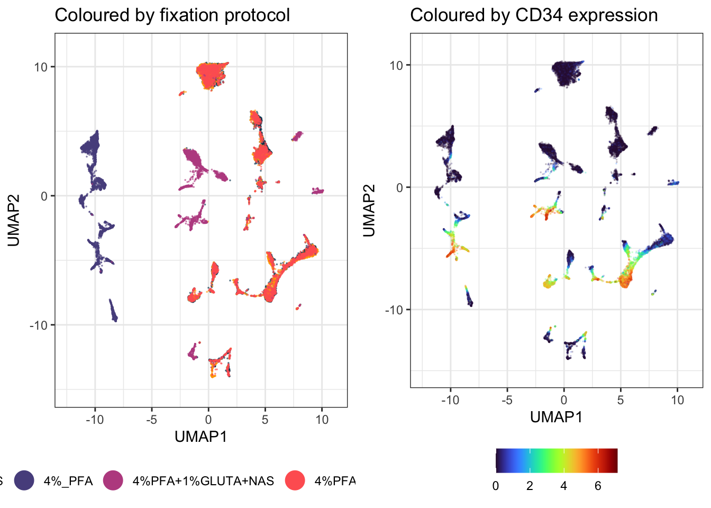

The protocol version explains the picture and the marker version does not. **The dominant structure in this projection is technical, not biological.**

The experiment is doing what it was designed to do. These five samples are the same bone marrow prepared five ways. Without permeabilisation the intracellular markers are never stained, so those cells genuinely do have a different expression profile across the panel, and UMAP separates them because they are different. Glutaraldehyde separates for its own protocol reasons. The three PFA concentrations with NAS overlap, which is the useful practical result: across 2% to 8%, PFA concentration is not changing the measured phenotype much.

UMAP separates on whatever varies most in the data you hand it. Very often that is batch, operator, staining day or protocol rather than biology. A clean separation is not evidence of a biological difference, and reading one as if it were is the commonest way this method is misused. Colour your projection by every technical variable you have before you colour it by the one you care about.

### Reading the Projection: Expression of Every Marker

To find out what a region *is*, colour it by one marker at a time:


``` r
marker_plots <- list()
for (m in marker_cols) {
  marker_plots[[m]] <- ggplot(EXPRESSION_DATA_SAMPLE_ID_UMAPPED,
                              aes(x = UMAP1, y = UMAP2, colour = .data[[m]])) +
    geom_point(size = 0.01, alpha = 1/5) +
    xlim(c(xmin, xmax)) + ylim(c(ymin, ymax)) +
    viridis::scale_colour_viridis(option = "turbo") +
    theme_bw() +
    labs(title = m, colour = NULL) +
    theme(legend.key.size = unit(0.3, "cm"), legend.text = element_text(size = 6))
}

length(marker_plots)
#> [1] 37
```

**Success looks like this:**
```
[1] 37
```

Look at four of them before doing anything with the rest. Two of these say something and two do not, which is the more useful lesson:


``` r
plot_grid(marker_plots[["Sm149Di_CD34"]], marker_plots[["Er168Di_CD71"]],
          marker_plots[["Dy161Di_CD90"]], marker_plots[["Nd143Di_CD45RA"]], ncol = 2)
```

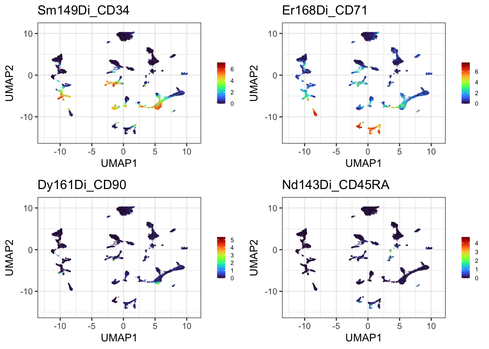

CD34 and CD71 each light up a distinct part of the projection, so they are worth annotating. CD90 and CD45RA are dark almost everywhere, so no region can be read from them and no amount of gating will change that. Most panels in a 37-marker survey look like the second pair, and the survey is how you find out which kind you have.

Thirty-seven plots is too many to page through on screen, so write the whole set to a single PDF and open it properly:


``` r
pages <- split(marker_plots, ceiling(seq_along(marker_plots) / 4))
page_grids <- lapply(pages, function(p) plot_grid(plotlist = p, ncol = 2))

gg_save_pdf <- function(plots, filename) {
  pdf(filename, width = 11, height = 8.5)
  for (p in plots) print(p)
  dev.off()
  invisible(NULL)
}

gg_save_pdf(page_grids, here("Figures", "umap_every_marker.pdf"))

length(page_grids)
#> [1] 10
file.exists(here("Figures", "umap_every_marker.pdf"))
#> [1] TRUE
```

**Success looks like this:**
```
[1] 10
[1] TRUE
```

**This chunk draws nothing on screen, and that is expected.** `pdf()` redirects plotting to a file, so the ten pages go there instead of to the Plots pane. The two lines above are the only feedback you get: how many pages were built, and whether the file arrived.

**Now go and open it.** `Figures/umap_every_marker.pdf`, ten pages, four markers each. This is the survey you use to work out what your populations are, and it is the input to the next section, where regions get named. Scroll through the whole thing once and note which markers localise and which are flat. That list is what you will annotate.

Keep `gg_save_pdf()`. `ggsave()` writes one plot to one file, so a 37-panel survey would be ten separate files to open and compare. Opening a PDF device, printing into it repeatedly and closing it puts everything in one document you can page through, which is how you actually read a survey like this.

**A warning on file size.** That PDF is around 55 MB, because a PDF stores every one of the 25,000 points on every one of the 37 panels as its own vector object. If you need to email it or put it in a repository, either write a PNG instead, at the cost of not being able to zoom, or downsample with `sample_frac()` first as described further down. Check that your `.gitignore` covers PDFs, as this project's does.

`.data[[m]]` is how you tell `aes()` to use a column whose name is held in a variable. Older code uses `aes_string()` for this, which is deprecated and will eventually stop working.

### Naming Regions, and Why It Has to Be Done Within a Group

Now the identification step. Two warnings first, both of which follow from what we have already established.

The first: protocol dominates this projection, so a region identified across the whole map risks being a protocol effect wearing a marker's name. The unpermeabilised sample in particular has no intracellular staining at all, so any region it occupies says more about the preparation than about cell identity. **Identify lineages inside one protocol group, not across the map**, which is why everything below runs on `UMAP_PERM` rather than the full table.


``` r
PERM <- c("2%PFA+NAS", "4%PFA+NAS", "8%PFA+NAS")
UMAP_PERM <- dplyr::filter(EXPRESSION_DATA_SAMPLE_ID_UMAPPED, condition %in% PERM)

# Fixed limits have to come from the cells you are actually drawing. Step 2b's limits
# were taken from the whole projection, and the no-permeabilisation territory that sat
# on one side of it has just been filtered out, so reusing them here would reserve a
# third of the panel width for cells that are no longer in the plot.
perm_xmin <- round(min(UMAP_PERM$UMAP1) - 1, 1)
perm_xmax <- round(max(UMAP_PERM$UMAP1) + 1, 1)
perm_ymin <- round(min(UMAP_PERM$UMAP2) - 1, 1)
perm_ymax <- round(max(UMAP_PERM$UMAP2) + 1, 1)

nrow(UMAP_PERM)
#> [1] 15000
```

**Success looks like this:**
```
[1] 15000
```

Check rather than assume, though, and it is one line. `table()` on the top 5% of a marker tells you whether its high cells belong to one condition or to all of them:


``` r
hi <- UMAP_PERM[UMAP_PERM$Er168Di_CD71 >= quantile(UMAP_PERM$Er168Di_CD71, 0.95), ]
table(hi$condition)
#> 
#> 2%PFA+NAS 4%PFA+NAS 8%PFA+NAS 
#>       274       298       178
```

If a marker's positive cells come overwhelmingly from one condition, you are probably looking at a preparation effect. If they are spread across conditions, the population is real and worth naming.

The second: any coordinates you write down belong to one seed on one machine. Rather than hard-coding numbers that will be wrong on your own data, find the region from the data itself:

The obvious way to draw a gate is a rectangle around the high-expressing cells. Do not start there, because the failure is instructive. A bounding box assumes the cells you are gating form **one** blob. Take the top 10% of cells for a marker and box the middle 80% of them, and it works beautifully for a marker with one hot spot and falls apart completely for a marker with two: the box stretches across the gap between them and swallows every unstained cell in between.

Cluster the high-expressing cells first, and the problem disappears. `dbscan` groups points by density, labels sparse points as noise, and does not need to be told how many groups to look for, which is exactly the property wanted here. A marker lighting up three islands gets three gates rather than one box over everything:


``` r
gate_regions <- function(data, marker, top = 0.05, eps = 0.6, minPts = 25) {
  v  <- data[[marker]]
  hi <- data[v >= quantile(v, 1 - top), c("UMAP1", "UMAP2")]
  if (nrow(hi) < minPts) return(hi[0, ])
  cl <- dbscan::dbscan(as.matrix(hi), eps = eps, minPts = minPts)
  hi$region <- cl$cluster
  hi[hi$region > 0, ]     # region 0 is dbscan's noise label
}

gate_plot <- function(marker) {
  g <- gate_regions(UMAP_PERM, marker)
  n <- if (nrow(g)) length(unique(g$region)) else 0
  p <- ggplot(UMAP_PERM, aes(x = UMAP1, y = UMAP2)) +
    geom_point(aes(colour = .data[[marker]]), size = 0.01, alpha = 1/5) +
    xlim(c(perm_xmin, perm_xmax)) + ylim(c(perm_ymin, perm_ymax)) +
    viridis::scale_colour_viridis(option = "turbo") +
    theme_bw() + theme(legend.position = "none")
  if (n > 0) {
    p <- p + geom_mark_hull(data = g, aes(group = factor(region)),
                            expand = unit(2, "mm"), radius = unit(2, "mm"),
                            colour = "black", linewidth = 0.4)
  }
  p + labs(title = sprintf("%s: %d region(s), cutoff %.2f",
                           marker, n, quantile(UMAP_PERM[[marker]], 1 - 0.05)))
}

plot_grid(gate_plot("Sm149Di_CD34"), gate_plot("Yb172Di_CD38"),
          gate_plot("Er168Di_CD71"), gate_plot("Dy161Di_CD90"), ncol = 2)
```

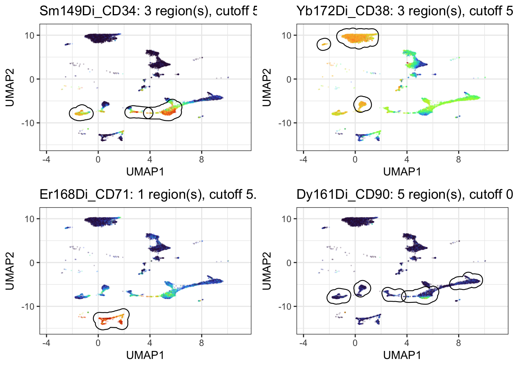

`geom_mark_hull()` from `ggforce` draws a rounded outline around each group instead of a rectangle, so the gate follows the shape of the island rather than boxing the empty space around it.

**The cutoff in each title is the part to read.** It is the expression value at the 95th percentile, the level a cell has to reach to be gated at all, and it tells you whether the gates mean anything:

| Marker | Cutoff | Regions found |
|---|---|---|
| CD34 | 5.15 | 3 |
| CD38 | 5.49 | 3 |
| CD71 | 5.33 | 1 |
| CD41 | 2.96 | 1 |
| CD235ab | 0.89 | 2 |
| CD90 | 0.81 | 5 |

The markers with a genuine positive population cut at around 5. CD90 and CD235ab cut below 1, which means their "top 5%" is barely above background, and the five neat regions found for CD90 are gates drawn around noise. **A gating function will always return something.** Print the cutoff next to it, and you can tell the difference between a real population and the least-negative corner of a negative marker, without needing an arbitrary threshold buried inside the function.

Why 5% rather than 10%: at 10% the cutoff drops far enough to pull in the shoulder of the negative population, and the regions blur together. Try both on your own data. The right number depends on how large the positive population actually is, and if you know it is 20% of cells then gate 20%, not 5%.

### Then Move Them by Hand

Everything above is a first pass, not an answer. Automatic gating gets you a starting position quickly and without bias; your eye and your knowledge of the biology get you the rest of the way. This is exactly how gating works at the instrument, and it should work the same way here.

Three levers, in the order worth trying them:

1. **`top`**, the fraction gated. The single most useful knob. Raise it if the gate is clearly missing part of a population, lower it if it is bleeding into the negative.
2. **`eps`**, how close two cells must be to count as the same region. Raise it to merge regions the algorithm split unnecessarily, lower it to separate two populations it has run together.
3. **`minPts`**, the smallest region worth reporting. Raise it to stop small scatter being called a population.

And when none of that puts the gate where you know it belongs, place it yourself.

The clearest case in this dataset is the unpermeabilised sample. We know exactly which cells those are, because the metadata says so, and that beats anything the algorithm can work out from coordinates. Note this one has to be drawn on the full projection rather than on `UMAP_PERM`, since that subset had these cells filtered out.

Ask dbscan what it makes of them:


``` r
NOPERM <- dplyr::filter(EXPRESSION_DATA_SAMPLE_ID_UMAPPED, condition == "4%_PFA")

cl <- dbscan::dbscan(as.matrix(NOPERM[, c("UMAP1", "UMAP2")]), eps = 0.8, minPts = 30)
NOPERM$patch <- cl$cluster

NOPERM %>%
  dplyr::filter(patch > 0) %>%
  group_by(patch) %>%
  summarise(n = n(),
            x_from = round(min(UMAP1), 2), x_to = round(max(UMAP1), 2),
            y_from = round(min(UMAP2), 2), y_to = round(max(UMAP2), 2))
#> # A tibble: 3 × 6
#>   patch     n x_from  x_to y_from  y_to
#>   <int> <int>  <dbl> <dbl>  <dbl> <dbl>
#> 1     1  1633 -10.6  -8.35  -5.97 -2   
#> 2     2  2976 -11.4  -9.05  -1.51  5.05
#> 3     3   391  -8.71 -8.07  -9.73 -8.04
```

**Success looks like this:**
```
  patch     n x_from  x_to y_from  y_to
      1  1633 -10.61 -8.35  -5.97 -2.00
      2  2976 -11.38 -9.05  -1.51  5.05
      3   391  -8.71 -8.07  -9.73 -8.04
```

Three patches. But these are not three populations, they are one sample, and no amount of tuning `eps` will tell the algorithm that, because the information is not in the coordinates. It is in the metadata. So draw one rectangle over the lot:


``` r
ggplot(EXPRESSION_DATA_SAMPLE_ID_UMAPPED, aes(x = UMAP1, y = UMAP2)) +
  geom_point(aes(colour = condition), size = 0.01, alpha = 1/3) +
  custom_colour_manual() +
  guides(colour = guide_legend(override.aes = list(size = 6, alpha = 1))) +
  annotate("rect", xmin = -11.7, xmax = -7.8, ymin = -10.0, ymax = 5.3,
           alpha = 0.2, fill = "blue", colour = "blue", linewidth = 0.5) +
  annotate("text", x = -9.7, y = 6.4, label = "No permeabilisation",
           colour = "blue", size = 3.5) +
  theme_bw() + theme(legend.title = element_blank(), legend.position = "bottom")
```

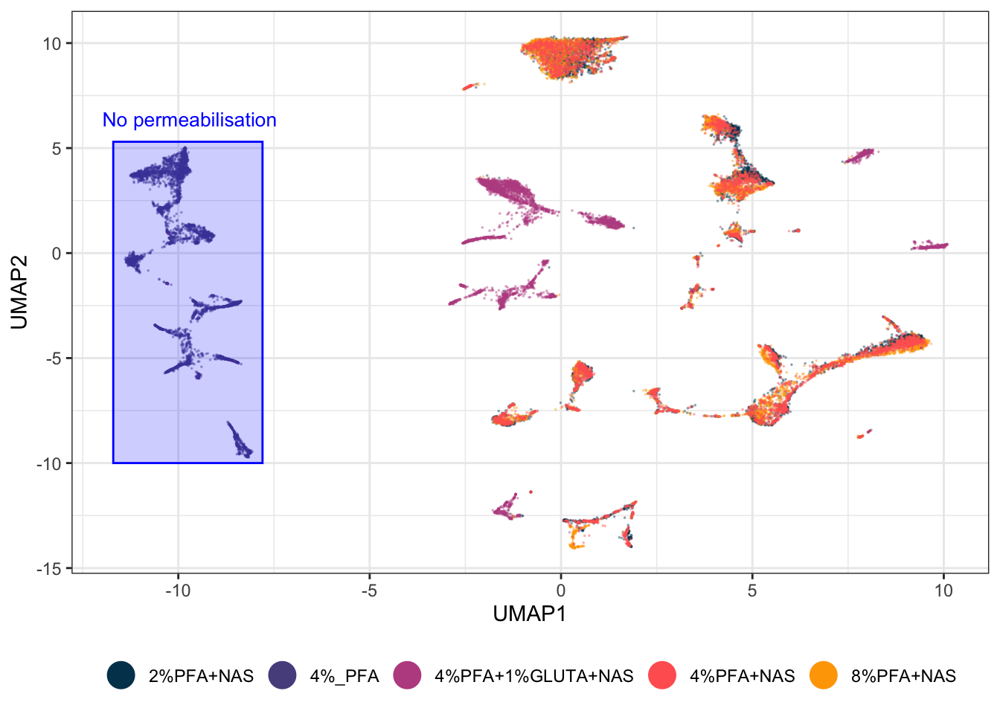

Check what it caught rather than trusting your eye:


``` r
gated <- EXPRESSION_DATA_SAMPLE_ID_UMAPPED %>%
  dplyr::filter(UMAP1 >= -12.2, UMAP1 <= -6.7, UMAP2 >= -9.6, UMAP2 <= 5.1)

table(gated$condition)
#> 
#>            4%_PFA 4%PFA+1%GLUTA+NAS 
#>              4949                 4
```

**Success looks like this:**
```
           4%_PFA 4%PFA+1%GLUTA+NAS
             5000                 4
```

All 5,000 unpermeabilised cells, and four strays from another condition. One rectangle, typed by hand from the table above with 0.3 of margin, does in a single step what the clustering split into three, and it is 99.9% pure. **That is the case for manual gating in one number.** When you know something the coordinates do not contain, your rectangle beats the algorithm, and you can prove it rather than assert it.

A translucent fill rather than an outline, because a filled gate reads as a region containing cells while an outline reads as a border between things. `alpha` controls the fill and the points stay visible through it, so you can still see what you have gated and what you have left out.

Two habits to take from this. Get the coordinates from a printed table, not from squinting at the plot. And check the gate's contents afterwards, because a gate that looks right and a gate that is right are different things, and the `table()` above is the difference between the two.

Record the reason next to the coordinates. In six months the rectangle will still be in your script and the reason will not be.

### Gating the Territories, Not the Markers

The same technique answers the chapter's main question directly. Rather than gating where a marker is high, gate where each fixation protocol lives, and the picture makes its own argument.

`geom_mark_hull()` takes `fill`, `colour` and `label` as aesthetics, so the regions can be coloured by what they are and labelled with a callout instead of needing separate `annotate()` calls:


``` r
EXPRESSION_DATA_SAMPLE_ID_UMAPPED$territory <- dplyr::case_when(
  EXPRESSION_DATA_SAMPLE_ID_UMAPPED$condition == "4%_PFA"            ~ "No permeabilisation",
  EXPRESSION_DATA_SAMPLE_ID_UMAPPED$condition == "4%PFA+1%GLUTA+NAS" ~ "Glutaraldehyde",
  TRUE                                                               ~ "PFA + NAS")

territory_cols <- c("No permeabilisation" = "#58508d",
                    "Glutaraldehyde"      = "#bc5090",
                    "PFA + NAS"           = "#ffa600")

# Split each territory into its own separate patches, for the same reason as before:
# a group scattered across the plot must not become one hull spanning all of it.
patches <- lapply(split(EXPRESSION_DATA_SAMPLE_ID_UMAPPED,
                        EXPRESSION_DATA_SAMPLE_ID_UMAPPED$territory), function(d) {
  cl <- dbscan::dbscan(as.matrix(d[, c("UMAP1", "UMAP2")]), eps = 0.8, minPts = 30)
  d$patch <- cl$cluster
  d[d$patch > 0, ]
})
PATCHES <- dplyr::bind_rows(patches)
PATCHES$grp <- paste(PATCHES$territory, PATCHES$patch)

# Label only the largest patch of each territory, so each name is drawn once
biggest <- PATCHES %>% count(territory, grp) %>%
  group_by(territory) %>% slice_max(n, n = 1) %>% pull(grp)
PATCHES$lab <- ifelse(PATCHES$grp %in% biggest, PATCHES$territory, NA_character_)

ggplot(EXPRESSION_DATA_SAMPLE_ID_UMAPPED, aes(x = UMAP1, y = UMAP2)) +
  geom_point(size = 0.01, alpha = 1/6, colour = "grey40") +
  geom_mark_hull(data = PATCHES,
                 aes(group = grp, fill = territory, colour = territory, label = lab),
                 concavity = 2, expand = unit(2, "mm"), radius = unit(2, "mm"),
                 alpha = 0.18, linewidth = 0.4, label.fontsize = 9,
                 con.cap = unit(1, "mm")) +
  scale_fill_manual(values = territory_cols) +
  scale_colour_manual(values = territory_cols) +
  xlim(c(xmin - 4, xmax + 4)) + ylim(c(ymin - 2, ymax + 3)) +
  theme_bw() + theme(legend.position = "none") +
  labs(title = "What the projection separates on: fixation protocol")
```

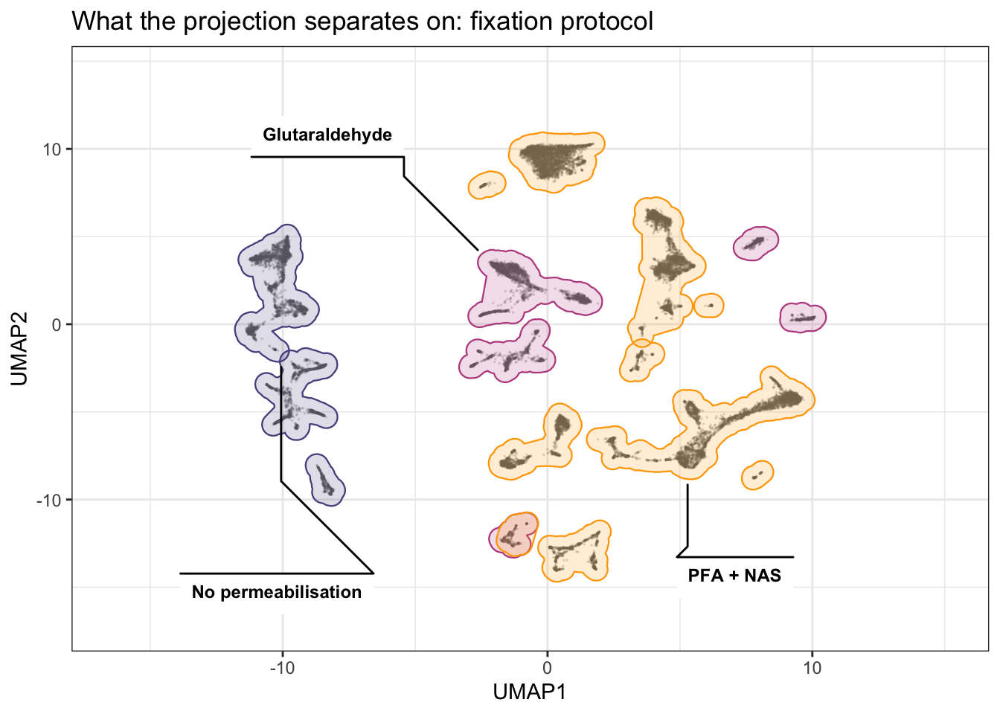

Three things to take from the result. **No permeabilisation** holds a block of patches on one side and shares none of them with anything else. **Glutaraldehyde** is scattered across several small patches round the edge, which is why a single hull for it spanned the whole plot until the patches were separated. **PFA + NAS** holds the most patches, through the middle, and the three concentrations pooled into it sit on top of each other rather than beside each other.

The exact patch counts are not quoted here on purpose. They shift with the seed and the uwot version, the way every coordinate in this chapter does, so read them off your own run rather than off this page.

None of the three overlaps another. On a projection built from every marker, the fixation protocol accounts for essentially all of the large-scale structure.

**On `concavity`:** it controls how far the hull is allowed to bend inwards to follow the points. `concavity = 2` traces the islands closely; raise it and the hulls relax towards convex blobs that swallow the space between islands, which is exactly what you do not want here. Try a few values on your own data, because the right one depends on how tight your clusters are.

**And the same caution as everywhere else in this section.** These hulls are drawn from the data, so unlike hand-typed coordinates they survive a re-run. What they do not survive is a change of seed or marker set, because then the patches themselves are different. Redraw, do not reuse.

**One rule that is not negotiable.** Those coordinates belong to this projection, this seed, this marker set and this version of uwot. Re-run the UMAP with anything changed and they point at empty space. Hand-drawn gates have to be re-checked every time the projection is rebuilt, which is the strongest practical argument for keeping the automatic pass in the code and the hand adjustment as a documented tweak on top of it, rather than replacing one with the other.

### Does Condition Change the Picture?

The question the experiment was designed to answer. Each condition alone, on the same fixed axes, beside the overlay:


``` r
one_condition <- function(cond, colour) {
  EXPRESSION_DATA_SAMPLE_ID_UMAPPED %>%
    dplyr::filter(condition == cond) %>%
    ggplot(aes(x = UMAP1, y = UMAP2)) +
    geom_point(size = 0.01, alpha = 1/2, colour = colour) +
    xlim(c(xmin, xmax)) + ylim(c(ymin, ymax)) +
    theme_bw() + labs(title = cond)
}

conditions <- sort(unique(EXPRESSION_DATA_SAMPLE_ID_UMAPPED$condition))
condition_panels <- Map(one_condition, conditions, colour_conditions[seq_along(conditions)])

plot_grid(plotlist = c(condition_panels, list(by_protocol)), nrow = 2)
```

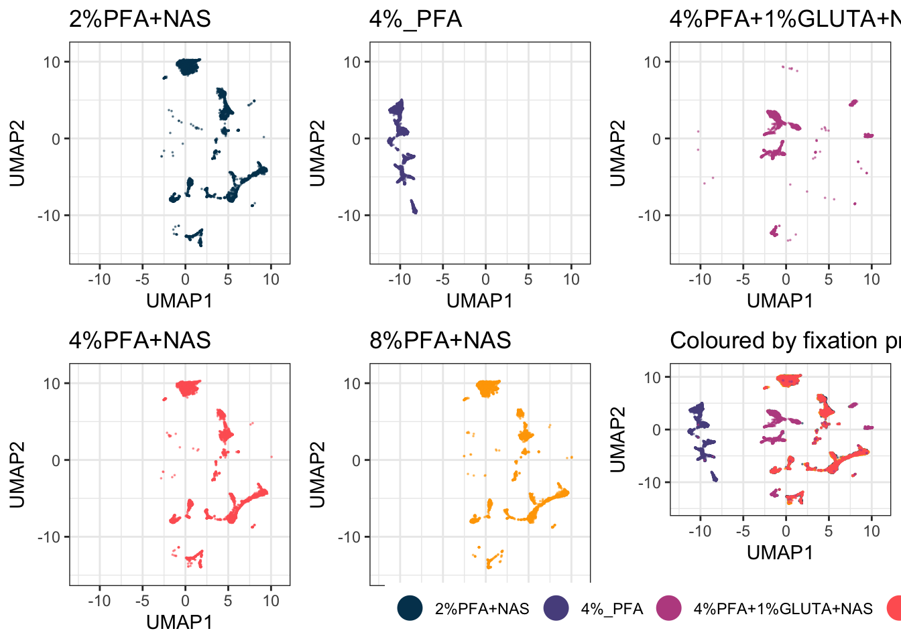

Writing this as a function over the conditions rather than as five near-identical blocks means it still works when you have twenty samples instead of five, which you will.

### Every Sample Side by Side

The condition panels above pool samples within a condition. Sometimes you need to see each sample on its own, to check whether a condition-level effect is really there or is one odd sample dragging the group:


``` r
ggplot(EXPRESSION_DATA_SAMPLE_ID_UMAPPED,
       aes(x = UMAP1, y = UMAP2, colour = condition)) +
  geom_point(size = 0.05, alpha = 1/10) +
  xlim(c(xmin, xmax)) + ylim(c(ymin, ymax)) +
  custom_colour_manual() +
  facet_wrap(~ sample_id) +
  theme_bw() +
  theme(legend.position = "none")
```

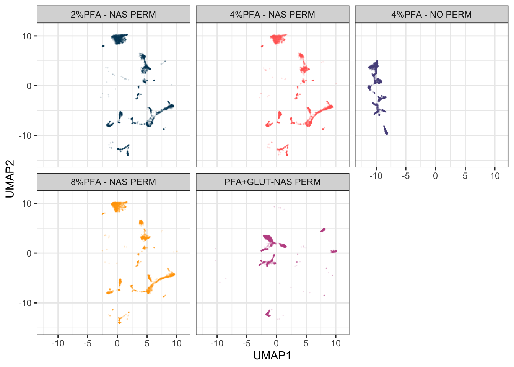

The fixed limits are doing real work here. Without them each panel would be scaled to its own sample's range, and panels that look alike would not be comparable at all.

This dataset has one sample per condition, so a plain `facet_wrap()` is enough. Real studies are usually nested: several patients within each treatment arm, several timepoints within each patient. `ggh4x::facet_nested_wrap()` draws the nesting as a two-level strip, which is far easier to read than pasting the variables into one label:


``` r
library(ggh4x)

ggplot(EXPRESSION_DATA_SAMPLE_ID_UMAPPED,
       aes(x = UMAP1, y = UMAP2, colour = condition)) +
  geom_point(size = 0.05, alpha = 1/10) +
  xlim(c(xmin, xmax)) + ylim(c(ymin, ymax)) +
  custom_colour_manual() +
  facet_nested_wrap(~ condition + sample_id, ncol = 4) +
  theme_bw() +
  theme(legend.position = "none")
```

That chunk is not run here because with one sample per condition the nesting has nothing to show. Swap it in when your design has a real hierarchy.

### Plot a Fraction, Not Everything


``` r
set.seed(42)
UMAP_FRAC <- dplyr::sample_frac(EXPRESSION_DATA_SAMPLE_ID_UMAPPED, 0.05)
nrow(UMAP_FRAC)
#> [1] 1250
```

Run the algorithm on all your data, then plot a fraction of it. At 25,000 cells this dataset does not need it, which makes it a good place to learn it before it matters. With several hundred samples it is the difference between a figure and a hung session, and the picture is essentially unchanged because you are drawing overlapping points anyway.

### Assembling a Figure Rather Than a Plot

Titles, subtitles and captions are drawn as their own strips and stacked with the plot:


``` r
title <- ggdraw() +
  draw_label("What separates the cells in this projection?",
             fontface = "bold", x = 0, hjust = 0) +
  theme(plot.margin = margin(0, 0, 0, 7))

subtitle <- ggdraw() +
  draw_label("The same UMAP coloured by fixation protocol and by CD34 expression",
             fontface = "italic", x = 0, hjust = 0, size = 10) +
  theme(plot.margin = margin(0, 0, 0, 7))

caption <- ggdraw() +
  draw_label(
    "The five samples are one bone marrow prepared five ways. Protocol, not cell type, is what this projection separates on: the unpermeabilised sample sits apart because its intracellular markers were never stained, and the glutaraldehyde sample separates for its own reasons. The three PFA concentrations with NAS overlap, which is the practical result. Colour by every technical variable you have before you colour by the one you care about.",
    fontface = "italic", x = 0, hjust = 0, size = 8) +
  theme(plot.margin = margin(0, 0, 0, 7))

plot_grid(title, subtitle, plot_grid(by_protocol, by_marker, ncol = 2), caption,
          ncol = 1, rel_heights = c(0.1, 0.1, 1, 0.3))
```

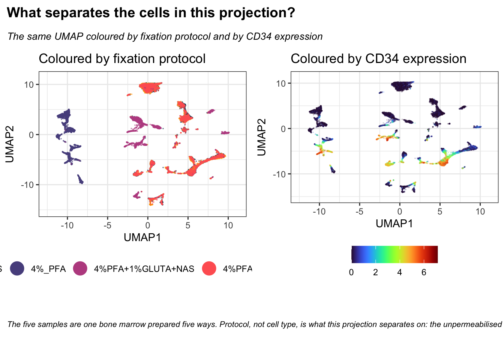

`rel_heights` controls how much vertical space each strip takes. The numbers are relative, so `c(0.1, 0.1, 1, 0.3)` gives the plot ten times the height of the title.

### Cycling Through the Samples

Small multiples force your eye to jump between panels. An animation holds the axes still and swaps the data underneath, which makes it much easier to see a population appear, move or vanish between conditions.

`gganimate` takes an ordinary ggplot and a variable to step through. Note that it needs a renderer to write the file: `gifski` is the usual choice, and without it `anim_save()` fails.


``` r
library(gganimate)
library(gifski)

anim_base <- ggplot(UMAP_FRAC, aes(x = UMAP1, y = UMAP2, colour = condition)) +
  geom_point(size = 1, alpha = 1) +
  xlim(c(xmin, xmax)) + ylim(c(ymin, ymax)) +
  custom_colour_manual() +
  guides(colour = guide_legend(override.aes = list(size = 6, alpha = 1))) +
  theme_bw() +
  theme(legend.title = element_blank())

# Cumulative: each condition is added to the ones already drawn
anim_base +
  transition_manual(condition, cumulative = TRUE) +
  labs(title = "Condition: {current_frame}")

anim_save(here("Images", "umap_animation_cumulative.gif"))

# One at a time, fading between them
anim_base +
  transition_states(condition, transition_length = 2, state_length = 1) +
  enter_fade() + exit_fade() +
  labs(title = "Condition: {closest_state}")

anim_save(here("Images", "umap_animation_states.gif"))
```

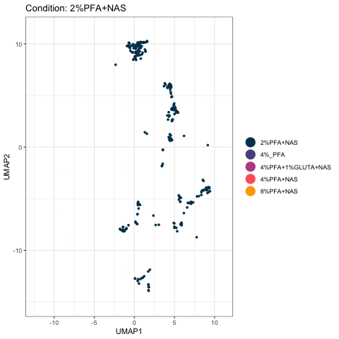<!-- -->

The cumulative version is the more useful of the two for this experiment. Watch the unpermeabilised sample claim its own territory on the left and never share it, while the three PFA-plus-NAS conditions pile onto the same structures.

Two practical notes. The chunk that builds the animations is `eval=FALSE` and the GIF is committed to `Images/`, so the book displays the result without re-rendering it on every build; this is the same pattern Chapter 2 uses for its screen recordings. And the animation runs on `UMAP_FRAC` rather than the full table, because rendering fifty frames of 25,000 points each is slow and the picture is no different.

`Rtsne` normally rejects duplicate rows in the input (identical expression values across every marker, more likely after downsampling and rounding from transformation). `check_duplicates = FALSE` tells it to skip that check and run anyway, rather than removing duplicate rows beforehand, which is deliberate here: removing rows would leave `tsne_out$Y` with fewer rows than the table you're combining it back into, breaking the position-based `cbind`/`data.frame()` step that follows.

### Choosing Lineage Markers Interactively

Step 6 takes its list from the panel file, which is the reproducible way and the one a book build can run unattended. Sometimes you want to pick by hand instead, to try a subset the panel doesn't describe, or when the panel's classification isn't settled yet:


``` r
library(tcltk)

choose_markers <- tk_select.list(marker_cols, multiple = TRUE,
                                 title = "Choose the markers to project on")
saveRDS(choose_markers, file = here("Data", "RDS", "choose_markers.rds"))
```

`tk_select.list()` opens a real, interactive checklist window listing every marker, letting you tick off exactly the ones you want rather than typing out a vector. It is not something a book build can run, since there is nobody there to click through a dialog during a knit, which is why the chunk is `eval=FALSE`. Saving the result means you make the selection once and reload it in later sessions instead of choosing again every time.

**Then use it.** The survey above already showed which markers define a region on this data, CD34, CD38, CD71 and CD41, so project on just those four and see what a deliberately chosen, minimal marker set does compared with all thirty-two:


``` r
# Substitute your own choose_markers here. These four are the markers that produced
# real gates earlier in this chapter, so they are a defensible small set rather than
# an arbitrary one.
chosen_markers <- c("Sm149Di_CD34", "Yb172Di_CD38", "Er168Di_CD71", "Y89Di_CD41..")

set.seed(1234)
chosen_umap <- umap(EXPRESSION_DATA_SAMPLE_ID[, chosen_markers],
                    n_neighbors = 15, metric = "cosine", min_dist = 0.001,
                    verbose = FALSE)

CHOSEN <- data.frame(UMAP1 = chosen_umap[, 1], UMAP2 = chosen_umap[, 2],
                     condition = EXPRESSION_DATA_SAMPLE_ID_UMAPPED$condition)

chosen_plot <- ggplot(CHOSEN, aes(x = UMAP1, y = UMAP2, colour = condition)) +
  geom_point(size = 0.01, alpha = 1/3) +
  custom_colour_manual() +
  guides(colour = guide_legend(override.aes = list(size = 6, alpha = 1))) +
  theme_bw() + theme(legend.title = element_blank(), legend.position = "bottom") +
  labs(title = paste(length(chosen_markers), "chosen markers"))

plot_grid(by_protocol + labs(title = paste(length(marker_cols), "markers")),
          chosen_plot, ncol = 2)
```

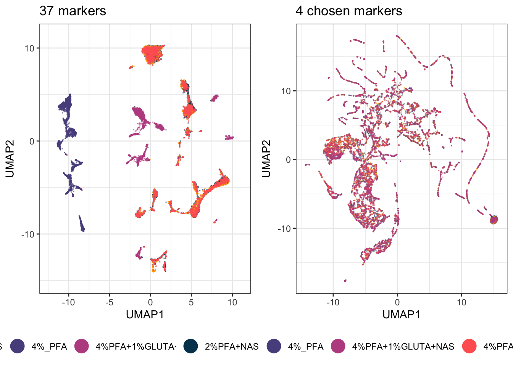

Fewer markers is not automatically worse. Thirty-two markers include everything, which means they include every technical difference too. Four well-chosen ones ask a narrower question and often answer it more cleanly. Which of the two projections you should trust depends entirely on what you are asking. Build both and choose.

This is also the honest end of what dimensionality reduction can tell you. It shows you that structure exists and roughly where. It will not tell you how many populations there are, or which cells belong to which, because outlines drawn by eye cannot be repeated or checked. That is what the next chapter is for.

### What's Next

With both the all-markers and lineage-only UMAP/tSNE coordinates saved, the next chapter clusters the data to identify distinct cell populations, using Phenograph and FlowSOM.
