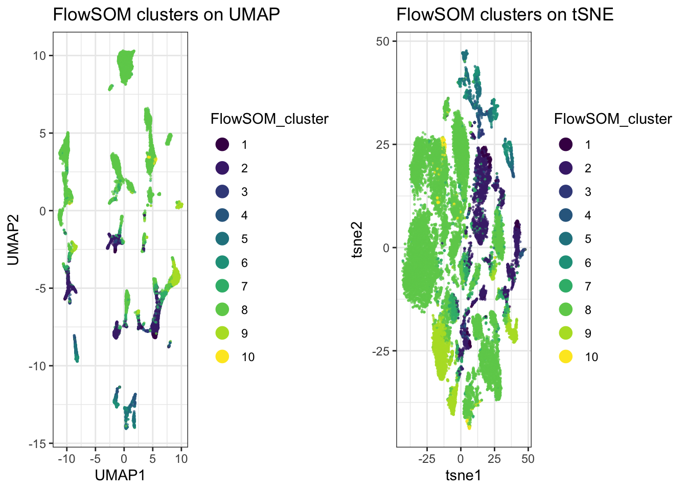
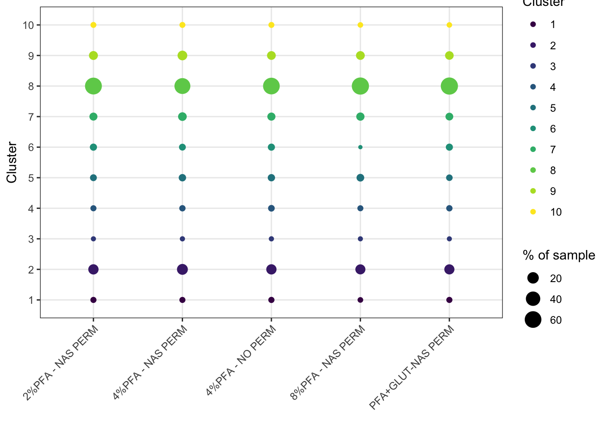
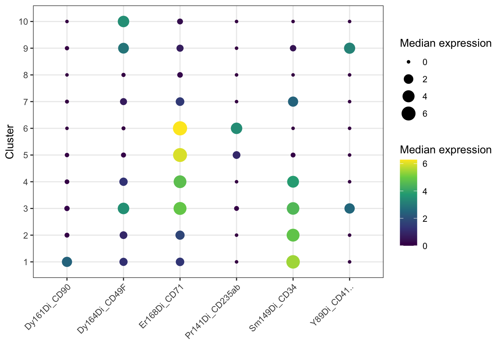

# Chapter 15 - Clustering and Population Discovery

## What You'll Learn

UMAP and tSNE show you structure, but they don't assign labels. This chapter runs two clustering algorithms, FlowSOM and Phenograph, to assign each event to a discrete population, so you can identify and count distinct cell types rather than just eyeballing a 2D plot.

## The Essentials {.essentials}

### Step 1: Load Required Packages and Data


``` r
library(here)
#> Warning in readLines(f, n): line 1 appears to contain an
#> embedded nul
#> here() starts at /Volumes/T31/CLAUDE/Analysing-Cytometry-Data-With-R
library(flowCore)
library(ggplot2)
library(cowplot)
library(dplyr)
#> 
#> Attaching package: 'dplyr'
#> The following object is masked from 'package:flowCore':
#> 
#>     filter
#> The following objects are masked from 'package:stats':
#> 
#>     filter, lag
#> The following objects are masked from 'package:base':
#> 
#>     intersect, setdiff, setequal, union
library(tidyr)      # pivot_longer(), used in the Deep Dive
library(viridis)
#> Loading required package: viridisLite

EXPRESSION_DATA_SAMPLE_ID_UMAPPED_TSNE <- readRDS(here("Data", "RDS", "EXPRESSION_DATA_SAMPLE_ID_UMAPPED_TSNE.rds"))
```

### Step 2: Choose Markers to Cluster On

Clustering is usually done on lineage/phenotyping markers rather than every channel, functional markers and QC channels (Time, Event_length) tend to add noise rather than help define populations.

Name the antigens you want and let the panel file build the column names, the same approach as Chapter 14. Typing them out by hand does not survive contact with real panels: `CD41` in this one carries trailing whitespace, so its column is actually `Y89Di_CD41..`, and a hardcoded `"Y89Di_CD41"` fails with an unhelpful subscript error.


``` r
panel <- read.csv(here("Data", "other", "ACDwR_panel.csv"))
panel_cols <- make.names(paste(panel$fcs_colname, panel$antigen, sep = "_"))

cluster_antigens <- c("CD34", "CD90", "CD49F", "CD71", "CD235ab", "CD41")
lineage_markers  <- panel_cols[trimws(panel$antigen) %in% cluster_antigens]

lineage_markers
#> [1] "Y89Di_CD41.."    "Pr141Di_CD235ab" "Sm149Di_CD34"   
#> [4] "Dy161Di_CD90"    "Dy164Di_CD49F"   "Er168Di_CD71"
```

**Success looks like this:**
```
[1] "Y89Di_CD41.."    "Pr141Di_CD235ab" "Sm149Di_CD34"    "Dy161Di_CD90"
[5] "Dy164Di_CD49F"   "Er168Di_CD71"
```

`trimws()` is doing the work that matters here: it strips the whitespace before matching, so you can ask for `CD41` and still get the column whose real name has two dots on the end.

This can be, and often should be, a different list from the one you used for UMAP/tSNE in Chapter 14. Clustering benefits from a narrower, more targeted marker set than visualisation does, using the same list for both isn't the goal. Six here against Chapter 14's thirty-two.

### Step 3: Run FlowSOM

FlowSOM works in two stages. First it builds a self-organising map, a grid of nodes where each node holds cells with similar expression, which gives you around a hundred small groups. Then it metaclusters those nodes down to the number of populations you actually want to work with.


``` r
library(FlowSOM)
#> Loading required package: igraph
#> 
#> Attaching package: 'igraph'
#> The following object is masked from 'package:tidyr':
#> 
#>     crossing
#> The following objects are masked from 'package:dplyr':
#> 
#>     as_data_frame, groups, union
#> The following object is masked from 'package:flowCore':
#> 
#>     normalize
#> The following objects are masked from 'package:stats':
#> 
#>     decompose, spectrum
#> The following object is masked from 'package:base':
#> 
#>     union
#> Thanks for using FlowSOM. From version 2.1.4 on, the scale 
#> parameter in the FlowSOM function defaults to FALSE

data_FlowSOM <- flowCore::flowFrame(as.matrix(EXPRESSION_DATA_SAMPLE_ID_UMAPPED_TSNE[, lineage_markers]))

set.seed(1234)
fSOM <- FlowSOM::ReadInput(data_FlowSOM, transform = FALSE, scale = FALSE)
fSOM <- FlowSOM::BuildSOM(fSOM, colsToUse = lineage_markers)
#> Building SOM
#> Mapping data to SOM
fSOM <- FlowSOM::BuildMST(fSOM)
#> Building MST

# every cell's SOM node
labels_pre <- fSOM$map$mapping[, 1]

k <- 10   # final number of clusters after metaclustering
fSOM_meta <- FlowSOM::metaClustering_consensus(fSOM$map$codes, k = k, seed = 1234)

# map each cell from its node to that node's metacluster
flowsom_labels <- fSOM_meta[labels_pre]
table(flowsom_labels)
#> flowsom_labels
#>     1     2     3     4     5     6     7     8     9    10 
#>   314  3580    82   409   843   622  1496 15257  2161   236
```

**Success looks like this:**
```
flowsom_labels
    1     2     3     4     5     6     7     8     9    10
  314  3580    82   409   843   622  1496 15257  2161   236
```

`k = 10` is the number of populations you are asking for, not something the data decides. Cluster 8 holding 15,257 of the 25,000 cells is worth noticing rather than glossing over: a single cluster carrying 60% of your events usually means either that population genuinely dominates the sample, or that `k` is too low and something is being lumped together. Try `k = 15` and see whether cluster 8 splits into things that look biologically distinct.

Both `set.seed()` and the `seed` argument are needed here, and they do different jobs. The first fixes the SOM build, the second fixes the metaclustering. Miss either and you get a different answer each run.

### Step 4: Add Cluster Labels and Save


``` r
EXPRESSION_DATA_SAMPLE_ID_UMAPPED_TSNE$FlowSOM_cluster <- as.factor(flowsom_labels)

saveRDS(EXPRESSION_DATA_SAMPLE_ID_UMAPPED_TSNE, here("Data", "RDS", "EXPRESSION_DATA_SAMPLE_ID_UMAPPED_TSNE.rds"))
```

### Step 5: Plot Clusters on the UMAP/tSNE


``` r
p_umap <- ggplot(EXPRESSION_DATA_SAMPLE_ID_UMAPPED_TSNE, aes(x = UMAP1, y = UMAP2, color = FlowSOM_cluster)) +
  geom_point(size = 0.3, alpha = 0.6) +
  scale_colour_viridis_d() +
  guides(colour = guide_legend(override.aes = list(size = 4, alpha = 1))) +
  theme_bw() +
  ggtitle("FlowSOM clusters on UMAP")

p_tsne <- ggplot(EXPRESSION_DATA_SAMPLE_ID_UMAPPED_TSNE, aes(x = tsne1, y = tsne2, color = FlowSOM_cluster)) +
  geom_point(size = 0.3, alpha = 0.6) +
  scale_colour_viridis_d() +
  guides(colour = guide_legend(override.aes = list(size = 4, alpha = 1))) +
  theme_bw() +
  ggtitle("FlowSOM clusters on tSNE")

plot_grid(p_umap, p_tsne)
```



``` r

ggsave2(here("Figures", "flowsom_clusters.pdf"), width = 11, height = 8.5)
ggsave2(here("Figures", "flowsom_clusters.png"), width = 11, height = 8.5)
```

### Step 6: Cluster Abundance per Sample

The UMAP/tSNE plots above show where clusters sit in 2D space, but not whether a cluster is a similar size across all samples or concentrated in just one or two. A bubble plot of each cluster's percentage of each sample's cells answers that directly:


``` r
cluster_counts <- table(sample_id = EXPRESSION_DATA_SAMPLE_ID_UMAPPED_TSNE$sample_id, FlowSOM_cluster = EXPRESSION_DATA_SAMPLE_ID_UMAPPED_TSNE$FlowSOM_cluster)
cluster_percent <- prop.table(cluster_counts, margin = 1) * 100
cluster_percent <- as.data.frame(cluster_percent)
colnames(cluster_percent)[3] <- "percent"

ggplot(cluster_percent, aes(x = sample_id, y = FlowSOM_cluster)) +
  geom_point(aes(size = percent, colour = FlowSOM_cluster)) +
  scale_colour_viridis_d() +
  labs(x = "", y = "Cluster", size = "% of sample", colour = "Cluster") +
  theme_bw() +
  theme(axis.text.x = element_text(angle = 45, hjust = 1))
```



``` r

ggsave2(here("Figures", "bubble_cluster_abundance.pdf"), width = 11, height = 8.5)
ggsave2(here("Figures", "bubble_cluster_abundance.png"), width = 11, height = 8.5)
```

`prop.table(cluster_counts, margin = 1)` divides each row (each sample) by its own row total, so every sample's percentages sum to 100 regardless of how many total cells that sample contributed, a cluster making up 20% of a small sample and 20% of a large sample both show up the same size here. This compares composition, not raw cell counts.

Size carries the number, `percent`. Colour carries the identity, `FlowSOM_cluster`, using the same `viridis_d` scale as the UMAP and tSNE plots above, so cluster 7 is the same colour in all three figures and your eye can follow it between them.

You could map both to `percent`, and plenty of bubble plots do. It reads well, because colour separates the small values that size alone struggles to distinguish. But it spends two aesthetics on one variable and quietly teaches that size and colour travel together, which they do not. Prove it to yourself by changing one and leaving the other, the plot will tell you immediately which is which.

## A Deeper Dive {.deeper-dive}

### An Alternative: Phenograph

Phenograph builds a nearest-neighbour graph between events and detects communities within it, a different underlying approach to FlowSOM's self-organising map. It's worth trying both and comparing, they don't always agree, and disagreement is often informative about where population boundaries are genuinely ambiguous.


``` r
if(!require(Rphenograph)) devtools::install_github("JinmiaoChenLab/Rphenograph", force = TRUE)
#> Loading required package: Rphenograph
library(Rphenograph)

Rpheno_in <- unique(EXPRESSION_DATA_SAMPLE_ID_UMAPPED_TSNE[, lineage_markers])

set.seed(1234)
Rphenograph_result <- Rphenograph(Rpheno_in, k = 30) # k is nearest-neighbours here, not a cluster count
#> Run Rphenograph starts:
#>   -Input data of 24207 rows and 6 columns
#>   -k is set to 30
#>   Finding nearest neighbors...DONE ~ 0.226 s
#>   Compute jaccard coefficient between nearest-neighbor sets...DONE ~ 2.721 s
#>   Build undirected graph from the weighted links...DONE ~ 0.72 s
#>   Run louvain clustering on the graph ...DONE ~ 0.832 s
#> Run Rphenograph DONE, totally takes 4.499s.
#>   Return a community class
#>   -Modularity value: 0.9102834 
#>   -Number of clusters: 40
phenograph_labels <- factor(membership(Rphenograph_result[[2]]))

length(unique(phenograph_labels))
#> [1] 40
```

**Success looks like this:**
```
Run Rphenograph starts:
  -Input data of 24207 rows and 6 columns
  -k is set to 30
  Finding nearest neighbors...DONE ~ 0.228 s
  Compute jaccard coefficient between nearest-neighbor sets...DONE ~ 2.805 s
  Build undirected graph from the weighted links...DONE ~ 0.711 s
  Run louvain clustering on the graph ...DONE ~ 0.776 s
Run Rphenograph DONE, totally takes 4.52 s
  Return a community class
  -Modularity value: 0.9102834
  -Number of clusters: 40
```

**Forty clusters, from the same cells and the same six markers that gave FlowSOM ten.**

That is not a disagreement about the biology, it is the difference between the two methods. FlowSOM's `k` is a number you chose: you asked for ten populations and it gave you ten, whether or not ten is right. Phenograph's `k` is the size of each cell's neighbourhood when the graph is built, and the number of communities falls out of the graph structure. Nobody asked for forty.

So the two are answering different questions. FlowSOM answers "divide this into ten", Phenograph answers "how many groups are actually here, given how tightly cells cluster at this neighbourhood size". Run both and the gap between the answers tells you something: forty against ten suggests the ten are coarse, and that several of them contain real substructure. That is the same signal as cluster 8 holding 61% of the cells.

**Modularity 0.91** is the graph's own measure of how well-separated those communities are, from 0 for no better than random to 1 for perfectly separated. 0.91 is high, which says the structure Phenograph found is real rather than an artefact of cutting a continuum into pieces.

Trying a few values of `k` (10, 20, 30) and comparing both the cluster count and the modularity is normal practice. There is no single correct value, and watching how both numbers move as you change it tells you more than any one run.

Note `unique()` on the input. Phenograph will not accept duplicate rows, and after downsampling and transformation a six-marker table has plenty of cells with identical values, so the graph is built on the distinct rows rather than on every cell.

### Naming Clusters from Marker Expression: A Worked Example

FlowSOM and Phenograph both output numbered clusters, `1`, `2`, `3`. Turning those into biologically meaningful names, "HSC-like", "erythroid", is a judgement call based on each cluster's own marker expression, not something either algorithm does for you. The method: compute median expression per cluster per marker, look for which markers are distinctly high or low in each cluster, and match that pattern against what you know those markers mark.


``` r
cluster_expression <- EXPRESSION_DATA_SAMPLE_ID_UMAPPED_TSNE %>%
  select(FlowSOM_cluster, all_of(lineage_markers)) %>%
  group_by(FlowSOM_cluster) %>%
  summarise(across(everything(), median))

cluster_expression_long <- tidyr::pivot_longer(cluster_expression, -FlowSOM_cluster,
  names_to = "marker", values_to = "median_expression")

ggplot(cluster_expression_long, aes(x = marker, y = FlowSOM_cluster)) +
  geom_point(aes(size = median_expression, color = median_expression)) +
  scale_color_viridis_c() +
  labs(x = "", y = "Cluster", size = "Median expression", color = "Median expression") +
  theme_bw() +
  theme(axis.text.x = element_text(angle = 45, hjust = 1))
```



The bubble plot is for spotting patterns. To actually name things you want the numbers, along with how big each cluster is, because a striking phenotype in 0.3% of your cells means something different from the same phenotype in 30%:


``` r
cluster_expression %>%
  left_join(count(EXPRESSION_DATA_SAMPLE_ID_UMAPPED_TSNE, FlowSOM_cluster),
            by = "FlowSOM_cluster") %>%
  mutate(pct = round(100 * n / sum(n), 1),
         across(all_of(lineage_markers), ~ round(.x, 2))) %>%
  as.data.frame()
#>    FlowSOM_cluster Y89Di_CD41.. Pr141Di_CD235ab
#> 1                1         0.00            0.00
#> 2                2         0.00            0.00
#> 3                3         2.54            0.10
#> 4                4         0.00            0.00
#> 5                5         0.00            0.98
#> 6                6         0.00            3.45
#> 7                7         0.00            0.00
#> 8                8         0.00            0.00
#> 9                9         3.22            0.00
#> 10              10         0.00            0.00
#>    Sm149Di_CD34 Dy161Di_CD90 Dy164Di_CD49F Er168Di_CD71
#> 1          5.46         2.44          1.19         1.36
#> 2          4.82         0.10          0.98         1.76
#> 3          4.51         0.18          3.52         4.87
#> 4          3.81         0.07          1.27         4.71
#> 5          0.10         0.04          0.12         5.97
#> 6          0.00         0.00          0.01         6.28
#> 7          2.44         0.01          0.68         1.44
#> 8          0.00         0.00          0.02         0.24
#> 9          0.46         0.03          2.89         0.71
#> 10         0.00         0.00          3.47         0.31
#>        n  pct
#> 1    314  1.3
#> 2   3580 14.3
#> 3     82  0.3
#> 4    409  1.6
#> 5    843  3.4
#> 6    622  2.5
#> 7   1496  6.0
#> 8  15257 61.0
#> 9   2161  8.6
#> 10   236  0.9
```

**Success looks like this:**
```
 FlowSOM_cluster CD41.. CD235ab CD34 CD90 CD49F CD71     n  pct
               1   0.00    0.00 5.46 2.44  1.19 1.36   314  1.3
               2   0.00    0.00 4.82 0.10  0.98 1.76  3580 14.3
               3   2.54    0.10 4.51 0.18  3.52 4.87    82  0.3
               4   0.00    0.00 3.81 0.07  1.27 4.71   409  1.6
               5   0.00    0.98 0.10 0.04  0.12 5.97   843  3.4
               6   0.00    3.45 0.00 0.00  0.01 6.28   622  2.5
               7   0.00    0.00 2.44 0.01  0.68 1.44  1496  6.0
               8   0.00    0.00 0.00 0.00  0.02 0.24 15257 61.0
               9   3.22    0.00 0.46 0.03  2.89 0.71  2161  8.6
              10   0.00    0.00 0.00 0.00  3.47 0.31   236  0.9
```

Now do the work the algorithm cannot. Take each row and ask what that combination of markers means:

**Cluster 1, CD34 high and CD90 high.** CD34 marks haematopoietic stem and progenitor cells, and CD90 is what separates true stem cells from the progenitors below them. High both, and nothing else on. Haematopoietic stem cells, and at 1.3% the sort of frequency you would expect.

**Cluster 2, CD34 high and CD90 absent.** Same progenitor compartment, one step down. Progenitors rather than stem cells, and there are ten times as many of them, which is also what you would expect.

**Clusters 4, 5 and 6 are the same lineage caught at three stages, and this is the nicest thing in the table.** CD71 is the transferrin receptor, which erythroid cells need in quantity to take up iron for haemoglobin. CD235ab is glycophorin, which arrives later as the cell commits. So: cluster 4 is CD34 positive with CD71 climbing, an erythroid progenitor still carrying its stem marker. Cluster 5 has lost CD34 entirely, CD71 is higher still, glycophorin only just detectable. Cluster 6 has CD71 at its highest and glycophorin properly on. That is erythroid maturation, read straight off the medians, in a bone marrow sample where you would hope to find exactly that.

**Cluster 9, CD41 high with CD49F.** CD41 is integrin alpha-IIb, the platelet and megakaryocyte marker. Megakaryocytic.

Which leaves four clusters.

**Cluster 8 is 61% of your cells and every marker is at zero.**

The clustering has not failed. Six markers are being asked to describe 25,000 bone marrow cells, and most of those cells are things this panel was never designed to see: mature lymphocytes, myeloid cells, anything without CD34, CD41 or an erythroid marker. The algorithm did its job and put them together correctly. There is simply nothing to call them.

**Name it "unresolved" and move on.** Do not invent a label for it, do not stretch a marker to cover it, and do not quietly drop it from your figures because it looks untidy. A cluster you cannot identify is a real result about the limits of your panel, and it is information: if 61% of your sample is invisible to your markers and the population you care about is in there, that is the finding, and the next experiment needs different antibodies rather than better clustering.

Clusters 3, 7 and 10 are the same story in miniature. Cluster 3 is 82 cells with several markers up at once, too few and too mixed to call. Cluster 7 has CD34 at half the level of cluster 2, which could be a dimmer progenitor or could be spillover. Cluster 10 has CD49F alone. Describe the phenotype, admit you cannot name it, and let the next panel settle it.


``` r
levels(EXPRESSION_DATA_SAMPLE_ID_UMAPPED_TSNE$FlowSOM_cluster) <- c(
  "HSC",                      # 1: CD34+ CD90+
  "CD34+ progenitor",         # 2: CD34+ CD90-
  "Unclear, mixed",           # 3: 82 cells, several markers up
  "Erythroid progenitor",     # 4: CD34+ CD71+
  "Proerythroblast",          # 5: CD71 high, CD235ab just appearing
  "Erythroblast",             # 6: CD71 high, CD235ab on
  "Unclear, CD34 dim",        # 7
  "Unresolved",               # 8: 61% of cells, all six markers negative
  "Megakaryocytic",           # 9: CD41+ CD49F+
  "Unclear, CD49f only")      # 10

table(EXPRESSION_DATA_SAMPLE_ID_UMAPPED_TSNE$FlowSOM_cluster)
#> 
#>                  HSC     CD34+ progenitor 
#>                  314                 3580 
#>       Unclear, mixed Erythroid progenitor 
#>                   82                  409 
#>      Proerythroblast         Erythroblast 
#>                  843                  622 
#>    Unclear, CD34 dim           Unresolved 
#>                 1496                15257 
#>       Megakaryocytic  Unclear, CD49f only 
#>                 2161                  236

# Save again, now the clusters have names. Step 4's save was before this,
# so without this the naming exists only in your session.
saveRDS(EXPRESSION_DATA_SAMPLE_ID_UMAPPED_TSNE,
        here("Data", "RDS", "EXPRESSION_DATA_SAMPLE_ID_UMAPPED_TSNE.rds"))
```

Four of ten named with confidence, two more as stages of one lineage, four left open. That ratio is normal on a six-marker panel and it is a better outcome than ten confident labels, because every name here can be defended from the table above.

Two things to hold on to. These names belong to this clustering run: change `k`, change the marker list, and the numbering changes with them, so re-derive rather than reuse. And a name is a hypothesis. Cluster 6 is erythroblasts because CD71 and glycophorin say so, and if that matters to your conclusion it wants confirming with a marker you did not cluster on.

### What's Next

With clusters identified and labelled, the next chapter covers statistical comparison between conditions and building publication-quality figures.
