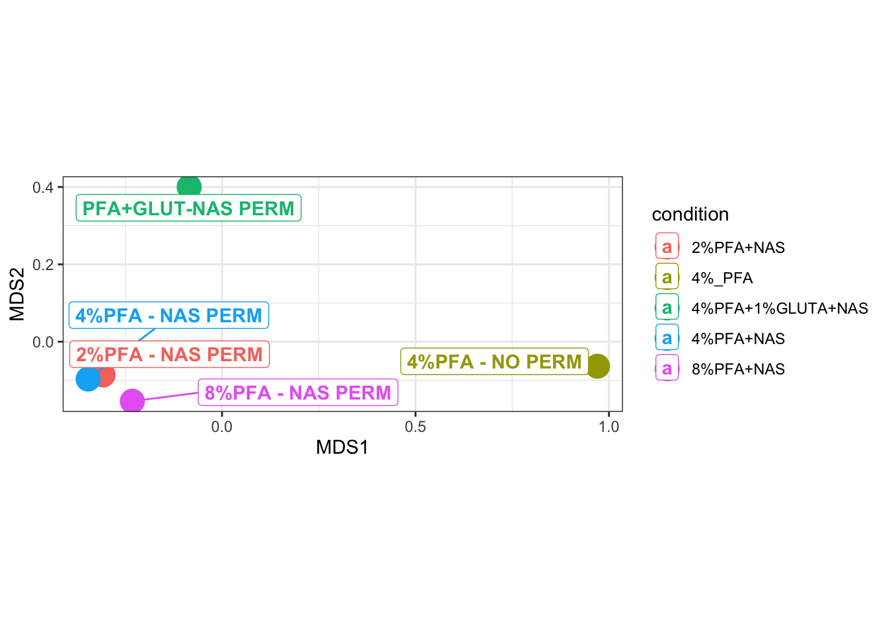
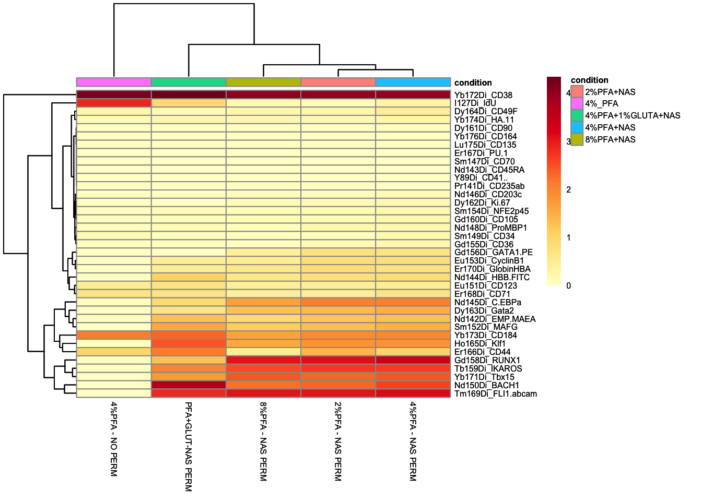
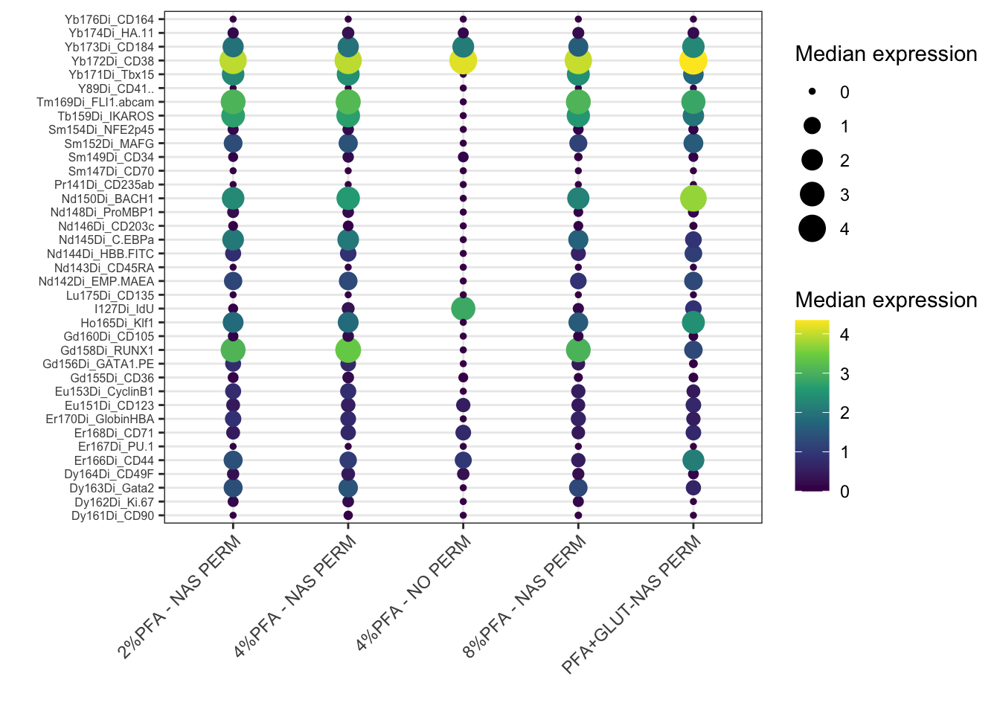
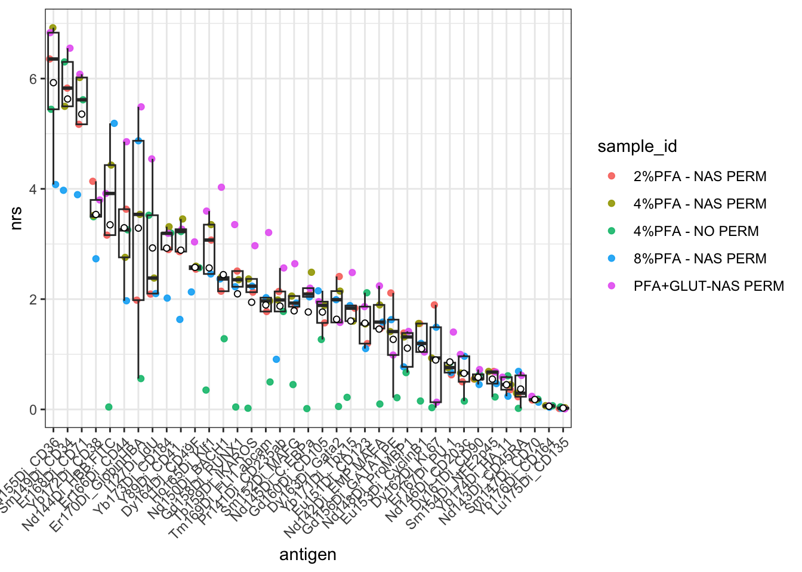
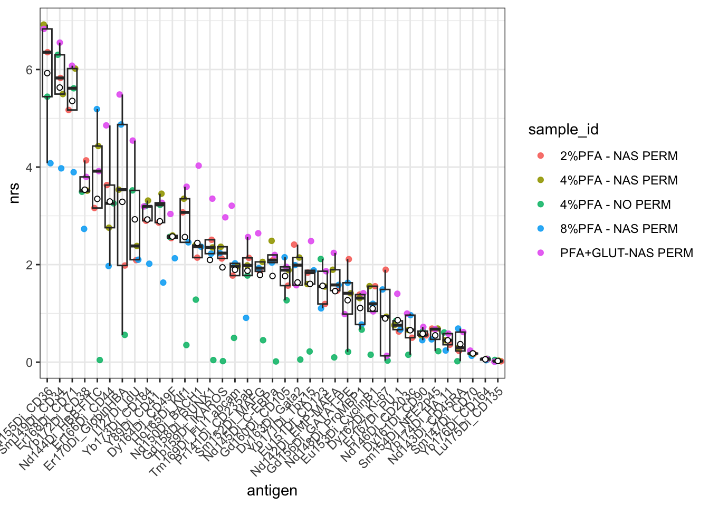

# Chapter 16 - Statistical Analysis and Publication Figures

## What You'll Learn

This chapter covers four ways to summarise and compare samples at a higher level than individual-cell plots: an MDS plot to see which samples resemble each other, a heatmap of median marker expression, a bubble plot showing the same median expression a different way, and a Non-Redundancy Score to identify which markers actually drive the differences between samples.

## The Essentials {.essentials}

### Step 1: Load Required Packages and Data


``` r
library(here)
#> Warning in readLines(f, n): line 1 appears to contain an
#> embedded nul
#> here() starts at /Volumes/T31/CLAUDE/Analysing-Cytometry-Data-With-R
library(dplyr)
#> 
#> Attaching package: 'dplyr'
#> The following objects are masked from 'package:stats':
#> 
#>     filter, lag
#> The following objects are masked from 'package:base':
#> 
#>     intersect, setdiff, setequal, union
library(flowCore)   # fsApply() and flowSet subsetting, used by the NRS section
library(limma)
library(ggplot2)
library(ggrepel)
library(cowplot)

EXPRESSION_DATA_SAMPLE_ID <- readRDS(here("Data", "RDS", "EXPRESSION_DATA_SAMPLE_ID.rds"))
metadata <- readxl::read_xlsx(here("Data", "other", "ACDwR_metadata.xlsx"))
```

### Step 2: Compute Median Expression per Sample

`EXPRESSION_DATA_SAMPLE_ID` carries three columns that are not markers: `Time`, `Event_length`, and `Original_ID`, the event index PeacoQC added back in Chapter 9. None of them belongs in a median expression table used for MDS, heatmap, or NRS, so exclude all three before summarising:


``` r
marker_cols <- setdiff(colnames(EXPRESSION_DATA_SAMPLE_ID),
                       c("sample_id", "Time", "Event_length", "Original_ID"))

EXPRESSION_DATA_SAMPLE_ID_TABLE <- data.frame(EXPRESSION_DATA_SAMPLE_ID) %>%
  group_by(sample_id) %>%
  summarise(across(everything(), median))

MEDIAN_EXPRESSION_DATA_SAMPLE_ID <- t(EXPRESSION_DATA_SAMPLE_ID_TABLE[, marker_cols])
colnames(MEDIAN_EXPRESSION_DATA_SAMPLE_ID) <- EXPRESSION_DATA_SAMPLE_ID_TABLE$sample_id

saveRDS(MEDIAN_EXPRESSION_DATA_SAMPLE_ID, here("Data", "RDS", "MEDIAN_EXPRESSION_DATA_SAMPLE_ID.rds"))
```

### Step 3: MDS Plot

MDS (multidimensional scaling) places samples in 2D space such that samples with similar overall marker expression profiles sit close together, useful for spotting outlier samples or batch effects at a glance:


``` r
mds <- plotMDS(MEDIAN_EXPRESSION_DATA_SAMPLE_ID, plot = FALSE)

MDS_TABLE <- data.frame(MDS1 = mds$x, MDS2 = mds$y, sample_id = colnames(MEDIAN_EXPRESSION_DATA_SAMPLE_ID))
mm <- match(MDS_TABLE$sample_id, metadata$sample_id)
MDS_TABLE$condition <- metadata$condition[mm]

ggplot(MDS_TABLE, aes(x = MDS1, y = MDS2, color = condition)) +
  geom_point(size = 6) +
  geom_label_repel(aes(label = sample_id), fontface = "bold", fill = "white") +
  theme_bw() +
  coord_fixed()
```



``` r

ggsave2(here("Figures", "mds_plot.pdf"), width = 11, height = 8.5)
ggsave2(here("Figures", "mds_plot.png"), width = 11, height = 8.5)
```

### Step 4: Heatmap of Median Expression


``` r
library(pheatmap)
library(RColorBrewer)

mm <- match(colnames(MEDIAN_EXPRESSION_DATA_SAMPLE_ID), metadata$sample_id)
annotation_col <- data.frame(condition = metadata$condition[mm])
rownames(annotation_col) <- colnames(MEDIAN_EXPRESSION_DATA_SAMPLE_ID)

color <- colorRampPalette(brewer.pal(n = 9, name = "YlOrRd"))(100)

heatmap <- pheatmap(MEDIAN_EXPRESSION_DATA_SAMPLE_ID, color = color, annotation_col = annotation_col, fontsize = 6)
heatmap
```



### Step 5: Bubble Plot of Median Expression

The Step 4 heatmap and this bubble plot show the same `MEDIAN_EXPRESSION_DATA_SAMPLE_ID` data, just encoded differently, tile colour there, dot size and colour together here. Both are useful: a heatmap reads well as a whole grid at a glance, a bubble plot makes individual high/low values easier to compare precisely once you're looking closely at one marker or one sample. Needs melting to long format first, one row per marker/sample pair, since `geom_point()` expects that shape rather than the wide matrix `pheatmap()` took directly:


``` r
library(tidyr)

MEDIAN_EXPRESSION_LONG <- data.frame(marker = rownames(MEDIAN_EXPRESSION_DATA_SAMPLE_ID), MEDIAN_EXPRESSION_DATA_SAMPLE_ID, check.names = FALSE)
MEDIAN_EXPRESSION_LONG <- tidyr::pivot_longer(MEDIAN_EXPRESSION_LONG, -marker,
  names_to = "sample_id", values_to = "median_expression")

ggplot(MEDIAN_EXPRESSION_LONG, aes(x = sample_id, y = marker)) +
  geom_point(aes(size = median_expression, color = median_expression)) +
  scale_color_viridis_c() +
  labs(x = "", y = "", size = "Median expression", color = "Median expression") +
  theme_bw() +
  theme(axis.text.x = element_text(angle = 45, hjust = 1), axis.text.y = element_text(size = 6))
```



``` r

ggsave2(here("Figures", "bubble_median_expression.pdf"), width = 11, height = 8.5)
ggsave2(here("Figures", "bubble_median_expression.png"), width = 11, height = 8.5)
```

**Note:** `check.names = FALSE` is needed because sample IDs in this course's metadata contain spaces and `%` (e.g. `2%PFA - NAS PERM`), which `data.frame()` would otherwise silently rewrite into syntactically valid but unrecognisable column names.

### Step 6: Non-Redundancy Score (NRS)

NRS identifies which markers contribute most to the differences between samples, using PCA on each sample's events and weighting each marker by how much it drives the first few principal components:


``` r
library(tidyr)

NRS <- function(x, ncomp = 3) {
  pr <- prcomp(x, center = TRUE, scale. = FALSE)
  score <- rowSums(outer(rep(1, ncol(x)), pr$sdev[1:ncomp]^2) * abs(pr$rotation[, 1:ncomp]))
  return(score)
}

ARCSINH_DOWNSAMPLED_CLEANED_FLOWSET <- readRDS(here("Data", "RDS", "ARCSINH_DOWNSAMPLED_CLEANED_FLOWSET.rds"))

# marker_cols came from the data frame, and the flowSet spells seven of those antigens
# differently, so it cannot be used here. Take the names from the flowSet itself.
marker_cols_flowset <- setdiff(colnames(ARCSINH_DOWNSAMPLED_CLEANED_FLOWSET),
                               c("Time", "Event_length", "Original_ID"))

nrs_matrix <- fsApply(ARCSINH_DOWNSAMPLED_CLEANED_FLOWSET[, marker_cols_flowset], NRS, use.exprs = TRUE)
nrs_sample <- data.frame(nrs_matrix)

nrs <- colMeans(nrs_sample, na.rm = TRUE)
markers_ord <- names(sort(nrs, decreasing = TRUE))

nrs_sample$sample_id <- rownames(nrs_sample)
nrs_df <- tidyr::pivot_longer(nrs_sample, -sample_id, names_to = "antigen", values_to = "nrs")
nrs_df$antigen <- factor(nrs_df$antigen, levels = markers_ord)

ggplot(nrs_df, aes(x = antigen, y = nrs)) +
  geom_point(aes(color = sample_id), alpha = 0.9, position = position_jitter(width = 0.3, height = 0)) +
  geom_boxplot(outlier.color = NA, fill = NA) +
  stat_summary(fun = "mean", geom = "point", shape = 21, fill = "white") +
  theme_bw() +
  theme(axis.text.x = element_text(angle = 45, hjust = 1))
```



``` r

ggsave2(here("Figures", "nrs_plot_unfinished_labels.pdf"), width = 11, height = 8.5)
ggsave2(here("Figures", "nrs_plot_unfinished_labels.png"), width = 11, height = 8.5)
```

Markers further left (higher mean NRS) contribute more to distinguishing samples from each other; markers further right contribute less.

### Step 7: Finish the Labels

Look along the x axis before you go any further. Seven antigens are not spelled the way you wrote them:

```
Dy162Di_Ki.67        should be   Dy162Di_Ki-67
Nd144Di_HBB.FITC     should be   Nd144Di_HBB-FITC
Nd142Di_EMP.MAEA     should be   Nd142Di_EMP-MAEA
Nd145Di_C.EBPa       should be   Nd145Di_C-EBPa
Gd156Di_GATA1.PE     should be   Gd156Di_GATA1-PE
Tm169Di_FLI1.abcam   should be   Tm169Di_FLI1 abcam
Y89Di_CD41..         should be   Y89Di_CD41   (with two trailing spaces you cannot see)
```

Two other antigens, `Er167Di_PU.1` and `Yb174Di_HA.11`, carry dots of their own. Those are correct and untouched, which is part of why this is easy to miss: the axis is a mixture of dots that belong and dots that do not.

The figure is not wrong. Every score on it is correct, and the markers are in the right order. The labels are simply unfinished, and a figure with unfinished labels is not a publication figure.

The cause is `data.frame()` on the line above the plot. It calls `check.names` by default, which rewrites anything that is not a legal R variable name: hyphens and spaces become dots, and the two trailing spaces on `Y89Di_CD41` become two more. You have already switched this off once in this chapter, at Step 5, for exactly the same reason. Here it is switched off again, and the plot rebuilt from the same numbers:


``` r
nrs_finished <- data.frame(nrs_matrix, check.names = FALSE)

nrs_finished_order <- names(sort(colMeans(nrs_finished, na.rm = TRUE), decreasing = TRUE))

nrs_finished$sample_id <- rownames(nrs_finished)
nrs_finished_df <- tidyr::pivot_longer(nrs_finished, -sample_id,
                                       names_to = "antigen", values_to = "nrs")
nrs_finished_df$antigen <- factor(nrs_finished_df$antigen, levels = nrs_finished_order)

ggplot(nrs_finished_df, aes(x = antigen, y = nrs)) +
  geom_point(aes(color = sample_id), alpha = 0.9, position = position_jitter(width = 0.3, height = 0)) +
  geom_boxplot(outlier.color = NA, fill = NA) +
  stat_summary(fun = "mean", geom = "point", shape = 21, fill = "white") +
  theme_bw() +
  theme(axis.text.x = element_text(angle = 45, hjust = 1))
```



``` r

ggsave2(here("Figures", "nrs_plot.pdf"), width = 11, height = 8.5)
ggsave2(here("Figures", "nrs_plot.png"), width = 11, height = 8.5)
```

Both versions are saved, `nrs_plot_unfinished_labels` and `nrs_plot`, so you can put them side by side. `nrs_plot` is the one to use.

### Step 8: Record Your Package Versions

Throughout this course, saving each pipeline stage as an RDS file and setting a seed before every random step (downsampling, UMAP, tSNE, clustering) has already made your analysis reproducible in the sense that matters most: anyone, including you in six months, can rerun any chapter and get the identical result, or pick up from any saved stage without redoing earlier work. The one thing that isn't recorded anywhere is which package versions actually produced those results:


``` r
sessionInfo()
#> R version 4.6.0 (2026-04-24)
#> Platform: aarch64-apple-darwin23
#> Running under: macOS Tahoe 26.5.2
#> 
#> Matrix products: default
#> BLAS:   /Library/Frameworks/R.framework/Versions/4.6/Resources/lib/libRblas.0.dylib 
#> LAPACK: /Library/Frameworks/R.framework/Versions/4.6/Resources/lib/libRlapack.dylib;  LAPACK version 3.12.1
#> 
#> locale:
#> [1] en_US.UTF-8/en_US.UTF-8/en_US.UTF-8/C/en_US.UTF-8/en_US.UTF-8
#> 
#> time zone: America/Toronto
#> tzcode source: internal
#> 
#> attached base packages:
#> [1] stats     graphics  grDevices utils     datasets 
#> [6] methods   base     
#> 
#> other attached packages:
#>  [1] tidyr_1.3.2        RColorBrewer_1.1-3
#>  [3] pheatmap_1.0.13    cowplot_1.2.0     
#>  [5] ggrepel_0.9.8      ggplot2_4.0.3     
#>  [7] limma_3.68.4       flowCore_2.24.0   
#>  [9] dplyr_1.2.1        here_1.0.2        
#> 
#> loaded via a namespace (and not attached):
#>  [1] sass_0.4.10         generics_0.1.4     
#>  [3] xml2_1.6.0          digest_0.6.39      
#>  [5] magrittr_2.0.5      evaluate_1.0.5     
#>  [7] grid_4.6.0          bookdown_0.47      
#>  [9] fastmap_1.2.0       cellranger_1.1.0   
#> [11] rprojroot_2.1.1     jsonlite_2.0.0     
#> [13] purrr_1.2.2         viridisLite_0.4.3  
#> [15] scales_1.4.0        textshaping_1.0.5  
#> [17] jquerylib_0.1.4     cli_3.6.6          
#> [19] rlang_1.3.0         RProtoBufLib_2.24.0
#> [21] Biobase_2.72.0      withr_3.0.3        
#> [23] cachem_1.1.0        yaml_2.3.12        
#> [25] otel_0.2.0          cytolib_2.24.0     
#> [27] tools_4.6.0         memoise_2.0.1      
#> [29] BiocGenerics_0.58.1 vctrs_0.7.3        
#> [31] R6_2.6.1            matrixStats_1.5.0  
#> [33] stats4_4.6.0        lifecycle_1.0.5    
#> [35] S4Vectors_0.50.1    fs_2.1.0           
#> [37] ragg_1.5.2          pkgconfig_2.0.3    
#> [39] pillar_1.11.1       bslib_0.12.0       
#> [41] gtable_0.3.6        Rcpp_1.1.2         
#> [43] glue_1.8.1          systemfonts_1.3.2  
#> [45] statmod_1.5.2       xfun_0.60          
#> [47] tibble_3.3.1        tidyselect_1.2.1   
#> [49] rstudioapi_0.19.0   knitr_1.51         
#> [51] farver_2.1.2        htmltools_0.5.9    
#> [53] labeling_0.4.3      rmarkdown_2.31     
#> [55] compiler_4.6.0      S7_0.2.2           
#> [57] readxl_1.5.0        downlit_0.4.5
```

Save this output alongside your analysis, in a script comment, a README, or a supplementary file for publication. If `FlowSOM` or `flowCore` changes behaviour in a future release, this is what tells you, or a reviewer, exactly what you ran it with.

## A Deeper Dive {.deeper-dive}

These tools answer different questions: MDS tells you which whole samples resemble each other, the heatmap and bubble plot both show which markers are high or low in which samples (just laid out differently), and NRS tells you which markers are actually doing the work of separating your samples, useful for deciding which markers deserve closer follow-up versus which are largely uninformative for this particular dataset.

### Why the Labels Arrive Unfinished

`check.names` is not a bug and it is not `data.frame()` being careless. It is R protecting itself. A data frame's column names are meant to be usable as variable names, and `Ki-67` is not one: R would read the hyphen as a minus sign and try to subtract 67 from an object called `Ki`. Spaces are worse. So `data.frame()` quietly substitutes dots, which are legal, and says nothing.

Quietly is the part worth remembering. There is no warning, no error, and nothing in the object to tell you it happened. The rename lands in the same class of problem as the positional join in Chapter 12: your analysis keeps running, the numbers stay correct, and something you did not authorise has changed underneath the results. Here it costs you a figure caption. In Chapter 12 it cost you the biology.

It also has a second effect, which you may already have hit. The renamed columns no longer match the channel names in the flowSet, which still holds the originals, so a name that works against one object fails against the other:


``` r
# marker_cols came from the data frame. The flowSet spells seven of these differently,
# so this fails. Deliberate: the error below is the output of this chunk, not a typo.
ARCSINH_DOWNSAMPLED_CLEANED_FLOWSET[, marker_cols]
#> Error:
#> ! Subset out of bounds
```

That is why Step 6 builds `marker_cols_flowset` from the flowSet's own `colnames()` rather than reusing `marker_cols`. Two objects, two spellings, and you have to know which one you are addressing. When in doubt, print `colnames()` of both and compare them.

### Beyond sessionInfo(): renv

`sessionInfo()` tells you what you ran, after the fact. It doesn't stop your packages from silently updating between now and your next analysis, and it can't hand someone else your exact environment to install in one step. The `renv` package does both: it creates a project-specific library (so updating a package elsewhere on your computer doesn't touch this project), and a lockfile recording every package's exact version, which anyone can restore with `renv::restore()`. It's a more complete answer to reproducibility than `sessionInfo()`, at the cost of real overhead, a lockfile to maintain, an initialisation step, and a restore workflow to teach, worth adopting once you're running analyses you'll need to defend or rerun months later, not something this introductory course sets up for you.

### What's Next

This is the final chapter in the core pipeline. From here, the specific statistical tests and figures you build depend on your actual experimental question, comparing conditions, tracking populations over time, or correlating marker expression with an outcome.
