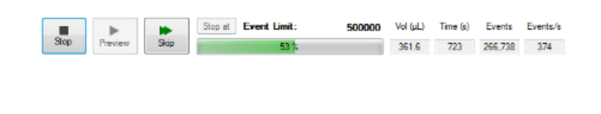
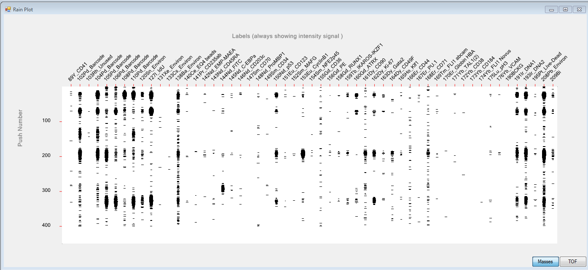
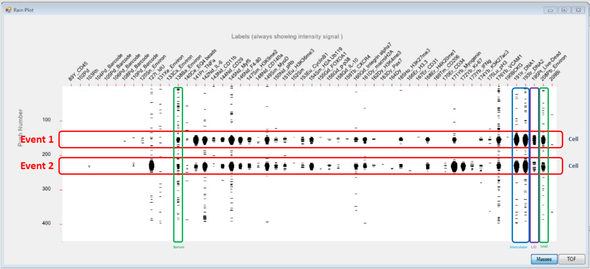
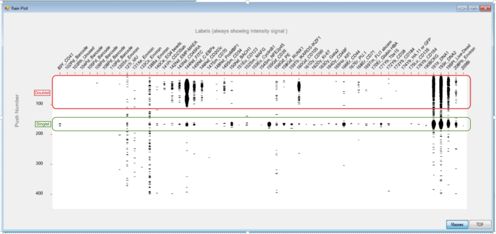
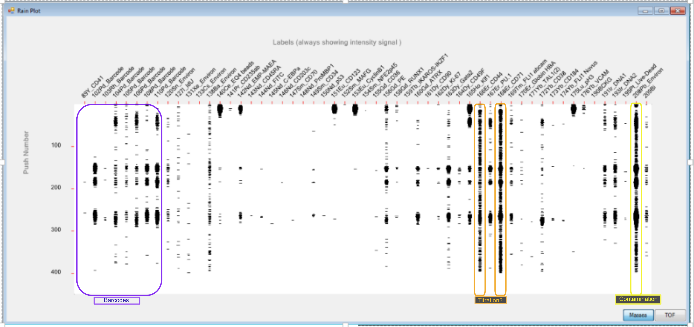

class: title-slide

# How the Helios Works
## Understanding the technology and its impact on your samples

### Damian Carragher
### OHRI Mass Cytometry Service
### 2020/04/08 (Updated: `r Sys.Date()`)

<!-- Hello and welcome to this brief presentation from the O H R I Mass Cytometry Service, part of the Proteomics Core Facility. Here, we'll discuss some of the things you should be thinking about when preparing suspension-based samples for the Helios instrument.

Here, we'll introduce the Helios mass cytometer, how it functions and what that means for your samples -->
---
## .small[What happens when you hand over your sample to the mass cytometry service?]
.pull-left[
<ohri-blockquote>Sample Preparation</ohri-blockquote>
  - Wash
  - ddH<sub>2</sub>O
        
<ohri-blockquote>Sample Introduction</ohri-blockquote>
  - Pressurised sample staion
  - Standard 5 ML facs tubes
  - The nebuliser
  - The spray chamber (_-200<sup>o</sup>C_)
]
.pull-right[      
<ohri-blockquote>Sample Destruction</ohri-blockquote>
  - The plasma torch (_5000K_)
   
<ohri-blockquote>Sample Measurement</ohri-blockquote>
  - Mass Spectrometry
  - The rain plot
]
  
<!-- 
We'll cover everything that happens to your sample after you hand it to the instrument operator, so that you understand all of the practical and technical aspects of what's going on. We'll discuss how we process your sample to get it ready for acquisition and then what happens to the sample once we introduce it into the instrument.

So, once you give us your sample here's what happens 
-->
---
## Sample Preparation for Acquisition

#### Washing your sample
  - Removes free DNA intercalator
  - Quench fixative
  
#### Resuspension in ddH<sub>2</sub>O
  - All samples acquired in ddH<sub>2</sub>O or Cell Acquisition Solution
  - Good fixation crucial
  
#### Filtration
  - _Instrument blocks very easily_
  - .strong[MUST] filter all samples prior to acquisition
  - .strong[GENERALLY] use a 40um filter but can use 70um on request.

#### Transfer to 5ml FACS tubes
  - .strong[ONLY] tube the sample station accepts
  - Polypropylene tubes preferred


<!--
When you hand your cells over to the mass cytometry service we'll work them through 4 steps before acquisition. Firstly, we'll wash your sample with a protein-rich medium like staining buffer. This quenches any remaining fixative and removes any free DNA intercalator. We also count your cells so that we can resuspend them at the correct concentration later.

Next, mass cytometry samples MUST be acquired in water - the sample is eventually ionised, and any salts in the solution can confound the analysis,  or block the instrument, so we wash your samples twice with water.

This is why your samples must be fixed properly. If your samples are insufficiently fixed they will lies. 

Even if you're samples are fixed perfectly some cells will be lost due to the osmotic pressure. This is part of why cells-in-solution-mass-cytometry is lossy.

To help counteract this, Fluidigm have released Cell Acquisition Solution, shortened as CAS. It is a less than 0.1% salt solution that reduces the osmotic pressure on your sample. It helps cell loss through lysis and at O H R I we use it for all samples.

Finally, we'll resuspend your samples at a concentration of half a million per ml. Then  transfer the sample to a filter-top FACS tube in a volume of 300-500 microlitres. Polypropylene tubes are preferred because cells ahere to these tubes less than polystyrene ones.

Now your sample is ready to put on the instrument. Let's discuss Helios sample introduction. 
-->

---
background-image: url('Images/Helios_Sample_Introduction_Part1_Tube_to_Nebulizer_ALL.png')
background-position: center
background-size: contain


<!--Once we have your sample suspended in CAS in a FACS tube we'll load it onto the instrument. Here's what that looks like. This is the first step in transporting your sample to the detector.  There are 3 components starting with the sample station-->
---
background-image: url('Images/Helios_Sample_Introduction_Part1_Tube_to_Nebulizer_1_Sample_Station.png')
background-position: center
background-size: contain
<!--  which is pressurised to force the cell solution into the sample line. 

The bright blue light isn't just for decoration. Blue means it's ready to acquire. When the blue light pulses the sample is acquiring. It turns yellow when the station is depressurised, whether at acquisition's end or if there's a blockage. 

The sample is pressurised to propel your sample into the sample line at a rate of 30 microlitres per minute. -->
---
background-image: url('Images/Helios_Sample_Introduction_Part1_Tube_to_Nebulizer_2_Sample_Line.png')
background-position: center
background-size: contain

<!--The sample line is a long capillary tube that passes through 3 connectors. 

It's a long, fine tube and is VERY prone to blocking. That's why we filter your sample prior to loading it. The sample line carries your sample to the nebulizer -->
---
background-image: url('Images/Helios_Sample_Introduction_Part1_Tube_to_Nebulizer_3_Nebulizer.png')
background-position: center
background-size: contain
<!--which is used to create very small droplets containing your cells. -->
---
background-image: url('Images/Helios_Sample_Introduction_Part2_Nebulizer_to_Plasma_ALL.png')
background-position: center
background-size: contain
<!-- This brings us to Part 2 of sample introduction which is laid out here. -->
---
background-image: url('Images/Helios_Sample_Introduction_Part2_Nebulizer_to_Plasma_1_Nebulizer.png')
background-position: center
background-size: contain
<!-- We're back at the nebulizer, which delivers the cells in a fine mist to the spray chamber. -->
---
background-image: url('Images/Helios_Sample_Introduction_Part2_Nebulizer_to_Plasma_2_Spray_Chamber.png')
background-position: center
background-size: contain
<!-- The spray chamber is a plastic cylinder that is heated to 200 degrees Celsius. It captures the cell-droplet mist from the nebulizer. It is also an area of further cell loss in the instrument. Cell-droplets that stick to the chamber walls cannot enter the sample injector. The high temperature helps reduce adherence and also reduces the volume of liquid in each droplet -->
---
background-image: url('Images/Helios_Sample_Introduction_Part2_Nebulizer_to_Plasma_3_Sample_Injector.png')
background-position: center
background-size: contain
<!--A vaccuum generated in the instrument draws the nebulized droplets into the sample injector.

The sample injector is a long glass tube. The injector must be made of glass. It delivers your sample to the plasma torch -->
---
background-image: url('Images/Helios_Sample_Introduction_Part3_Plasma_to_Detector_ALL.png')
background-position: center
background-size: contain
<!-- These are  the final steps before your sample is measured.   -->
---
background-image: url('Images/Helios_Sample_Introduction_Part3_Plasma_to_Detector_1_Plasma_Torch.png')
background-position: center
background-size: contain

<!-- The plasma torch is an argon-plasma generated by radio-frequency applied by copper coils. Your cells are delivered directly into the plasma torch by the injector. The intense heat of the plasma torch, almost 5000 degrees kelvin, ionises the cells and propels the resulting ion clouds to the cone assembly -->
---
background-image: url('Images/Helios_Sample_Introduction_Part3_Plasma_to_Detector_2_Cones.png')
background-position: center
background-size: contain
<!--The cones are designed to withstand the high heat of the plasma torch, maintain the high vacuum required in a mass spectrometry instrument and provide a small aperture for entry of the ion clouds into the mass spectrometer. -->
---
background-image: url('Images/Helios_Sample_Introduction_Part3_Plasma_to_Detector_3_Mass_Spec.png')
background-position: center
background-size: contain
<!-- The mass spectrometer is a fairly standard affair. 

The ion clouds are focused by electrostatic lenses, pass through a quadrapole to filter out low molecular weight material - in this case the organic material that used to be your cells. 

The remaining high molecular weight ions, primarily the lanthanide probes, are passed to the time-of-flight detector for measurement. -->
---
background-image: url('Images/Helios_Sample_Introduction_Part3_Plasma_to_Detector_4_Cells.png')
background-position: center
background-size: contain
<!-- So, in summary,  your cells are passed to the plasma torch in very small droplets. The plasma torch first vaporizes the liquid away, atomizes the cell and finally ionizes it. The ion clouds are passed through the cones, filtered for low molecular weight organic matter before the remaining lanthanides are measured by time of flight. -->
---
## <font size="6">What does the operator see?</font> 

``` {r Control Panel, echo = FALSE, out.width = "65%", fig.align = "center"} 

```

.dblue[Basic controls to monitor]
.pull-left[  
.grey[Volume]
  - The volume of sample passed to the instrument
  
.grey[Time elapsed]
  - Used with Volume to calculate sample running time
]
.pull-right[
.grey[Events/sec]
  - Important to maintain 300-550 events/sec

.grey[Events recorded]

.grey[Pressure]
  - Monitored to ensure smooth sample running (_no blockages, etc._)
]

<!-- As your sample is acquired, we monitor the instrument. 

The basic control panel provides ionformation on how much volume has been acquired along with the time elapsed and event rate. 

We also monitor the sample station pressure as an indicator of blockages -->
---
## <font size="6">What does the operator see? - The Rain Plot</font>  


``` {r Rain Plot, echo = FALSE, out.width = "95%", fig.align = "center"} 

```

  - Used to monitor data acquisition in real time

<!--The other way we monitor your sample is the rain plot. This is a visual representation of a subset of the events passing through the instrument. The rain plot  shows less than 10% of events but provides a good indicator of the overall quality of the sample. -->
---
## <font size="6">Understanding the Rain Plot</font> 

``` {r Rain Plot Annotated, echo = FALSE, out.width = "95%", fig.align = "center"} 

```

  - Each column is equivalent to one channel
  - __<span style="color:#F11526 ">Each horizontal line is a single event</span>__
  - __<span style="color:#3C4BC4 ">Every cell is positive for DNA intercalator</span>__
  - <span style="color:#149212 ">__Monitor for environmental contaminats (Barium, Lead etc.)__</span>


<!--Let's break down what the rain plot shows us. Each column is equivalent to a channle monitoring one probe. Each row is equivalent to a single event. The blobs in each part of the matrix are measured signal in that channel. So if we look at each horizontal event we can monitor each cell for specific markers as well as DNA intercalator. Finally, we are constantly monitoring the samples for doublets and environmental contamination. -->
---

## <font size="6">Understanding the Rain Plot - Doublets</font> 
``` {r Rain Plot Annotated Doublet, echo = FALSE, out.width = "95%", fig.align = "center"} 

```

  
   - __Monitor acquisition for <span style="color:#149212 ">singlets</span> and <span style="color:#F11526 ">doublets</span>__
  

<!--Let's first see what doublets look like. The event highlighted in green is a single event while the red highlighted event is a doublet. See how for several of the markers we have smears rather than ellipses. We cannot control the flow rate of the Helios. If we see large amounts of doublets and a high event rate we'll dilute the sample further to counteract this. -->
---
## <font size="6">Understanding the Rain Plot - Contamination</font> 
``` {r Rain Plot Annotated Problems, echo = FALSE, out.width = "95%", fig.align = "center"} 

```

  
   - __Monitor acquisition for <span style="color:#EEF26C; ; background-color:#0E0E0A ">environmental contamination</span> (Lead, Barium, Iodine etc.) and <span style="color:#F49F33; background-color:#0E0E0A" >titration issues</span>__
   - __Verify <span style="color:#5B12E5">barcodes</span>__
  
<!--We also monitor for any artifacts that might compromise the analysis of your samples. These are primarily environmental contamination, such as from led or barium. 

In this case we have led contamination highlighted in yellow. This suggests these cells were stored or processed in glass containers. 

We can also see 2 of the antibodies have a "tire-track" pattern down the screen. They are the orange-highlighted channels.

This is indicative of poor titration. 

These issues should be changed before the next acquisition. -->
---
background-image: url(Images/Background.png)
background-size: cover

## and Finally... 
  - __<span style="color:#1268E5">Normalise</span>__ <span style="color:#2C2E30">data</span>
  - __<span style="color:#1268E5">Debarcode</span>__ <span style="color:#302E2C">samples</span>
  - __<span style="color:#1268E5">FCS</span> <span style="color:#302E2C">file creation</span>__ 


</br>


   


_<span style="color:#25679E">Good Luck  - we're here to help when you need it!</span>_


<!--The final step before we return your data is normalization.

Mass spectrometry detectors lose a small amount of sensitivity over the course of a few hours. We normalise all the data using E Q beads added to your sample. This ensures all of the probes are measured equally over the acquisition time with no drop off.

If you run multiplexed samples we also debarcode the samples.

Finally we turn the data into an fcs file for you to analyse.

I hope we've helped you understand how the Helios works and shown you what happens to your sample from the moment you deliver it to us to the moment we give you your data. 
-->
---
class: title-slide-final

# Thanks for watching

Please get in touch if you need assistance with any aspect of your mass cytometry project:  

|     |     |
|:---:|:---:|
||dcarragher@ohri.ca|
||www.ohri.ca/masscytometry/dummy/website|

<div class="my-footer-png"></div> 

<!--
Thanks for watching. Please get in touch if you would like more information on how your samples are acquired or any other aspects of mass cytometry.-->
