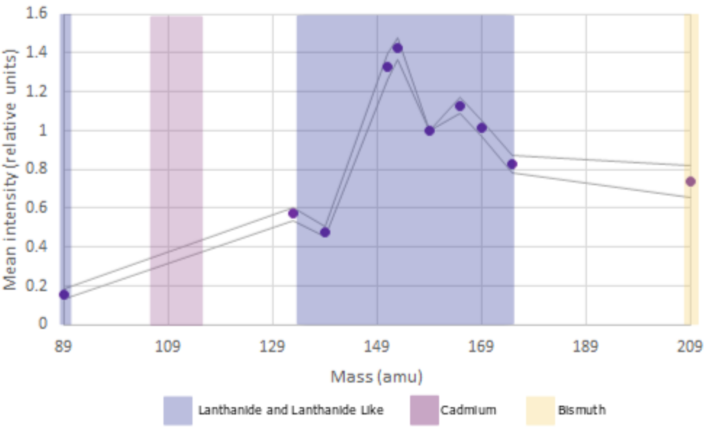
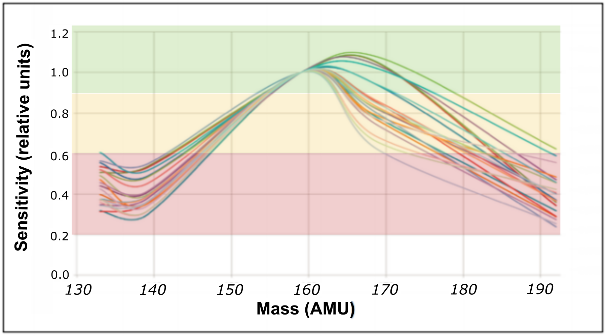

class: title-slide

# Panel Design for Mass Cytometry
## From concepts to validation

### Damian Carragher
### OHRI Mass Cytometry Service
### 2020/04/28 (Updated: `r Sys.Date()`)

<!--
Hello and welcome to this brief presentation from the O H R I Mass Cytometry Service, part of the Proteomics Core Facility. Here, we'll discuss the things you should consider when designing your mass cytometry antibody panels
-->
---
class: segue-blue, middle, center

# Mass Cytometry Panel Design
## .white[Overview]

<!--So, what will we be covering here-->
---

## What we'll cover

<ohri-blockquote>The steps of panel design</ohri-blockquote>
- Define your .strong[experimental goal]
- Understand your .strong[markers]
- Understand your .strong[probes]
- .strong[Maximise] your .strong[resolution]
- .strong[Iterate]

<ohri-blockquote>AND</ohri-blockquote>	
- Tools to help you with panel design

<!-- We'll explore what you need to know about your markers and probes to create a good panel design and the practical steps you'll need to work through to make sure your panel is as elegant and refined as possible.

Finally we'll cover the tools available to help you with this endeavour-->

---


class: segue-blue, middle, center
# Mass Cytometry Panel Design 
## .white[Experiment Goals]


<!--Firstly we'll just mention that mass cytometry experiments are significant undertakings.-->
---
class: segue-grey, middle, center

# Is mass cytometry right for you?

<ohri-blockquote>Mass cytometry is a powerful technique BUT a signifcant undertaking. </ohri-blockquote>

<ohri-blockquote>From the beginning, we must make sure that it's the correct approach to answer your question.</ohri-blockquote>

<!-- Before you start this process it is important to be sure that mass cytometry is the appropriate experimetnal approach to answer your scientific question. See our video on the costs and benefits of mass cytometry for info on this. -->

---
class: segue-blue, middle, center

# Mass Cytometry Panel Design 
## .white[Markers]
<!-- Now, lets get down to starting your panel design. We'll start with the markers you've chosen to form your panel design.-->
---

## Understand your markers
<ohri-blockquote>Think .strong[BIG]</ohri-blockquote>
  - Easier to make a larger panel than you need and not use all of it
  - Hard to add new markers to a moderately large panel
	
<ohri-blockquote> How are your markers expressed?</ohri-blockquote>
- Create a league table of antigen expression
	- Which markers are most strongly expressed?
	- Which markers are expressed most weakly?
		
		
<!--When designing a panel it's easier to design a very large panel that you only use a portion of, than to design a smaller panel and try to add markers to it later. 

So, the first tip is to think big with your initial panel design. WE can design a 37 marker panel even if you are only using 25 markers and you use the other markers as and when you need them. Once you have your complete list we can start to assess your markers for where they fit in the panel. 

The first step is to create a ranking of expression for all of your markers moving from those that are more highly expressed to those which are most weakly expressed. You can assemble the list from your own knowledge or from online resources.  We'll use this hierarchy later when we pair the markers with the probes. -->


---
## Understand your markers

<ohri-blockquote> Which markers are most important to your analysis? </ohri-blockquote>
</br>
.pull-left[<ohri-blockquote> Where are your markers expressed?</ohri-blockquote>
- Surface
- Cytoplasm
- Intranuclear]
.pull-right[
<ohri-blockquote>What expression patterns do your markers have?</ohri-blockquote>
- Unimodal
- Bimodal
- Shoulder
]

<!--It's important at this point to also take note of where in the cell your markers of interest are expressed. This helps us understand the types of staining protocols needed, which can impact how well the staining is measured -->

---
class: segue-blue, middle, center

# Mass Cytometry Panel Design
## .white[Probes]

<!-- Now that we've started to understand the differences between markers let's look at the probes that will complement your markers. -->

---
##  Understand your probes - .grey[Channels]
What channels are available?

```{r out.width = '50%', eval= TRUE, echo = FALSE, fig.align = "center"}


```

- The Helios is tuned to measure masses in the range of 75-209
- Currently available probes
	- Lanthanides (.strong[141-176])
		- .strong[157] exists but rare and expensive
	- Lanthanide-like Yttrium (.strong[89Y])
	- Bismuth (.strong[Bi209])
	- Cadmium Probes (.strong[106, 111, 112, 113, 114, 116])


<!--First let's figure out which probes are available for us to use. 
The main series of probes are metal lanthanides with masses ranging from 141-176. We can use probes in this entire range with the exception of 157. 
157 isotopes exist but are extremely rare, and therefore, extremely expensive so unless you absolutely need to it's better to skip it.
In addition to the Lanthanide series we have 2 additional markers at the current extreme ranges of the mass chart - 89 Yttrium is the lowest mass probe currently used and 209 Bismuth is the highest probe used.
Recently, Fluidigm  expanded the available probes by adding cadmium isotopes. We can use 7 cadmium isotopes with masses between 106-116. -->

---

## Understand your probes - .grey[Additional Probes]
.pull-left[<ohri-blockquote> Barcoding</ohri-blockquote>
  - (Palladium 102, 104, 105, 106, 108, 110)
  
<ohri-blockquote>Live-Dead Discriminator</ohri-blockquote>
  - (Rhodium 103 or cis-Platin 195)]
  
.pull-right[<ohri-blockquote>Proliferation</ohri-blockquote>  
  - (IdU  Thymidine analog - I127)  
  
<ohri-blockquote>Cell identifier</ohri-blockquote> 
  - (DNA intercalator - 193-195 Iridium)  
]
<!-- One other advantage of mass cytometry is that the lanthanide and cadmium channels are available for your phenotyping or functional markers. There are additional channels available for standard aspects of cytometry like leif-dead discrimination, mulitplexing etc.  -->

---

## Understand your probes - .grey[Sensitivity]	
- What channels are most sensitive?	

```{r out.width = "75%", eval= TRUE, echo = FALSE, fig.align="center"}

```

- Most sensitive 159 +/- 9 		
- Sensitive  168-176		
- Less Sensitive  141-149 
- Least Sensitive 89Y, 209Bi and  cadmium probes

<!--Okay, so we know which channels are availble but which channels are the most sensitive?

The standard tuning of a Helios Cytof makes the area around 159 the most sensitive region of the "spectrum". If you've done flow cytometry, this area of the mass spectrum is equivalent to the fluorochromes P E, A P C,  or B V 421. In other words they are the channels/probes that are measured by the instrument. After this there is a descending list of sensitivity. The area from 168 to 176 is next best, then the area from 141-46. The areas at the edges including the cadmium and yttrium area in 89-116 is lowest sensitivity.-->
---

class: segue-blue, middle, center
# Mass Cytometry Panel Design
## .white[Combining Markers and Probes]


<!--The next step is to pair the metal probes to your markers.  -->
---

## Pair your markers and probes
<ohri-blockquote> Marker Expression Ranking</ohri-blockquote>
<ohri-blockquote>Marker Importance tier list</ohri-blockquote>


### __Maximise your resolution, Minimise your background__
<ohri-blockquote> Panel design is all about </ohri-blockquote>
  - Enhancing observed postive signal
  - Reducing background signal	
    - Mass cytometry's low spillover helps to reduce background signal.
    
<!--We'll use the Marker Expression Ranking and Marker importance list that we created earlier. The goal of panel design is to maximise our resolution of each marker, ensuring we can clearly identify positive and negative populations. Part of resolution maximization is reducing the background noise. Lowering the backgoround floor lets us identify true negative events, which in turn helps us to identify positive events --> 

---
class: segue-blue, middle, center

## The 2 basic rules of panel design

* .white[__Most sensitive channels = Most important or weakly expressed markers __.]
*  .white[__Neighbouring/Interacting channels = Markers on different cells__.]

<!--There are 2 rules that we can use to help us assign markers to metals:

1). The weakest expressed markers should be placed with markers in channels of highest sensitivity. 

This gives us the best chance of separating positive from negative.

And 2). If possible, avoid placing markers measured on the same cell in neighbouring or interacting channels. 

What do we mean by this? Neighbouring channels is obvious but in mass cytometry there are other channels that can interact. Metals can be oxidised, which adds 16, the mass of oxygen, to the metal probe meaning that any channel in mass cytometry interacts with channels plus 16 away.

Background is most often attributable in  cytometry to spillover. Spillover is minimised in mass cytometry but still exists so it is something that we should consider. The easiest way to minimise it's impact is to make these interactions irrelevant by placing markers appropriately.-->

---

class: segue-blue, middle, center

# Mass Cytometry Panel Design
## .white[Iteration]


<!--After following the steps so far we should have a draft panel design. Our next steps will refine the panel design through practical iteration -->
---

## Iterate on your design

```{r Quote, eval= TRUE, echo=TRUE, eval=FALSE}
"No plan survives contact with the enemy"
```
A Pen-and-paper panel design is a great starting point .strong[BUT] they often need tweaking.

<ohri-blockquote>Unexpected spillover</ohri-blockquote>
<ohri-blockquote>Unexpected non-specific binding</ohri-blockquote>
<ohri-blockquote>Metal-Minus-One controls</ohri-blockquote> 
<center>
  - similar to Fluorescence-Minus-One (FMO) in flow cytometry.</span>
	- Help with identifying true positive and negative populations.
</center>
<!-- Like most theoretical plans, a pen and paper panel design will change when put into practise. When we test the panel on real samples we may see more or less spillover than expected or more non-specific binding from some antibodies than expected. Like Fluorescence Minus One controls in flow cytometry we can use Metal Minus One controls to assess what is positive versus negative for the more ambiguous markers. -->

---

class: segue-blue, middle, center

# Mass Cytometry Panel Design
## .white[Resources]


<!--Hopefully, you've seen the steps required for a good panel design. It is a significant undertaking. Thankfully there are tools and resources available to aid you. -->

---

## The Fluidigm Panel Designer

<ohri-blockquote>Fluidigm's online tool</ohri-blockquote>
- Generate a full panel
- Assess possible spillover
- Export design
- Provides quote for Fluidigm-derived reagents

<!--Firstly, we'll discuss the panel designer available from FLuidigm. You'll need an account - contact the Fluidigm F A S or the O H R I cytof opertator for access. We'll cover how to use the panel designer in depth in a separate video. For now, we just want you to be aware that it's out there and it can be very helpful. It can optimise panels, suggest the spillover that might be encountered and provide quotes for Fluidigm reagents.   -->

---

## Published Panels

.grey[Many mass cytometry studies across many disciplines]
- Use a pre-existing panel
- Make minor modifications to an existing panel
  
.strong[Remember, if you need to make major modifications to a published panel, it's probably better to design your own.]

<!--The poularity of mass cytometry is increasing every year. There are now thousands of studies across many disciplines. It's likely that there is a panel published you can use for your study. This may be the easiest way to get up and running quickly, as long as the panel is very similar to what you want for your studies. -->

---

## People

<ohri-blockquote>OHRI Mass Cytometry Specialist</ohri-blockquote>

<ohri-blockquote>Fluidigm Field Application Specialist (FAS)</ohri-blockquote>

<!--The institute and Fluidigm have personnel available with experience in designing large panels for mass cytometry. We're here to help you generate the best data possible and that starts with panel design. If you'd prefer, FLuidigm provides support through their Field Application Specialists. They also have experience in designing diverse large panels for users and are happy to help with your panel design.  -->

---

## Conclusion

- Panel design consists of
<ohri-blockquote>Understanding marker expression</ohri-blockquote>
<ohri-blockquote>Understanding differences in channel sensitivity</ohri-blockquote>
<ohri-blockquote>Matching markers to probes to:</ohri-blockquote>
     <center> 
     - Maximise marker resolution
     - Minimise background signal
     </center>
<ohri-blockquote>Practical testing and iteration</ohri-blockquote>

<!--In conclusion, panel design is a complex undertaking but we can break it down into the following steps. 1). Understanding your chosen markers expression patterns and levels, 2). Understanding the instrument's channels and their relative sensitivity and 3). Using this information to pair markers and probes appropriately to maximise the resolution of each marker while minimizing the background signal. Finally, we test the panel practically and iterate the design to improve it's efficacy.  -->
---

class: title-slide-final

# Thanks for watching

Please get in touch if you need assistance with any aspect of your mass cytometry project:  

|     |     |
|:---:|:---:|
||dcarragher@ohri.ca|
||www.ohri.ca/cytof

<div class="my-footer-png"></div> 
<!--
Thanks for watching. Please get in touch if you need any help with panel design or any other aspects of mass cytometry. We know this is a complex topic and we're here to assist you in any way we can.-->
