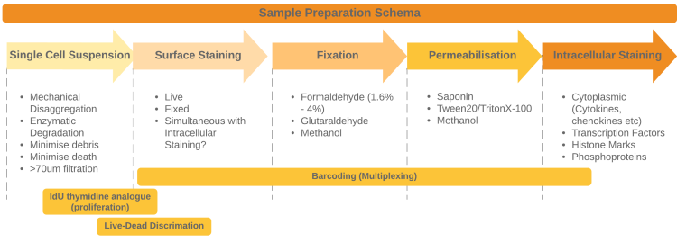
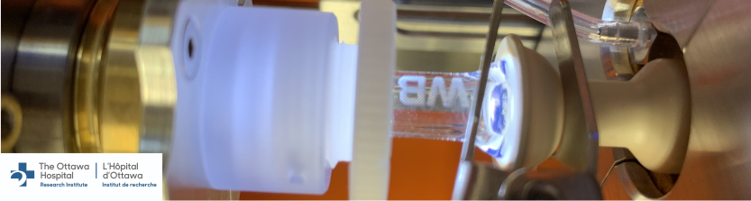

class: title-slide

# Sample Preparation for Mass Cytometry
## Tips to help you improve your samples

### Damian Carragher
### OHRI Mass Cytometry Service
### 2020/04/07 (Updated: `r Sys.Date()`)
### 

<!-- Hello and welcome to this brief presentation from the O H R I Mass Cytometry Service, part of the Proteomics Core Facility. Here, we'll discuss some of the things you should be thinking about when preparing suspension-based samples for the Helios instrument.
-->
---
### How to prepare samples for the Helios

```{r Helios Image, echo=FALSE, out.width="50%", fig.align='center'}
library(knitr)
include_graphics("Images/Horizontal_Instrument_small.png")


```

- .strong[_Remember_]
  <ohri-blockquote>Reduce environmental contamination</ohri-blockquote>
  <ohri-blockquote>Single cell suspension</ohri-blockquote>
  <ohri-blockquote>Reduce dead cells and debris</ohri-blockquote>


<!-- 
We'll talk about ways to avoid ruining your sample and offer some tips about improving your technique

When preparing your samples, there are 3 things you should watch for; 
1). Preventing environmental contamination;
2). Ensuring a good single cell suspension;
and 3). Reducing the amount of debris and dead cells in your sample preps. 

We'll discuss each of these in turn, starting with how you can eliminate envrironmental contamination of your sample 
-->

---

### Reduce Environmental Contamination
- Unique problem to mass cytometry
  - Most of the probes used for mass cytometry are very rare in nature
  -.orange[BUT] _3 possible environmental contamination sources_:  
 
.pull-left[  
<ohri-blockquote>__Lead (Pb<sub>208</sub>)__</ohri-blockquote>
.small[- Used in glassware manufacture
  - .strong[DO NOT] use any glassware when preparing your samples
  - .green[DO] use plastic labware]
  

__<ohri-blockquote>Barium (Ba<sub>138</sub>)</ohri-blockquote>__
  .small[- Found in dish-washing liquids and powders
  - .strong[DO NOT] use any "glass-washed" labware
  - .green[DO] use disposable lab ware]]
  
.pull-right[  
<ohri-blockquote>__Iodine (I<sub>127</sub>)__</ohri-blockquote>

.small[- Used in separation media e,g, **lymphopaque**
- .orange[BE CAREFUL] when extracting cellular layer from separation media]]

<!--
The vast majority of probes we use in mass cytometry are rare-earth metals. They don't exist in the lab environment. This greatly reduces the chances of contaminating samples. However, there are 3 elements that ARE common in the lab. These sources can contaminate our samples. Contamination might make your samples difficult or impossible to acquire. The elements to watch out for are Led, Barium and Iodine. It's important to avoid these elements as much as possible.

Firstly, led is commonly used in  glass manufacturing. Led can leech into cells held in glass containers or washed with solutions from glass bottles. Please avoid using ANY glassware when preparing your samples. 

Secondly, Barium is a common component in dish washing solutions. Please avoid any "glass-washed" lab-ware when processing your samples (even if it's plastic).

Finally, density gradient separation media such as lymphopack contain iodine-based compounds. Sometimes you have to isolate your cells with these, but it's very important to be careful when extracting the cell layer. Do not remove any of the density gradient media with your cells. 

Next we'll discuss creating your single cells suspension, why it's important and what you can do to improve. 
-->
---

### Single Cell Suspension Preparation


* __The very first step__
* __The Helios__
  * __Analyses single cell events__
  * __Extremely prone to blocking__
* __Good sample preparation &rarr; Good acquisition &rarr; Good data &rarr; Good analysis__

<!--Generating a single cell suspension is the first, and most important step in preparing your sample for analysis. The Helios is designed to analyse single cells. A good single cell suspension will run quickly, without blocking the instrument. This generates the best quality data. Poor preparation will lead to difficulties in downstream protocols like staining. The primary way to improve your single cell suspension is to reduce cell death and debris.-->
---
### Reduce cell death and debris
- __The most important part of creating a single cell suspension__

.pull-left[<ohri-blockquote>.small[__Wash__]</ohri-blockquote>
- .small[Wash tissues or cells with PBS to remove blood and debris]

<ohri-blockquote>.small[__Mechanical disaggregation__]</ohri-blockquote>
- .small[Increase surface area]
- .small[Enhance enzyme exposure]
]


.pull-right[<ohri-blockquote>__Enzymatic disaggregation__</ohri-blockquote>
- Use .strong[__DNase__] and .strong[__EDTA__] to retard clumping
- Titrate proteases/collagenases
    - Optimum temperature
    - Optimum incubation
- Seek milder alternatives e.g. _Accutase_
]

  

<!--Dead cells and debris cause aggregates and "clumping". This contributes to further cell loss and makes working with your samples more difficult.

You should take some time before using rare and precious samples to reduce how much death and debris are created when you prepare your samples. 

Firstly, make sure you wash tissues or adherent cells to remove any blood or debris that's already present. Use PBS or other suitable media.

When you dis-aggregate your samples you'll probably use a combination of mechanical and enzymatic methods. 

For mechanical dis-aggregation, make sure to use a sharp blade to chop or mince the sample into small pieces. This provides greater surface area for enzymatic dis-aggregation. 

It's worth paying attention to 3 things for your enzyme treatments: 

1). Remember to use DNase and E D T A to stop cells aggregating and to reduce clumping due to DNA from dead cells.

2). It's worth optimizing your enzyme treatments on test cells and tissues so that when you process your key samples the technique is perfect. 

3). Remember, there are a range of modern enzymes available that are generally less harsh.  such as ack-u-tase, benzo-nase and dis-pase.

After the dis-aggregation steps you will have a raw single cell suspension. The following steps will help to further clean up the sample. 

Red blood cells can cause further aggregation. A quick treatment with lysis buffers such as ACK can quickly and effectively remove them. -->

---
### Reduce cell death and debris
.pull-left[<ohri-blockquote>.small[__Red Blood Cell Lysis__]</ohri-blockquote>
- Erythrocytes enhance cell clumping
- Easy and cheap to remove
  - ACK or RBC Lysis Buffer

<ohri-blockquote>__Filtration__</ohri-blockquote>
- Remove undigested tissue, aggregates and clumps
- Use 40-70um
]

.pull-right[<ohri-blockquote>__Clean-up__</ohri-blockquote>
- Debris-removal kits
  - can be used for final cleanup
  - or if all else fails
]


<!--Filtration is the final step to ensure a good single cell suspension. You can use filters from 40 to 70 microns depending on the type of cells in your sample. 

If you have difficult samples that are still contaminated with dead cells and debris even after careful preparation there are still options available. Several manufacturers now provide dead cell or debris-removal kits that can drastically clean up your sample.-->
---
### Conclusion
.grey[__Good sample preparation__] makes staining and acquisition easier

.grey[__Bad sample preparation__] inhibits our ability to generate good data from your samples

.strong[__Remember__]
  - Avoid glassware and processed lab ware when preparing your samples
  - Analyse how you process your tissues and cells to 
    - Reduce cell death
    - Reduce cell clumping and aggregate formation  


.big[.blue[_Good Luck with your sample preps .strong[!]_]
]

```{r, out.width = "50%", eval= TRUE, echo = FALSE, fig.align='center'}

```

<!--I hope you've seen some ideas that will help you prepare your samples for the Helios. Remember that good sample preparation will make all of your downstream work easier so it's worth optimizing. 

Follow the simple tips outlined here such as avoiding glassware and glass-washed plastic-ware, reduce cell-death and debris and you'll be setting yourself up to produce beautiful samples that generate beautiful data! Good luck with your sample preparation. Let us know if you have any feedback on improving these videos or if you have any topics that you'd like covered.
-->
---
class: title-slide-final

# Thanks for watching

Please get in touch if you need assistance with any aspect of your mass cytometry project:  

|     |     |
|:---:|:---:|
||dcarragher@ohri.ca|
||www.ohri.ca/masscytometry/dummy/website|

<div class="my-footer"></div> 
<!--
Thanks for watching. Please get in touch if you need any more help with sample preparation or any other aspects of mass cytometry.-->
